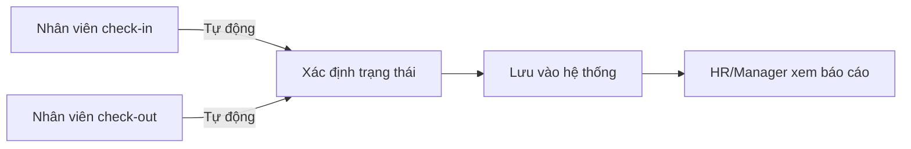

# Tài liệu Yêu cầu Nghiệp vụ (BRD)

## Hệ thống Quản lý Nhân sự (HR Management)

| Phiên bản | Ngày       | Người soạn | Mô tả            |
|-----------|------------|------------|------------------|
| 1.0       | 17/06/2026 | HR Team    | Phiên bản đầu tiên |

---

## Mục lục

1. [Tổng quan dự án](#1-tổng-quan-dự-án)
2. [Mục tiêu kinh doanh](#2-mục-tiêu-kinh-doanh)
3. [Các bên liên quan](#3-các-bên-liên-quan)
4. [Quy trình nghiệp vụ hiện tại](#4-quy-trình-nghiệp-vụ-hiện-tại)
5. [Quy trình nghiệp vụ mục tiêu](#5-quy-trình-nghiệp-vụ-mục-tiêu)
6. [Yêu cầu nghiệp vụ](#6-yêu-cầu-nghiệp-vụ)
7. [Phạm vi dự án](#7-phạm-vi-dự-án)
8. [Chỉ số đo lường thành công](#8-chỉ-số-đo-lường-thành-công)
9. [Phân tích rủi ro](#9-phân-tích-rủi-ro)
10. [Giả định và phụ thuộc](#10-giả-định-và-phụ-thuộc)

---

## 1. Tổng quan dự án

### 1.1 Bối cảnh

Doanh nghiệp đang phát triển nhanh chóng với quy mô nhân sự lên đến 500+ người. Hiện tại, công tác quản lý nhân sự được thực hiện thủ công qua email, bảng tính Excel và giấy tờ, dẫn đến nhiều vấn đề:

- **Thiếu tập trung**: Dữ liệu nhân viên phân tán ở nhiều file, nhiều nơi
- **Chậm trễ**: Quy trình xin nghỉ phép mất 2-3 ngày do gửi email qua lại
- **Sai sót**: Tính lương thủ công dễ nhầm lẫn
- **Thiếu minh bạch**: Nhân viên không biết quỹ phép còn bao nhiêu
- **Khó báo cáo**: Tổng hợp dữ liệu nhân sự mất nhiều thời gian

### 1.2 Giải pháp

Xây dựng hệ thống **Quản lý Nhân sự (HR Management)** — một ứng dụng web toàn diện giúp tự động hóa và số hóa toàn bộ quy trình nhân sự, từ quản lý hồ sơ, nghỉ phép, chấm công đến tính lương và tuyển dụng.

---

## 2. Mục tiêu kinh doanh

| #  | Mục tiêu                                    | Chỉ số đo lường (KPI)                      | Mốc thời gian |
|----|---------------------------------------------|--------------------------------------------|---------------|
| 1  | Giảm thời gian xử lý đơn nghỉ phép          | Từ 2-3 ngày xuống < 5 phút                 | Sau 1 tháng   |
| 2  | Tập trung hóa dữ liệu nhân sự               | 100% hồ sơ nhân viên trên hệ thống         | Sau 2 tháng   |
| 3  | Tự động hóa tính lương                      | Giảm 80% thời gian tính lương hàng tháng   | Sau 3 tháng   |
| 4  | Minh bạch quỹ phép                          | 100% nhân viên tra cứu được quỹ phép       | Sau 1 tháng   |
| 5  | Báo cáo nhân sự thời gian thực              | Dashboard cập nhật theo ngày               | Sau 2 tháng   |
| 6  | Giảm sai sót dữ liệu                        | Giảm 95% lỗi nhập liệu thủ công            | Sau 3 tháng   |
| 7  | Tiết kiệm chi phí hành chính                | Giảm 50% thời gian HR cho tác vụ thủ công   | Sau 6 tháng   |

---

## 3. Các bên liên quan

### 3.1 Ma trận stakeholders

| Bên liên quan              | Vai trò                      | Mối quan tâm chính                           | Mức độ ảnh hưởng |
|---------------------------|------------------------------|----------------------------------------------|:-----------------:|
| **Ban Giám đốc**          | Nhà tài trợ dự án            | ROI, hiệu quả vận hành, tuân thủ pháp luật   | Cao               |
| **Phòng Nhân sự**         | Người dùng chính + Đề xuất   | Quản lý hồ sơ, báo cáo, quy trình nghiệp vụ  | Rất cao           |
| **Trưởng phòng**          | Người dùng (Manager)         | Duyệt đơn, quản lý đội nhóm, báo cáo phòng   | Cao               |
| **Nhân viên**             | Người dùng cuối              | Nghỉ phép, chấm công, bảng lương, profile    | Trung bình        |
| **Phòng Tài chính**       | Bên liên quan                | Dữ liệu lương chính xác, báo cáo chi phí     | Cao               |
| **Phòng IT**              | Bên triển khai               | Bảo mật, hiệu năng, tích hợp, vận hành       | Rất cao           |

### 3.2 Kênh giao tiếp

| Bên liên quan   | Tần suất       | Hình thức                        |
|-----------------|---------------|----------------------------------|
| Ban Giám đốc    | Hàng tháng     | Báo cáo tiến độ, demo            |
| Phòng Nhân sự   | Hàng tuần      | Họp yêu cầu, review              |
| Trưởng phòng    | Hàng tháng     | Khảo sát, feedback               |
| Nhân viên       | Đợt triển khai | Training, hướng dẫn sử dụng      |
| Phòng IT        | Hàng ngày      | Scrum, technical review          |

---

## 4. Quy trình nghiệp vụ hiện tại

### 4.1 Quy trình nghỉ phép (hiện tại)

**Vấn đề:**
- Email dễ bị trôi, không theo dõi được
- HR phải nhập liệu thủ công vào Excel
- Không kiểm tra được quỹ phép còn hay hết
- Mất 2-3 ngày cho một đơn

### 4.2 Quy trình chấm công (hiện tại)

**Vấn đề:**
- Giấy tờ dễ thất lạc
- Cuối tháng mới tổng hợp, không real-time
- Không kiểm soát được giờ giấc

### 4.3 Quy trình lương (hiện tại)

**Vấn đề:**
- Tính toán thủ công dễ sai
- Mất 3-5 ngày làm lương mỗi tháng
- Không lưu vết lịch sử

---

## 5. Quy trình nghiệp vụ mục tiêu

### 5.1 Quy trình nghỉ phép (mục tiêu)

**Cải tiến:**
- Toàn bộ quy trình mất < 5 phút
- Tự động kiểm tra quỹ phép
- Thông báo tức thời
- Không cần nhập liệu lại

### 5.2 Quy trình chấm công (mục tiêu)

**Cải tiến:**
- Real-time, không giấy tờ
- Tự động tính giờ và trạng thái
- Báo cáo tức thời

### 5.3 Quy trình lương (mục tiêu)

**Cải tiến:**
- Tự động tính toán, loại trừ trùng lặp
- Giảm từ 3-5 ngày xuống 30 phút
- Lưu vết đầy đủ

---

## 6. Yêu cầu nghiệp vụ

### 6.1 Quản lý hồ sơ nhân viên

| ID      | Yêu cầu                                                       | Ưu tiên | Phụ thuộc     |
|---------|---------------------------------------------------------------|:-------:|---------------|
| BR-001  | Hệ thống cho phép lưu trữ đầy đủ thông tin nhân viên          | Cao     | -             |
| BR-002  | Hỗ trợ tìm kiếm, lọc, phân trang danh sách nhân viên          | Cao     | BR-001        |
| BR-003  | Cho phép upload tài liệu (hợp đồng, CV, bằng cấp)             | Trung bình | BR-001     |
| BR-004  | Lưu trữ lịch sử thay đổi (lương, chức vụ, phòng ban)          | Cao     | BR-001        |
| BR-005  | Xuất danh sách nhân viên ra file CSV                           | Thấp    | BR-001        |
| BR-006  | Cho phép xóa hàng loạt nhân viên                               | Thấp    | BR-001        |

### 6.2 Quản lý phòng ban

| ID      | Yêu cầu                                                       | Ưu tiên |
|---------|---------------------------------------------------------------|:-------:|
| BR-010  | Hệ thống cho phép CRUD phòng ban                              | Cao     |
| BR-011  | Gán trưởng phòng cho mỗi phòng ban                            | Cao     |
| BR-012  | Hiển thị sơ đồ tổ chức dạng cây                               | Trung bình |

### 6.3 Quản lý nghỉ phép

| ID      | Yêu cầu                                                       | Ưu tiên | Phụ thuộc     |
|---------|---------------------------------------------------------------|:-------:|---------------|
| BR-020  | Nhân viên tạo đơn nghỉ phép với 3 loại: năm, ốm, cá nhân       | Cao     | -             |
| BR-021  | Hệ thống tự động kiểm tra chồng chéo và giới hạn 30 ngày       | Cao     | BR-020        |
| BR-022  | Trưởng phòng/admin duyệt hoặc từ chối đơn                      | Cao     | BR-020        |
| BR-023  | Tự động trừ quỹ phép khi duyệt                                 | Cao     | BR-022        |
| BR-024  | Gửi thông báo real-time cho nhân viên                          | Trung bình | BR-022    |
| BR-025  | Tra cứu quỹ phép còn lại                                       | Trung bình | BR-023    |

### 6.4 Quản lý chấm công

| ID      | Yêu cầu                                                       | Ưu tiên |
|---------|---------------------------------------------------------------|:-------:|
| BR-030  | Nhân viên check-in/check-out qua hệ thống                     | Cao     |
| BR-031  | Tự động xác định trạng thái: đúng giờ, trễ, nửa ngày          | Cao     |
| BR-032  | Báo cáo chấm công theo phòng ban, thời gian                    | Trung bình |

### 6.5 Quản lý lương

| ID      | Yêu cầu                                                       | Ưu tiên | Phụ thuộc     |
|---------|---------------------------------------------------------------|:-------:|---------------|
| BR-040  | Admin xử lý lương theo tháng/năm cho từng nhân viên           | Cao     | BR-001        |
| BR-041  | Tự động tính netPay = lương + thưởng - khấu trừ               | Cao     | BR-040        |
| BR-042  | Chống tạo trùng lặp bảng lương                                | Cao     | BR-040        |
| BR-043  | Đánh dấu trạng thái đã thanh toán                             | Trung bình | BR-041    |

### 6.6 Tuyển dụng

| ID      | Yêu cầu                                                       | Ưu tiên |
|---------|---------------------------------------------------------------|:-------:|
| BR-050  | Đăng tin tuyển dụng với thông tin chi tiết                    | Trung bình |
| BR-051  | Quản lý ứng viên và theo dõi trạng thái                       | Trung bình |

### 6.7 Đánh giá hiệu suất

| ID      | Yêu cầu                                                       | Ưu tiên |
|---------|---------------------------------------------------------------|:-------:|
| BR-060  | Tạo đánh giá hiệu suất cho nhân viên theo kỳ                  | Trung bình |
| BR-061  | Nhân viên xem đánh giá của mình                               | Thấp    |

### 6.8 Dashboard & Báo cáo

| ID      | Yêu cầu                                                       | Ưu tiên |
|---------|---------------------------------------------------------------|:-------:|
| BR-070  | Dashboard với thống kê khác nhau theo từng vai trò             | Cao     |
| BR-071  | Hiển thị biểu đồ trực quan (pie chart, bar chart)             | Trung bình |

### 6.9 Thông báo

| ID      | Yêu cầu                                                       | Ưu tiên |
|---------|---------------------------------------------------------------|:-------:|
| BR-080  | Thông báo trong ứng dụng khi có sự kiện quan trọng            | Cao     |
| BR-081  | Thông báo thời gian thực qua WebSocket                        | Trung bình |

### 6.10 Giao diện & Trải nghiệm

| ID      | Yêu cầu                                                       | Ưu tiên |
|---------|---------------------------------------------------------------|:-------:|
| BR-090  | Hỗ trợ 2 ngôn ngữ: tiếng Anh và tiếng Việt                    | Trung bình |
| BR-091  | Hỗ trợ chế độ sáng/tối (dark mode)                           | Thấp    |
| BR-092  | Giao diện thân thiện, responsive trên mobile                   | Trung bình |
| BR-093  | Phím tắt điều hướng nhanh                                     | Thấp    |

---

## 7. Phạm vi dự án

### 7.1 Trong phạm vi (In scope)

| Module                    | Mô tả ngắn                                     |
|---------------------------|------------------------------------------------|
| Xác thực & Phân quyền     | Đăng nhập, JWT, RBAC 3 vai trò                 |
| Quản lý Nhân viên         | CRUD, tìm kiếm, lọc, documents, history        |
| Quản lý Phòng ban         | CRUD, sơ đồ tổ chức, gán manager               |
| Quản lý Nghỉ phép         | Tạo đơn, duyệt, quỹ phép, thông báo            |
| Quản lý Chấm công         | Check-in/out, tự động phân loại                |
| Quản lý Lương             | Tính lương hàng tháng, đánh dấu đã trả         |
| Tuyển dụng                | Tin tuyển dụng + quản lý ứng viên              |
| Đánh giá Hiệu suất        | Đánh giá định kỳ                               |
| Dashboard                 | Thống kê theo vai trò                          |
| Thông báo                 | In-app + Socket.IO real-time                   |
| Đa ngôn ngữ               | EN + VI                                        |
| Dark mode                 | Chuyển đổi sáng/tối                            |

### 7.2 Ngoài phạm vi (Out of scope)

- Tích hợp bảo hiểm xã hội, thuế thu nhập cá nhân
- Tích hợp phần mềm kế toán (MISA, Fast...)
- Chấm công qua vân tay/khuôn mặt
- Mobile app native (chỉ web responsive)
- Email/SMS gateway (chỉ thông báo in-app)
- Quản lý đào tạo và phát triển
- Cổng thông tin cho ứng viên tự apply

### 7.3 Tiêu chí chấp nhận (Acceptance Criteria)

1. 100% chức năng trong scope hoạt động đúng theo SRS
2. Thời gian phản hồi API < 500ms
3. Bảo mật: JWT, bcrypt, Helmet, rate limiting
4. Hỗ trợ đồng thời 100+ người dùng
5. Tài liệu đầy đủ: SRS, SDD, UM

---

## 8. Chỉ số đo lường thành công

### 8.1 KPIs sau triển khai

| KPI                          | Giá trị hiện tại | Mục tiêu      | Phương pháp đo       |
|------------------------------|:----------------:|:-------------:|----------------------|
| Thời gian xử lý đơn nghỉ phép | 2-3 ngày         | < 5 phút      | Hệ thống log         |
| Thời gian làm lương tháng    | 3-5 ngày         | < 30 phút     | HR báo cáo           |
| Sai sót dữ liệu nhân sự      | ~5%/tháng        | < 0.5%/tháng  | Audit log            |
| Thời gian tra cứu thông tin  | 10-15 phút       | < 30 giây     | Khảo sát người dùng  |
| Mức độ hài lòng người dùng   | -                | > 80%         | Khảo sát sau 3 tháng |
| % nhân viên sử dụng hệ thống | 0%               | > 95%         | Thống kê đăng nhập   |

### 8.2 ROI dự kiến (12 tháng đầu)

| Khoản mục                      | Số tiền (VNĐ/năm) |
|--------------------------------|:-----------------:|
| Chi phí phát triển             | -                 |
| Chi phí vận hành (server, maintenance) | -        |
| **Tổng chi phí**               | **-**            |
| Tiết kiệm thời gian HR        | -                |
| Giảm sai sót tính lương       | -                |
| Tăng năng suất quản lý        | -                |
| **Tổng lợi ích**              | **-**            |
| **ROI**                        | **-**            |

> *Chi tiết tài chính cần được cập nhật sau khi có báo giá triển khai cụ thể.*

---

## 9. Phân tích rủi ro

| ID    | Rủi ro                                      | Khả năng | Tác động | Biện pháp giảm thiểu                        |
|-------|---------------------------------------------|:--------:|:--------:|---------------------------------------------|
| R-001 | Người dùng không chịu chuyển đổi từ Excel   | Cao      | Cao      | Training kỹ, hỗ trợ 1:1 trong 2 tuần đầu   |
| R-002 | Mất dữ liệu khi migration                   | Thấp     | Rất cao  | Backup dữ liệu, migration từ từ             |
| R-003 | Yêu cầu thay đổi nghiệp vụ phát sinh        | Cao      | Trung bình| Agile development, sprint review hàng tuần |
| R-004 | Hiệu năng khi quá nhiều người dùng          | Thấp     | Cao      | Load testing, tối ưu query, indexing        |
| R-005 | Bảo mật thông tin nhân viên                 | Thấp     | Rất cao  | JWT, mã hóa, audit log, phân quyền chặt     |
| R-006 | Nhân sự phát triển không đủ năng lực         | Trung bình | Cao    | Training, code review, technical spec       |
| R-007 | Thiết bị người dùng không đáp ứng            | Thấp     | Trung bình| Yêu cầu cấu hình tối thiểu, test đa trình duyệt |

---

## 10. Giả định và phụ thuộc

### 10.1 Giả định

1. Người dùng có kiến thức cơ bản về sử dụng web
2. Hạ tầng mạng nội bộ đủ ổn định cho ứng dụng web
3. Dữ liệu nhân sự hiện tại có sẵn ở dạng số hóa (Excel)
4. Ban lãnh đạo cam kết hỗ trợ quá trình chuyển đổi
5. Nhân viên được trang bị máy tính/điện thoại có trình duyệt web

### 10.2 Phụ thuộc

1. Phòng IT cung cấp server hoặc cloud infrastructure
2. Phòng Nhân sự cung cấp dữ liệu mẫu và quy trình nghiệp vụ
3. Phòng Tài chính phê duyệt ngân sách nếu có
4. Có quyết định từ Ban Giám đốc về việc áp dụng hệ thống

---

## 11. Phê duyệt

| Vai trò           | Họ tên | Chữ ký | Ngày     |
|-------------------|--------|:------:|----------|
| Giám đốc Điều hành |        |   -    | DD/MM/YYYY |
| Trưởng phòng HR   |        |   -    | DD/MM/YYYY |
| Giám đốc Kỹ thuật |        |   -    | DD/MM/YYYY |
| Trưởng dự án      |        |   -    | DD/MM/YYYY |
