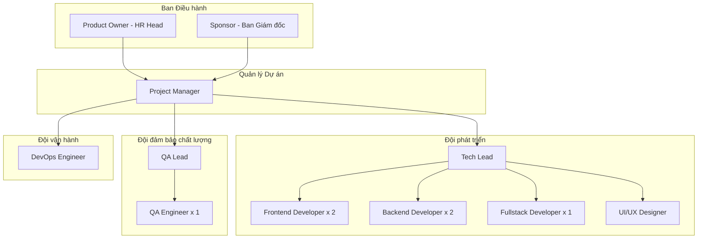
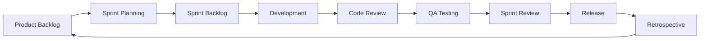
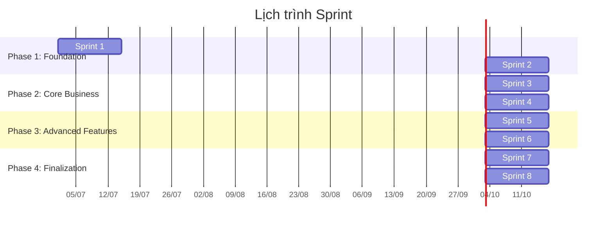
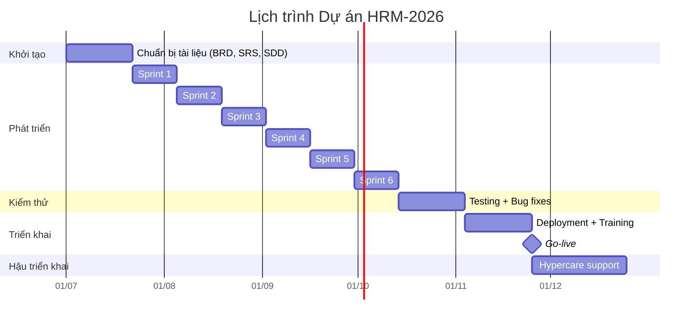
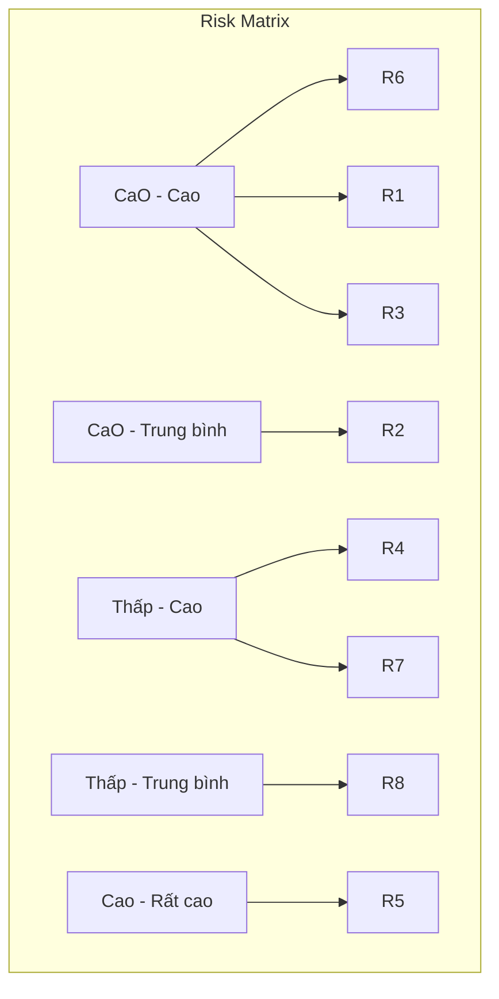
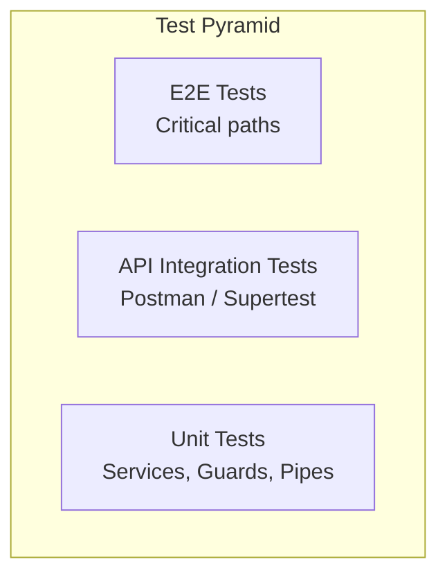
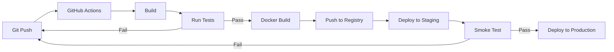

# Kế hoạch Dự án (Project Plan)

## Hệ thống Quản lý Nhân sự (HR Management)

| Phiên bản | Ngày       | Người soạn | Mô tả            |
|-----------|------------|------------|------------------|
| 1.0       | 17/06/2026 | PM Team    | Phiên bản đầu tiên |

---

## Mục lục

1. [Tổng quan dự án](#1-tổng-quan-dự-án)
2. [Phạm vi và mục tiêu](#2-phạm-vi-và-mục-tiêu)
3. [Tổ chức dự án](#3-tổ-chức-dự-án)
4. [Phương pháp phát triển](#4-phương-pháp-phát-triển)
5. [Kế hoạch Sprint](#5-kế-hoạch-sprint)
6. [Lịch trình tổng thể](#6-lịch-trình-tổng-thể)
7. [Phân bổ nguồn lực](#7-phân-bổ-nguồn-lực)
8. [Kế hoạch quản lý rủi ro](#8-kế-hoạch-quản-lý-rủi-ro)
9. [Kế hoạch kiểm thử](#9-kế-hoạch-kiểm-thử)
10. [Kế hoạch triển khai](#10-kế-hoạch-triển-khai)
11. [Kế hoạch đào tạo](#11-kế-hoạch-đào-tạo)
12. [Ngân sách dự kiến](#12-ngân-sách-dự-kiến)

---

## 1. Tổng quan dự án

### 1.1 Thông tin dự án

| Trường             | Giá trị                                           |
|--------------------|---------------------------------------------------|
| **Tên dự án**      | Hệ thống Quản lý Nhân sự (HR Management)          |
| **Mã dự án**       | HRM-2026                                          |
| **Khách hàng**     | Nội bộ doanh nghiệp                               |
| **Nhà phát triển** | Đội ngũ phát triển nội bộ / Đối tác gia công       |
| **Ngày bắt đầu**   | 01/07/2026                                        |
| **Ngày kết thúc**  | 31/12/2026                                        |
| **Thời gian**      | 6 tháng                                           |

### 1.2 Mô tả dự án

Xây dựng hệ thống quản lý nhân sự toàn diện dạng web SPA (Single Page Application) với kiến trúc React + NestJS + MongoDB.

### 1.3 Stakeholders chính

| Stakeholder      | Vai trò                       | Đại diện       |
|------------------|-------------------------------|----------------|
| Sponsor          | Nhà tài trợ dự án             | Ban Giám đốc   |
| Product Owner    | Chịu trách nhiệm sản phẩm     | Trưởng phòng HR|
| Project Manager  | Quản lý dự án                 | PM             |
| Tech Lead        | Kiến trúc & kỹ thuật          | IT Manager     |
| QA Lead          | Đảm bảo chất lượng            | QA Lead        |

---

## 2. Phạm vi và mục tiêu

### 2.1 Mục tiêu SMART

| Mục tiêu                                                        | Chỉ số KPI                | Deadline   |
|-----------------------------------------------------------------|---------------------------|------------|
| Giảm thời gian xử lý đơn nghỉ phép từ 2-3 ngày xuống < 5 phút  | Thời gian xử lý           | 30/09/2026 |
| Tập trung 100% hồ sơ nhân viên trên hệ thống                   | % hồ sơ số hóa            | 31/10/2026 |
| Giảm 80% thời gian tính lương hàng tháng                       | Thời gian tính lương      | 30/11/2026 |
| 95% nhân viên sử dụng hệ thống                                  | Tỷ lệ sử dụng             | 31/12/2026 |

### 2.2 Deliverables

| STT | Deliverable            | Mô tả                                   | Ngày dự kiến |
|:---:|------------------------|-----------------------------------------|:------------:|
| 1   | BRD                    | Tài liệu yêu cầu nghiệp vụ             | 07/07/2026   |
| 2   | SRS                    | Đặc tả yêu cầu phần mềm                | 14/07/2026   |
| 3   | SDD                    | Đặc tả thiết kế phần mềm               | 21/07/2026   |
| 4   | MVP (Sprint 1-4)       | Sản phẩm tối thiểu (Auth + CRUD core)  | 22/09/2026   |
| 5   | Full features          | Đầy đủ tính năng                       | 17/11/2026   |
| 6   | Test report            | Báo cáo kiểm thử                       | 01/12/2026   |
| 7   | Deployment             | Triển khai production                  | 15/12/2026   |
| 8   | User Manual            | Hướng dẫn sử dụng                      | 20/12/2026   |
| 9   | Training               | Đào tạo người dùng                     | 22-24/12/2026|
| 10  | Go-live                | Chính thức vận hành                    | 31/12/2026   |

---

## 3. Tổ chức dự án

### 3.1 Cấu trúc đội nhóm

### 3.2 Vai trò và trách nhiệm

| Vai trò             | Người      | Trách nhiệm chính                                |
|---------------------|------------|---------------------------------------------------|
| Project Manager     | PM         | Lịch trình, ngân sách, giao tiếp, báo cáo        |
| Product Owner       | HR Head    | Yêu cầu, prioritization, accept/reject           |
| Tech Lead           | IT Lead    | Kiến trúc, code review, technical decisions      |
| Frontend Developer  | FE Dev x2  | React components, API integration, UI             |
| Backend Developer   | BE Dev x2  | NestJS services, APIs, database                   |
| Fullstack Developer | FS Dev     | Hỗ trợ cả FE và BE                                |
| UI/UX Designer      | Designer   | Mockup, prototype, design system                  |
| QA Lead             | QA Lead    | Test plan, test cases, test execution             |
| QA Engineer         | QA Eng     | Manual + automation testing                       |
| DevOps Engineer     | DevOps     | CI/CD, Docker, deployment, monitoring             |

### 3.3 Phân công theo module

| Module              | FE     | BE     | UI     | Ưu tiên |
|---------------------|:------:|:------:|:------:|:-------:|
| Auth & Profile      | Dev 1  | Dev 3  | Des    | Sprint 1 |
| Employees           | Dev 1  | Dev 3  | Des    | Sprint 1 |
| Departments         | Dev 2  | Dev 4  | Des    | Sprint 1 |
| Leaves              | Dev 1  | Dev 3  | Des    | Sprint 2 |
| Attendance          | Dev 2  | Dev 4  | Des    | Sprint 2 |
| Payroll             | Dev 1  | Dev 3  | Des    | Sprint 3 |
| Dashboard           | Dev 2  | Dev 4  | Des    | Sprint 3 |
| Notifications       | FS     | FS     | Des    | Sprint 4 |
| Recruitment         | Dev 1  | Dev 3  | Des    | Sprint 5 |
| Performance Reviews | Dev 2  | Dev 4  | Des    | Sprint 5 |
| UI/UX Polish        | Dev 1,2| -      | Des    | Sprint 6 |
| i18n + Dark Mode    | FS     | -      | Des    | Sprint 6 |

---

## 4. Phương pháp phát triển

### 4.1 Scrum

Dự án sử dụng **Scrum** với:

| Yếu tố             | Giá trị                        |
|--------------------|--------------------------------|
| Sprint length      | 2 tuần                         |
| Ceremonies         | Sprint Planning, Daily, Review, Retro |
| Estimation         | Story Points (Fibonacci)        |
| Velocity target    | 20 SP / sprint                 |
| Definition of Done| Code complete + Tested + Reviewed + Documented |

### 4.2 Quy trình phát triển

### 4.3 Công cụ

| Công cụ        | Mục đích                     |
|----------------|------------------------------|
| Jira / Trello  | Quản lý tasks, backlog       |
| GitHub         | Code repository, PR, issues  |
| GitHub Actions | CI/CD                        |
| Slack          | Giao tiếp hàng ngày          |
| Google Meet    | Họp Sprint                   |
| Confluence     | Tài liệu dự án               |

---

## 5. Kế hoạch Sprint

### 5.1 Tổng quan Phase

### 5.2 Sprint 1: Foundation (01/07 - 14/07)

**Mục tiêu**: Thiết lập dự án, auth, CRUD cơ bản

| Task                     | SP | Assignee | Mô tả                          |
|--------------------------|:--:|:--------:|--------------------------------|
| Thiết lập dự án FE + BE  | 3  | FS       | React + NestJS + MongoDB setup |
| UI Design System         | 5  | Des      | shadcn/ui components           |
| User schema + Auth API   | 5  | BE 3     | Register, Login, JWT           |
| Login page               | 3  | FE 1     | Form + validation              |
| Employee CRUD API        | 8  | BE 3     | CRUD + search + pagination     |
| Employee list page       | 5  | FE 1     | DataTable + search             |
| Employee detail page     | 5  | FE 1     | Detail view                    |
| Department CRUD API      | 5  | BE 4     | CRUD + search                    |
| Department list page     | 3  | FE 2     | Table + CRUD dialogs           |
| Org Chart API + Page     | 5  | BE 4+FE2 | Org chart endpoint + UI        |
| **Tổng**                 |**47**|        |                               |

### 5.3 Sprint 2: Leaves + Attendance (15/07 - 28/07)

**Mục tiêu**: Quy trình nghỉ phép và chấm công

| Task                          | SP | Assignee | Mô tả                            |
|-------------------------------|:--:|:--------:|----------------------------------|
| Leave schema + CRUD API       | 5  | BE 3     | Create, list, validate overlap   |
| Leave balance schema + API    | 3  | BE 3     | CRUD + deduct logic              |
| Leave approval API            | 5  | BE 3     | Approve/reject + notification trigger |
| My leaves page                | 5  | FE 1     | Table + create dialog            |
| Leave approvals page          | 5  | FE 1     | Approve/reject buttons           |
| Leave balance cards           | 3  | FE 1     | Progress bar cards               |
| Attendance schema + API       | 5  | BE 4     | Check-in/out + auto status       |
| My attendance page            | 5  | FE 2     | Check-in/out + history table     |
| Attendance report page        | 5  | FE 2     | Stats + distribution chart       |
| **Tổng**                      |**41**|        |                                  |

### 5.4 Sprint 3: Payroll + Dashboard (29/07 - 11/08)

**Mục tiêu**: Xử lý lương và dashboard

| Task                          | SP | Assignee | Mô tả                            |
|-------------------------------|:--:|:--------:|----------------------------------|
| Payroll schema + API          | 5  | BE 3     | Process, pay, list               |
| Payroll process dialog        | 5  | FE 1     | Month/year/employee selection    |
| My payroll page               | 3  | FE 1     | Employee view                    |
| Payroll management page       | 5  | FE 1     | Admin view + mark paid           |
| Dashboard API                 | 5  | BE 4     | Role-based stats, charts data    |
| Dashboard page (admin)        | 5  | FE 2     | Stat cards + bar chart           |
| Dashboard page (manager)      | 3  | FE 2     | Department stats                 |
| Dashboard page (employee)     | 5  | FE 2     | Pie chart + bar chart            |
| **Tổng**                      |**36**|        |                                  |

### 5.5 Sprint 4: Notifications + Polish (12/08 - 25/08)

**Mục tiêu**: Thông báo real-time, profile, cải thiện UX

| Task                          | SP | Assignee | Mô tả                            |
|-------------------------------|:--:|:--------:|----------------------------------|
| Notification schema + API     | 3  | FS       | CRUD, mark read                  |
| Socket.IO gateway             | 5  | FS       | Real-time push + rooms           |
| Notification bell + badge     | 3  | FE 1     | Sidebar badge, toast             |
| Notifications list page       | 3  | FE 1     | List + mark read                 |
| Profile page                  | 5  | FE 2     | View + edit + change password    |
| Employee history API + UI     | 5  | BE+FE    | Timeline component               |
| Unsaved changes guard         | 3  | FE 2     | Prevent accidental navigation    |
| Keyboard shortcuts            | 3  | FE 1     | G+D, G+L, ? help dialog         |
| Route loading indicator       | 2  | FE 2     | Top progress bar                 |
| **Tổng**                      |**32**|        |                                  |

### 5.6 Sprint 5: Recruitment + Performance (26/08 - 08/09)

**Mục tiêu**: Tuyển dụng và đánh giá hiệu suất

| Task                          | SP | Assignee | Mô tả                            |
|-------------------------------|:--:|:--------:|----------------------------------|
| Job posting schema + API      | 5  | BE 3     | CRUD + filter                    |
| Candidate schema + API        | 5  | BE 3     | CRUD + status management         |
| Job postings page             | 5  | FE 1     | Table + CRUD dialogs             |
| Candidates page               | 5  | FE 1     | Table + CRUD + filter by posting |
| Performance review API        | 5  | BE 4     | CRUD + role-based scoping        |
| My reviews page               | 3  | FE 2     | Card list                        |
| Review management page        | 5  | FE 2     | Table + CRUD dialogs             |
| **Tổng**                      |**33**|        |                                  |

### 5.7 Sprint 6: Polish (09/09 - 22/09)

**Mục tiêu**: i18n, dark mode, responsive, bug fixes

| Task                          | SP | Assignee | Mô tả                            |
|-------------------------------|:--:|:--------:|----------------------------------|
| i18n English translations     | 5  | FE 1     | ~830 keys                        |
| i18n Vietnamese translations  | 5  | FE 1     | ~830 keys                        |
| Language switcher UI          | 3  | FE 2     | Settings dialog + context         |
| Dark mode implementation      | 5  | FE 2     | CSS variables, toggle            |
| Responsive layout             | 5  | FE 1     | Mobile sidebar, breakpoints      |
| Error boundaries              | 3  | FS       | Global error handling            |
| Loading skeletons             | 3  | FE 2     | Skeleton components              |
| Empty states                  | 2  | FE 1     | EmptyState components            |
| **Tổng**                      |**31**|        |                                  |

### 5.8 Sprint 7: Testing (23/09 - 06/10)

**Mục tiêu**: Kiểm thử toàn diện

| Task                          | SP | Assignee | Mô tả                            |
|-------------------------------|:--:|:--------:|----------------------------------|
| Test plan                     | 3  | QA Lead  | Strategy, scope, resources       |
| Test cases (all modules)      | 8  | QA Eng   | Chi tiết test cases              |
| Manual testing                | 8  | QA Eng   | Smoke + regression + UAT         |
| API testing (Postman)         | 5  | BE team  | End-to-end API tests             |
| Performance testing           | 5  | DevOps   | Load test, stress test           |
| Security audit                | 5  | TL       | JWT, CORS, rate limiting         |
| Bug fixing                    | 8  | Dev team | Fix bugs found                   |
| **Tổng**                      |**42**|        |                                  |

### 5.9 Sprint 8: Deployment (07/10 - 20/10)

**Mục tiêu**: Triển khai production

| Task                          | SP | Assignee | Mô tả                            |
|-------------------------------|:--:|:--------:|----------------------------------|
| Docker setup                  | 3  | DevOps   | Dockerfile, docker-compose       |
| CI/CD pipeline                | 5  | DevOps   | GitHub Actions                   |
| Staging deployment            | 3  | DevOps   | Test environment                 |
| Production deployment         | 5  | DevOps   | Production release               |
| Monitoring setup              | 3  | DevOps   | Logs, metrics, alerts            |
| User manual                   | 5  | PM+PO    | Comprehensive user guide         |
| Training materials            | 5  | PO       | Slides, videos, guides           |
| User training                 | 5  | PO+PM    | 3-day training sessions          |
| Go-live support               | 5  | Dev team | On-site support during go-live   |
| **Tổng**                      |**39**|        |                                  |

---

## 6. Lịch trình tổng thể

### 6.1 Timeline

### 6.2 Các mốc quan trọng (Milestones)

| Milestone                | Ngày       | Mô tả                                |
|--------------------------|------------|---------------------------------------|
| M1: Tài liệu hoàn thành  | 21/07/2026 | BRD, SRS, SDD phê duyệt              |
| M2: MVP hoàn thành       | 15/09/2026 | Sprint 1-4: Auth, Employees, Leaves, Attendance, Payroll, Dashboard |
| M3: Full features        | 13/10/2026 | Sprint 5-6: Recruitment, Performance, i18n, Dark Mode |
| M4: Sẵn sàng UAT         | 03/11/2026 | Testing hoàn thành, staging sẵn sàng |
| M5: Go-live              | 25/11/2026 | Production deployment                |
| M6: Kết thúc hỗ trợ      | 25/12/2026 | Kết thúc hypercare support            |

---

## 7. Phân bổ nguồn lực

### 7.1 Nhân sự

| Vai trò             | Số lượng | Tham gia từ | Tham gia đến | Full/Part-time |
|---------------------|:--------:|:-----------:|:------------:|:--------------:|
| Project Manager     | 1        | 01/07       | 31/12        | Full-time      |
| Tech Lead           | 1        | 01/07       | 31/12        | Full-time      |
| Frontend Developer  | 2        | 01/07       | 31/12        | Full-time      |
| Backend Developer   | 2        | 01/07       | 31/12        | Full-time      |
| Fullstack Developer | 1        | 01/07       | 31/12        | Full-time      |
| UI/UX Designer      | 1        | 01/07       | 31/08        | Part-time      |
| QA Lead             | 1        | 01/07       | 31/12        | Full-time      |
| QA Engineer         | 1        | 01/08       | 31/12        | Full-time      |
| DevOps Engineer     | 1        | 01/10       | 31/12        | Part-time      |
| **Tổng nhân sự**    | **11**   |             |              |                |

### 7.2 Person-months

| Tháng   | Số người | Person-months |
|:-------:|:--------:|:-------------:|
| 07/2026 | 9        | 9             |
| 08/2026 | 10       | 10            |
| 09/2026 | 10       | 10            |
| 10/2026 | 11       | 11            |
| 11/2026 | 11       | 11            |
| 12/2026 | 11       | 11            |
| **Tổng**|          | **62**        |

---

## 8. Kế hoạch quản lý rủi ro

### 8.1 Danh sách rủi ro

| ID  | Rủi ro                                    | Xác suất | Tác động | Điểm | Chiến lược              |
|:---:|-------------------------------------------|:--------:|:--------:|:----:|-------------------------|
| R1  | Thay đổi yêu cầu nghiệp vụ                | Cao      | Trung bình| 9   | Chấp nhận + Buffer     |
| R2  | Nhân sự nghỉ việc giữa chừng              | Trung bình| Cao     | 8    | Giảm thiểu + Cross-training |
| R3  | Chậm tiến độ do ước lượng sai             | Cao      | Trung bình| 9   | Chấp nhận + Buffer SP  |
| R4  | Hiệu năng database kém                    | Thấp     | Cao      | 6    | Giảm thiểu + Indexing + Load test |
| R5  | Bảo mật thông tin nhân viên              | Thấp     | Rất cao  | 10   | Giảm thiểu + Audit + JWT |
| R6  | Người dùng từ chối sử dụng hệ thống       | Cao      | Cao      | 12   | Giảm thiểu + Training + Change management |
| R7  | Tích hợp với hệ thống khác khó khăn       | Thấp     | Cao      | 6    | Tránh (out of scope)    |
| R8  | Vấn đề về license / bản quyền             | Thấp     | Trung bình| 4   | Chấp nhận (open source) |

### 8.2 Risk Matrix

### 8.3 Risk Response Plan

| Rủi ro | Response Plan                                     |
|:------:|---------------------------------------------------|
| R1     | Sprint review mỗi 2 tuần, product backlog refinement liên tục |
| R2     | Mỗi module có 2 người biết, code review, tài liệu đầy đủ |
| R3     | Sprint buffer 20%, không thêm tính năng giữa sprint |
| R4     | Index từ đầu, load test trước release            |
| R5     | JWT + bcrypt + rate limiting + security audit     |
| R6     | Training kỹ, support 1:1, demo lợi ích, có giai đoạn chuyển đổi |
| R7     | API-first design, webhook cho tích hợp sau       |

---

## 9. Kế hoạch kiểm thử

### 9.1 Chiến lược kiểm thử

| Loại test     | Công cụ         | Mục tiêu coverage | Thực hiện bởi |
|---------------|-----------------|:------------------:|:-------------:|
| Unit tests    | Jest            | > 70% services     | Dev team      |
| API tests     | Postman / Supertest | 100% endpoints | Dev + QA    |
| Integration   | Supertest + MongoMemoryServer | Critical flows | QA     |
| E2E           | Playwright      | User journeys      | QA            |
| Performance   | k6 / Artillery  | 100 concurrent users | DevOps      |
| Security      | Manual + tools  | OWASP top 10       | TL + DevOps   |
| UAT           | Manual          | Acceptance criteria | PO + HR team |

### 9.2 Test schedule

| Sprint | Loại test                          |
|:------:|------------------------------------|
| 1-6    | Unit tests (dev), API tests (dev)  |
| 7      | Full regression, Integration, E2E  |
| 8      | UAT, Performance, Security         |

---

## 10. Kế hoạch triển khai

### 10.1 Môi trường

| Môi trường | URL                        | Cấu hình          | Dùng để       |
|------------|----------------------------|-------------------|---------------|
| Development| localhost:5173 (FE), 3001 (BE) | Local machine | Phát triển    |
| Staging    | staging.hr.company.com     | 2 vCPU, 4GB RAM  | Testing, UAT  |
| Production | hr.company.com             | 4 vCPU, 8GB RAM  | Production    |

### 10.2 Quy trình triển khai

### 10.3 Rollback plan

Nếu production gặp sự cố:
1. Giữ nguyên phiên bản trước (previous Docker image)
2. Chạy `docker-compose down && docker-compose up`
3. Thông báo cho team
4. Debug và hotfix

---

## 11. Kế hoạch đào tạo

### 11.1 Đối tượng

| Nhóm       | Số lượng | Nội dung                        | Thời gian    |
|------------|:--------:|---------------------------------|:------------:|
| Admin      | 3        | Toàn bộ hệ thống, config, backup| 1 ngày       |
| Manager    | 10       | Duyệt đơn, báo cáo, dashboard   | 0.5 ngày     |
| Employee   | 50       | Nghỉ phép, chấm công, profile   | 2 tiếng      |

### 11.2 Hình thức

- **Trực tiếp**: Training hands-on cho Admin và Manager
- **Video hướng dẫn**: Ghi lại màn hình, đăng lên internal wiki
- **User Manual**: Tài liệu PDF, link trong hệ thống
- **FAQ**: Câu hỏi thường gặp

---

## 12. Ngân sách dự kiến

### 12.1 Chi phí nhân sự (ước tính)

| Vai trò             | Person-months | Đơn giá (VNĐ) | Thành tiền (VNĐ) |
|---------------------|:-------------:|:------------:|:----------------:|
| Project Manager     | 6             | -            | -                |
| Tech Lead           | 6             | -            | -                |
| Frontend Developer  | 12            | -            | -                |
| Backend Developer   | 12            | -            | -                |
| Fullstack Developer | 6             | -            | -                |
| UI/UX Designer      | 2             | -            | -                |
| QA Lead             | 6             | -            | -                |
| QA Engineer         | 5             | -            | -                |
| DevOps Engineer     | 3             | -            | -                |
| **Tổng nhân sự**    | **58**        |              | **Chưa xác định** |

### 12.2 Chi phí khác

| Khoản mục               | Chi phí (VNĐ) |
|-------------------------|:-------------:|
| Server (6 tháng)        | -             |
| MongoDB Atlas           | -             |
| Domain                  | -             |
| Công cụ (Jira, Slack)   | -             |
| **Tổng chi phí khác**   | **Chưa xác định** |

> *Ghi chú: Chi phí cụ thể cần được cập nhật sau khi có báo giá từ nhà cung cấp dịch vụ.*

---

## Phụ lục: Glossary

| Thuật ngữ     | Giải thích                                        |
|---------------|---------------------------------------------------|
| Sprint        | Chu kỳ phát triển 2 tuần trong Scrum              |
| Story Point   | Đơn vị ước lượng độ phức tạp công việc            |
| MVP           | Minimum Viable Product - Sản phẩm tối thiểu       |
| UAT           | User Acceptance Testing - Kiểm thử người dùng     |
| Go-live       | Ngày chính thức đưa hệ thống vào vận hành         |
| Hypercare     | Giai đoạn hỗ trợ đặc biệt ngay sau go-live        |
| PRD           | Product Requirements Document                     |
| ADR           | Architecture Decision Record                      |
