# Đặc tả Thiết kế Phần mềm (SDD)

## Hệ thống Quản lý Nhân sự (HR Management)

| Phiên bản | Ngày       | Người soạn | Mô tả                        |
|-----------|------------|------------|------------------------------|
| 1.0       | 17/06/2026 | HR Team    | Phiên bản đầu tiên           |
| 2.0       | 22/06/2026 | HR Team    | Cập nhật theo IEEE 1016       |

> **Trạng thái triển khai:** Auth, Employees, Departments, Leaves, Attendance, Payroll, LeaveBalance, Notifications đã triển khai (Spring Boot + MySQL). Dashboard, EmployeeHistory, Recruitment, Performance Reviews, Socket.IO chưa triển khai (đang kế hoạch).
>
> > **Ghi chú kiến trúc thực tế:** Hệ thống được triển khai với **Spring Boot 4.1 + MySQL 8** (JPA/Hibernate) thay vì Express + MongoDB như thiết kế ban đầu. Các sơ đồ và mô tả dưới đây đã được cập nhật tương ứng.

---

## Mục lục

1. [Giới thiệu](#1-giới-thiệu)
   1.1 [Mục đích](#11-mục-đích)
   1.2 [Phạm vi](#12-phạm-vi)
   1.3 [Định nghĩa và từ viết tắt](#13-định-nghĩa-và-từ-viết-tắt)
   1.4 [Tài liệu tham khảo](#14-tài-liệu-tham-khảo)
   1.5 [Tổng quan tài liệu](#15-tổng-quan-tài-liệu)
2. [Thiết kế kiến trúc tổng thể](#2-thiết-kế-kiến-trúc-tổng-thể)
   2.1 [Kiến trúc hệ thống](#21-kiến-trúc-hệ-thống)
   2.2 [Phân rã kiến trúc](#22-phân-rã-kiến-trúc)
   2.3 [Chiến lược thiết kế](#23-chiến-lược-thiết-kế)
   2.4 [Quyết định kiến trúc](#24-quyết-định-kiến-trúc)
3. [Thiết kế thành phần Client](#3-thiết-kế-thành-phần-client)
   3.1 [Phân rã thành phần](#31-phân-rã-thành-phần)
   3.2 [Mô tả chi tiết thành phần](#32-mô-tả-chi-tiết-thành-phần)
   3.3 [Luồng dữ liệu Client](#33-luồng-dữ-liệu-client)
   3.4 [Chi tiết Route](#34-chi-tiết-route)
   3.5 [Các hooks chính](#35-các-hooks-chính)
   3.6 [Giao diện người dùng](#36-giao-diện-người-dùng)
4. [Thiết kế thành phần Server](#4-thiết-kế-thành-phần-server)
   4.1 [Phân rã thành phần](#41-phân-rã-thành-phần)
   4.2 [Chi tiết Route Handlers](#42-chi-tiết-route-handlers)
   4.3 [Chi tiết Service Layer](#43-chi-tiết-service-layer)
   4.4 [Middleware Chain](#44-middleware-chain)
   4.5 [Seed Script](#45-seed-script)
5. [Thiết kế Cơ sở dữ liệu](#5-thiết-kế-cơ-sở-dữ-liệu)
   5.1 [Mô hình thực thể - quan hệ](#51-mô-hình-thực-thể---quan-hệ)
   5.2 [Chi tiết Schema](#52-chi-tiết-schema)
   5.3 [Chiến lược Index](#53-chiến-lược-index)
   5.4 [Chiến lược Embedding](#54-chiến-lược-embedding)
6. [Thiết kế Giao diện](#6-thiết-kế-giao-diện)
   6.1 [Thiết kế API REST](#61-thiết-kế-api-rest)
   6.2 [Định dạng Response](#62-định-dạng-response)
   6.3 [Mã trạng thái HTTP](#63-mã-trạng-thái-http)
7. [Thiết kế Xác thực & Phân quyền](#7-thiết-kế-xác-thực--phân-quyền)
   7.1 [Luồng đăng nhập (Session)](#71-luồng-đăng-nhập-session)
   7.2 [Dữ liệu lưu trong Session](#72-dữ-liệu-lưu-trong-session)
   7.3 [Logic Role Middleware](#73-logic-role-middleware)
   7.4 [Scoped Data theo Role](#74-scoped-data-theo-role)
8. [Thiết kế Thông báo (API Polling)](#8-thiết-kế-thông-báo-api-polling)
   8.1 [Kiến trúc Polling](#81-kiến-trúc-polling)
   8.2 [Vòng đời Polling](#82-vòng-đời-polling)
9. [Thiết kế chi tiết Module](#9-thiết-kế-chi-tiết-module)
   9.1 [Class Diagram - Service Layer](#91-class-diagram---service-layer)
   9.2 [Sequence Diagram - Xử lý đơn nghỉ phép](#92-sequence-diagram---xử-lý-đơn-nghỉ-phép)
   9.3 [Sequence Diagram - Xử lý lương](#93-sequence-diagram---xử-lý-lương)
   9.4 [Sequence Diagram - Chấm công](#94-sequence-diagram---chấm-công)
10. [Thiết kế Triển khai](#10-thiết-kế-triển-khai)
    10.1 [Môi trường Development](#101-môi-trường-development)
    10.2 [Môi trường Production](#102-môi-trường-production)
11. [Thiết kế Bảo mật](#11-thiết-kế-bảo-mật)
    11.1 [Các lớp bảo mật](#111-các-lớp-bảo-mật)
    11.2 [Quy tắc xác thực mật khẩu](#112-quy-tắc-xác-thực-mật-khẩu)
12. [Thiết kế Xử lý lỗi](#12-thiết-kế-xử-lý-lỗi)
    12.1 [Server-side Error Handling](#121-server-side-error-handling)
    12.2 [Client-side Error Handling](#122-client-side-error-handling)
13. [Thiết kế Đa ngôn ngữ](#13-thiết-kế-đa-ngôn-ngữ)
    13.1 [Kiến trúc i18n](#131-kiến-trúc-i18n)
14. [Ràng buộc và Giả định thiết kế](#14-ràng-buộc-và-giả-định-thiết-kế)

---

## 1. Giới thiệu

### 1.1 Mục đích

Tài liệu này mô tả chi tiết thiết kế kiến trúc phần mềm cho hệ thống **Quản lý Nhân sự (HR Management)**, bao gồm kiến trúc tổng thể, thiết kế thành phần (client, server, database), thiết kế giao diện, thiết kế chi tiết module, triển khai và bảo mật. Tài liệu tuân theo chuẩn IEEE 1016 (IEEE Standard for Software Design Descriptions).

Đối tượng đọc: kiến trúc sư phần mềm, đội phát triển frontend và backend, đội QA, DevOps.

### 1.2 Phạm vi

Tài liệu bao gồm thiết kế cho toàn bộ hệ thống HR Management với kiến trúc client-server (React + Spring Boot + MySQL). Các module được thiết kế bao gồm: xác thực, nhân viên, phòng ban, nghỉ phép, chấm công, lương, thông báo, quỹ phép (leave balance). Dashboard, lịch sử nhân viên, tuyển dụng và đánh giá hiệu suất chưa được triển khai.

Tài liệu KHÔNG bao gồm: thiết kế chi tiết giao diện người dùng (UI mockups), thiết kế test cases, kế hoạch dự án.

### 1.3 Định nghĩa và từ viết tắt

| Thuật ngữ      | Ý nghĩa                                                          |
|----------------|------------------------------------------------------------------|
| Component      | Thành phần phần mềm có tính đóng gói cao, cung cấp dịch vụ qua interface |
| Module         | Đơn vị tổ chức code (file/thư mục) trong hệ thống                |
| Service        | Lớp xử lý nghiệp vụ, tách biệt khỏi route handler               |
| Route Handler  | Hàm xử lý HTTP request, gọi service tương ứng                   |
| Middleware     | Bộ lọc xử lý request (Filter) trong pipeline Spring Security     |
| REST           | Representational State Transfer - kiến trúc API                 |
| SPA            | Single Page Application                                         |
| Session        | Trạng thái đăng nhập do server quản lý, lưu trong HttpSession (Spring Session JDBC) |
| RBAC           | Role-Based Access Control                                       |

### 1.4 Tài liệu tham khảo

| Tài liệu              | Mô tả                                                   |
|-----------------------|---------------------------------------------------------|
| IEEE Std 1016-2009    | IEEE Standard for Software Design Descriptions          |
| SRS.md                | Đặc tả Yêu cầu Phần mềm (Software Requirements Specification) |
| BRD.md                | Tài liệu Yêu cầu Nghiệp vụ                              |
| UC.md                 | Đặc tả Use Case                                        |
| AGENTS.md             | Hướng dẫn phát triển dự án                              |

### 1.5 Tổng quan tài liệu

Tài liệu gồm 14 phần chính: Giới thiệu, Thiết kế kiến trúc tổng thể, Thiết kế thành phần Client, Thiết kế thành phần Server, Thiết kế Cơ sở dữ liệu, Thiết kế Giao diện, Thiết kế Xác thực & Phân quyền, Thiết kế Thông báo, Thiết kế chi tiết Module, Triển khai, Bảo mật, Xử lý lỗi, Đa ngôn ngữ, và Ràng buộc thiết kế.

---

## 2. Thiết kế kiến trúc tổng thể

### 2.1 Kiến trúc hệ thống

Hệ thống sử dụng kiến trúc client-server phân tách rõ ràng (Two-tier architectural pattern). Client (React SPA) giao tiếp với Server (Spring Boot) qua REST API. Server kết nối với MySQL 8 qua JPA/Hibernate.

```mermaid
graph TB
    subgraph "Client (React SPA)"
        UI[Giao diện người dùng]
        API_Layer[Tầng API Client]
        CACHE[TanStack Query Cache]
    end

    subgraph "Server (Spring Boot)"
        subgraph "Tầng Filter / Config"
            AUTH[SessionAuthenticationFilter]
            SECURITY[SecurityConfig]
            CORS[CorsConfig]
            VALIDATE[@Valid Validation]
        end
        subgraph "Tầng Controller"
            AC[AuthController]
            EC[EmployeeController]
            DC[DepartmentController]
            LC[LeaveController]
            ATC[AttendanceController]
            PC[PayrollController]
            NC[NotificationController]
            LBC[LeaveBalanceController]
        end
        subgraph "Tầng Service"
            AS[AuthService]
            ES[EmployeeService]
            DS[DepartmentService]
            LS[LeaveService]
            ATS[AttendanceService]
            PS[PayrollService]
            NS[NotificationService]
            LBS[LeaveBalanceService]
        end
        subgraph "Tầng Database"
            MYSQL[(MySQL 8)]
        end
    end

    subgraph "External"
        BROWSER[Web Browser]
    end

    BROWSER --> UI
    UI --> API_Layer
    API_Layer -->|HTTP/REST + Session cookie| AUTH
    AUTH --> SECURITY --> CORS
    CORS --> AC & EC & DC & LC & ATC & PC & NC & LBC
    AC --> AS; EC --> ES; DC --> DS; LC --> LS; ATC --> ATS
    PC --> PS; NC --> NS; LBC --> LBS
    AS & ES & DS & LS & ATS & PS & NS & LBS --> MYSQL
    LS --> LBS & NS
```

### 2.2 Phân rã kiến trúc

| Tầng             | Thành phần                    | Trách nhiệm                                        |
|------------------|-------------------------------|----------------------------------------------------|
| **Client**       | UI Layer (Components)         | Render giao diện, xử lý sự kiện người dùng         |
|                  | API Layer (Axios)             | Gọi REST API kèm session cookie, xử lý response    |
|                  | Query Layer (TanStack Query)  | Cache, refetch, optimistic updates                 |
|                  | Polling Layer (API polling)   | Poll unread-count (30s) và list (15s)              |
| **Server**       | Middleware Layer               | Session auth (SessionAuthenticationFilter), role check, validation |
|                  | Route Handler Layer            | Xử lý request, gọi service, trả về response        |
|                  | Service Layer                  | Business logic, gọi database, orchestration        |
|                  | Database Layer (JPA Repository)| Entity mapping, CRUD operations, query methods     |

### 2.3 Chiến lược thiết kế

| Nguyên tắc                  | Áp dụng                                                    |
|-----------------------------|------------------------------------------------------------|
| Separation of Concerns      | Tách routing, business logic, data access thành 3 tầng    |
| Single Responsibility       | Mỗi module/service chỉ xử lý một nghiệp vụ duy nhất       |
| Dependency Inversion        | Service phụ thuộc vào interface (JPA Repository)          |
| DRY (Don't Repeat Yourself)| Validation, error handling dùng chung qua middleware       |
| Convention over Configuration| Cấu trúc thư mục nhất quán: `controller/` → `service/` → `repository/` |

### 2.4 Quyết định kiến trúc

| ID   | Quyết định                            | Lý do                                                           |
|:----:|---------------------------------------|----------------------------------------------------------------|
| AD-01| Spring Boot (không Express)           | DI container mạnh, Spring Security tích hợp, JPA/Hibernate mature |
| AD-02| MySQL 8 thay vì MongoDB               | Quan hệ chuẩn hóa cho HR data, phù hợp với JPA entity mapping, wide hosting support |
| AD-03| Tách User và Employee                 | Cô lập thông tin xác thực khỏi HR profile                     |
| AD-04| Xác thực bằng session (Spring Session JDBC) | httpOnly session cookie do server quản lý, chống XSS tốt hơn token lưu trong localStorage |
| AD-05| API polling cho thông báo            | Không cần hạ tầng WebSocket; poll unread-count 30s, list 15s    |
| AD-06| TanStack Query thay vì Redux          | Tự động cache, refetch, không cần boilerplate cho API calls   |
| AD-07| HeroUI v3 thay vì shadcn/ui         | CSS-only (không cần Provider), component sẵn có + design tokens, tích hợp Tailwind 4 |
| AD-08| Zod (client) + Jakarta Validation (server)| Client dùng Zod/react-hook-form; server dùng Jakarta Validation (`@Valid`) |

---

## 3. Thiết kế thành phần Client

### 3.1 Phân rã thành phần

```mermaid
graph TB
    subgraph "Provider Layer"
        QC[QueryClientProvider]
        BR[BrowserRouter]
        AP[AuthProvider]
        LP[LanguageProvider]
    end

    subgraph "Layout"
        AL[AppLayout]
        SID[Sidebar]
        OUT[Outlet]
    end

    subgraph "Shared Components"
        PH[PageHeader] & SB[StatusBadge] & SK[Skeleton]
        ES[EmptyState] & BC[Breadcrumb] & EB[ErrorBoundary]
        RL[RouteLoading] & KS[KeyboardShortcuts] & UT[UnsavedChanges]
    end

    subgraph "UI Components (HeroUI)"
        BTN[Button] & BDG[Badge] & CRD[Card] & DLG[Dialog]
        INP[Input] & LBL[Label] & SLT[Select] & TBL[Table]
        TST[Toaster] & CMD[ConfirmDialog] & DT[DataTable]
        DTP[DataTablePagination] & DTC[DataTableColumnHeader]
        DTF[DataTableFacetedFilter]
    end

    subgraph "Pages"
        LOGIN[Login Page]
        EMPL[Employees List] & EMPD[Employee Detail]
        DEPT[Departments List] & ORG[Org Chart]
        PROF[Profile Page] & NOTI[Notifications List] & NF[Not Found]
        ML[My Leaves] & LA[Leave Approvals]
        MAT[My Attendance] & ATR[Attendance Report]
        MYP[My Payroll] & PYM[Payroll Management]
        SETT[Settings]
    end

    QC --> BR --> AP --> LP --> AL
    AL --> SID & OUT
    OUT --> LOGIN & EMPL & EMPD & DEPT & ORG & PROF & NOTI & NF & SETT
    OUT --> ML & LA & MAT & ATR & MYP & PYM
    AL --> KS & RL & UT & EB & TST
```

### 3.2 Mô tả chi tiết thành phần

#### 3.2.1 Provider Layer

| Thành phần            | Mô tả                                                       |
|-----------------------|-------------------------------------------------------------|
| `QueryClientProvider` | TanStack Query provider, quản lý cache và state async       |
| `BrowserRouter`       | React Router v6, định tuyến client-side SPA                 |
| `AuthProvider`        | Context cho user, login/logout functions; khôi phục phiên qua GET /api/auth/me khi có cookie JSESSIONID |
| `LanguageProvider`    | Context cho i18n: lang hiện tại, `t(key)` function          |

#### 3.2.2 Layout Components

| Thành phần   | Mô tả                                               |
|--------------|-----------------------------------------------------|
| `AppLayout`  | Layout chính: sidebar trái + content area + header |
| `Sidebar`    | Menu điều hướng, lọc theo role, badge thông báo    |
| `Outlet`     | React Router Outlet cho nội dung trang con         |

#### 3.2.3 Shared Components

| Thành phần           | Mô tả                                                       |
|----------------------|-------------------------------------------------------------|
| `PageHeader`         | Tiêu đề trang + breadcrumb + action buttons                |
| `StatusBadge`        | Badge màu theo trạng thái (pending/approved/rejected...)    |
| `Skeleton`           | Loading skeleton cho danh sách và chi tiết                 |
| `EmptyState`         | Thông báo khi không có dữ liệu                             |
| `Breadcrumb`         | Đường dẫn điều hướng                                       |
| `ErrorBoundary`      | Bắt lỗi React, hiển thị fallback UI                       |
| `RouteLoading`       | Progress bar khi chuyển route                              |
| `KeyboardShortcuts`  | Xử lý phím tắt toàn cục (G+D, G+L, Escape...)              |
| `UnsavedChanges`     | Guard khi rời form có dữ liệu chưa lưu                     |

#### 3.2.4 DataTable (Component phức hợp)

| Sub-component               | Mô tả                                        |
|-----------------------------|----------------------------------------------|
| `DataTable`                 | Bảng dữ liệu với sort, filter, search        |
| `DataTablePagination`       | Điều khiển phân trang (10/20/30/50 items)    |
| `DataTableColumnHeader`     | Header cột có thể sort                       |
| `DataTableFacetedFilter`    | Filter theo danh mục (department, status)    |

### 3.3 Luồng dữ liệu Client

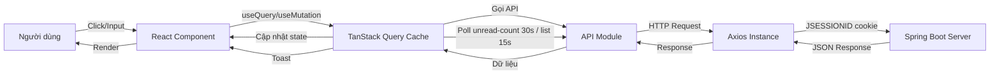

### 3.4 Chi tiết Route

```mermaid
graph TB
    ROOT[/] -->|redirect| LEAVES[/leaves]
    LOGIN[/login] -->|public| LOGIN
    EMP[/employees] -->|admin/manager| EMP
    EMPID[/employees/:id] -->|admin/manager/employee| EMPID
    PROF[/profile] -->|all| PROF
    DEPT[/departments] -->|admin/manager| DEPT
    ORG[/org-chart] -->|admin/manager| ORG
    LEAVES[/leaves] -->|all| LEAVES
    LEAVEA[/leaves/approvals] -->|admin/manager| LEAVEA
    ATT[/attendance] -->|all| ATT
    ATTR[/attendance/report] -->|admin/manager| ATTR
    PAY[/payroll] -->|all| PAY
    PAYM[/payroll/manage] -->|admin| PAYM
    NOTI[/notifications] -->|all| NOTI
    SETT[/settings] -->|all| SETT
    NF404["* (404)"] -->|any| NF404
```

### 3.5 Các hooks chính

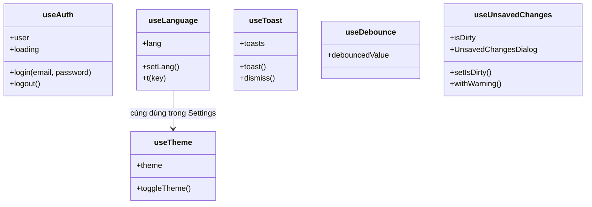

### 3.6 Giao diện người dùng

| Tính năng UX             | Mô tả                                                 |
|--------------------------|-------------------------------------------------------|
| Responsive               | Mobile-first, sidebar ẩn trên mobile, hamburger menu |
| Dark mode                | CSS variables + class `.dark` trên `<html>` (use-theme hook), toggle trong Settings |
| Đa ngôn ngữ              | Locale tiếng Việt duy nhất trong `locales/vi.ts` (~430 keys), truy cập qua `t()` |
| Skeleton loading         | Trên mọi danh sách và chi tiết                        |
| Empty state              | Khi không có dữ liệu                                  |
| Error boundary           | Global + per-component ErrorBoundary                  |
| Unsaved changes guard    | Cảnh báo khi rời form có dữ liệu chưa lưu             |
| Keyboard shortcuts       | G+D, G+E, G+L, G+A, G+P, Escape, ? help              |
| Phân trang               | 10/20/30/50 items per page, first/prev/next/last     |
| Toast notifications      | API polling (thông báo mới) + action feedback        |

---

## 4. Thiết kế thành phần Server

### 4.1 Phân rã thành phần

| Thành phần               | Đầu vào (file)                                           |
|--------------------------|----------------------------------------------------------|
| **Entry point**          | `server/src/main/java/.../AppApplication.java`           |
| **Controllers**          | `server/src/.../<module>/controller/*.java`              |
| **Services**             | `server/src/.../<module>/service/*.java`                 |
| **Entities/Repos**       | `server/src/.../<module>/entity/*.java` + `repository/`  |
| **DTOs**                 | `server/src/.../<module>/dto/*.java`                     |
| **Filter/Config**        | `server/src/.../auth/filter/` + `config/`                |

### 4.2 Chi tiết Route Handlers

| Module                 | Controller                                 | Routes                                      |
|------------------------|--------------------------------------------|---------------------------------------------|
| Auth                   | `auth/controller/AuthController.java`      | POST register/login, GET me, PUT profile, POST change-password |
| Employees              | `employee/controller/EmployeeController.java` | GET, GET me, GET export, GET /{id}, POST, POST bulk-delete, PUT /{id}, DELETE /{id} |
| Departments            | `department/controller/DepartmentController.java` | CRUD (GET, GET /{id}, POST, PUT /{id}, DELETE /{id}) |
| Leaves                 | `leave/controller/LeaveController.java`    | GET, POST, GET /{id}, PATCH /{id}/status    |
| Attendance             | `attendance/controller/AttendanceController.java` | GET, POST check-in, PATCH /{id}/check-out |
| Payroll                | `payroll/controller/PayrollController.java` | GET, POST process, PATCH /{id}/pay         |
| Notifications          | `notification/controller/NotificationController.java` | GET, GET unread-count, PATCH read-all, PATCH /{id}/read |
| Leave Balance          | `leavebalance/controller/LeaveBalanceController.java` | GET /my, GET /{employeeId} |

### 4.3 Chi tiết Service Layer

#### 4.3.1 AuthService

| Method                          | Tham số                                  | Trả về        | Mô tả                      |
|---------------------------------|------------------------------------------|---------------|----------------------------|
| `register(dto)`                 | `{ email, password }`                    | `AuthResponse` | Đăng ký, hash password, luôn tạo role `employee` |
| `login(dto)`                    | `{ email, password }`                    | `AuthResponse` | Xác thực bcrypt, lưu `userId`/`userRole` vào HttpSession, set maxInactiveInterval, đặt cookie JSESSIONID |
| `getMe(userId)`                 | `userId: string`                         | `Map`          | Lấy thông tin user        |
| `updateProfile(userId, dto)`    | `userId, { name?, email? }`              | `Map`          | Cập nhật profile          |
| `changePassword(userId, dto)`   | `userId, { currentPassword, newPassword }`| `Map`         | Đổi mật khẩu              |

#### 4.3.2 EmployeeService

| Method                          | Tham số                                  | Trả về        | Mô tả                      |
|---------------------------------|------------------------------------------|---------------|----------------------------|
| `findAll(query, user)`          | `{ search, departmentId, page, limit }`  | `PaginatedResponse`| Danh sách + phân trang |
| `findOne(id, user)`             | `id: string`                             | `Employee`    | Chi tiết, kiểm tra scope  |
| `create(dto)`                   | Employee DTO                             | `Employee`    | Tạo mới                    |
| `update(id, dto)`               | `id, EmployeeDTO`                        | `Employee`    | Cập nhật                   |
| `remove(id)`                    | `id: string`                             | `void`        | Xóa                        |
| `bulkDelete(ids)`               | `ids: string[]`                          | `Map`         | Xóa hàng loạt              |
| `getMyEmployee(userId)`         | `userId: string`                         | `Employee`    | Employee profile của user hiện tại |
| `exportCsv(user)`               | `user`                                   | `void`        | Xuất CSV (ghi vào HttpServletResponse) |
| `findByUserId(userId)`          | `userId: string`                         | `Employee`    | Tìm employee theo userId   |

#### 4.3.3 LeaveService

| Method                          | Tham số                                  | Trả về        | Mô tả                      |
|---------------------------------|------------------------------------------|---------------|----------------------------|
| `findAll(query, user)`          | `{ status, type, ... }`                  | `Leave[]`     | Danh sách, scoped         |
| `findOne(id, user)`             | `id`                                     | `Leave`       | Chi tiết                   |
| `create(dto, userId)`           | `{ type, startDate, endDate, reason }`   | `Leave`       | Tạo đơn + validate overlap|
| `updateStatus(id, dto, userId)` | `{ status, rejectionReason? }`           | `Leave`       | Duyệt/từ chối + deduct    |
| `-validateOverlap(...)`         | `employeeId, startDate, endDate`         | `void`        | Kiểm tra chồng chéo (private)|
| `-calculateDays(...)`           | `startDate, endDate`                     | `number`      | Tính số ngày (private)     |

### 4.4 Middleware Chain

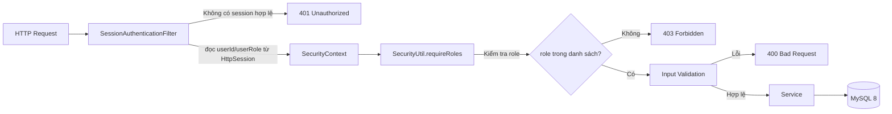

| Filter/Middleware          | Thứ tự | Trách nhiệm                                          |
|---------------------------|:------:|------------------------------------------------------|
| Spring Security Filter Chain | 1  | Bảo mật, session management, CSRF enable (header `X-XSRF-TOKEN`) |
| SessionAuthenticationFilter | 2    | Đọc `userId`/`userRole` từ HttpSession, gán SecurityContext |
| `SecurityUtil.requireRoles()` | 3  | Kiểm tra user role với danh sách allowed roles       |
| `@Valid` / Jakarta Validation | 4  | Validate input từ request body/param/query           |
| Controller Handler        | 5      | Xử lý request và gọi service                         |
| `@ControllerAdvice`       | -1     | Bắt tất cả exception, trả về JSON error              |

### 4.5 Seed Script

Chạy qua Maven profile `seed`: `mvn spring-boot:run -Dspring-boot.run.profiles=seed`. `DataSeeder.java` (implements `CommandLineRunner`) tạo dữ liệu mẫu: 1 admin, 6 managers, ~50 employees, 6 departments, leave balances, realistic attendance (2 tháng, hồ sơ punctuality theo nhân viên), và bảng lương thực tế (BHXH 8%, BHYT 1.5%, BHTN 1%, Công đoàn 1%, thuế TNCN lũy tiến 5 bậc, bonus = 0). Seed xong tự thoát.

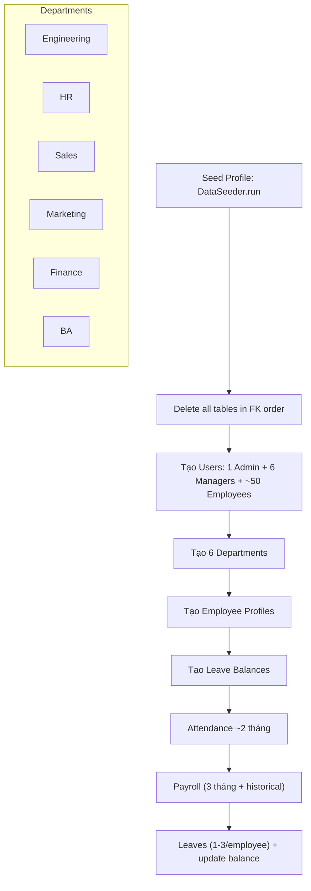

---

## 5. Thiết kế Cơ sở dữ liệu

### 5.1 Mô hình thực thể - quan hệ

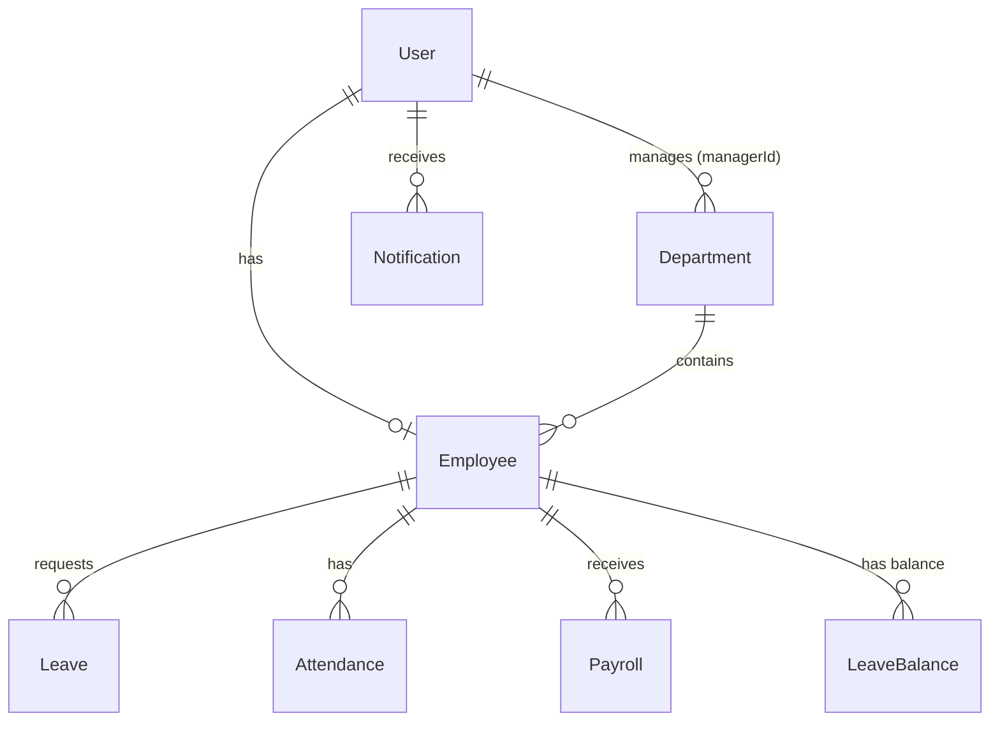

### 5.2 Chi tiết Schema

(Xem chi tiết các bảng tại SRS.md Phần 4 - Mô hình dữ liệu)

**Quan hệ giữa các Model:**

| Model              | Reference         | Type      | Ràng buộc              |
|--------------------|-------------------|-----------|------------------------|
| Employee.userId    | User.id           | 1-1       | Unique                 |
| Employee.departmentId| Department.id  | N-1       | Required               |
| Leave.employeeId   | Employee.id       | N-1       | Required               |
| Leave.approvedBy   | User.id           | N-1       | Optional               |
| Attendance.employeeId| Employee.id     | N-1       | Required               |
| Payroll.employeeId | Employee.id       | N-1       | Required               |
| LeaveBalance.employeeId| Employee.id  | 1-1       | Unique                 |
| Notification.userId| User.id           | N-1       | Required               |

### 5.3 Chiến lược Index

| Bảng               | Index                             | Loại      | Mục đích                          |
|--------------------|-----------------------------------|-----------|-----------------------------------|
| User               | `email`                           | Unique    | Login lookup                      |
| Employee           | `departmentId`                    | Single    | Lọc nhân viên theo phòng          |
| Employee           | `userId`                          | Unique    | Tìm employee từ session userId    |
| Leave              | `employeeId + status`             | Compound  | Lọc đơn theo NV + trạng thái      |
| Leave              | `employeeId + startDate + endDate`| Compound  | Kiểm tra chồng chéo               |
| Attendance         | `employeeId + date`               | Unique    | 1 bản ghi/ngày                    |
| Payroll            | `employeeId + month + year`       | Unique    | Chống trùng lặp                   |
| LeaveBalance       | `employeeId`                      | Unique    | 1 quỹ phép/NV                    |
| Notification       | `userId + isRead + createdAt`     | Compound  | Lấy thông báo chưa đọc            |
| Department         | `name`                            | Unique    | Tên phòng không trùng             |

### 5.4 Chiến lược Embedding

Hệ thống dùng MySQL 8 quan hệ (JPA/Hibernate): mọi quan hệ đều được thể hiện bằng khóa ngoại (foreign key), **không có embedded documents**. `Employee` không có trường `documents`; không có tính năng upload tài liệu.

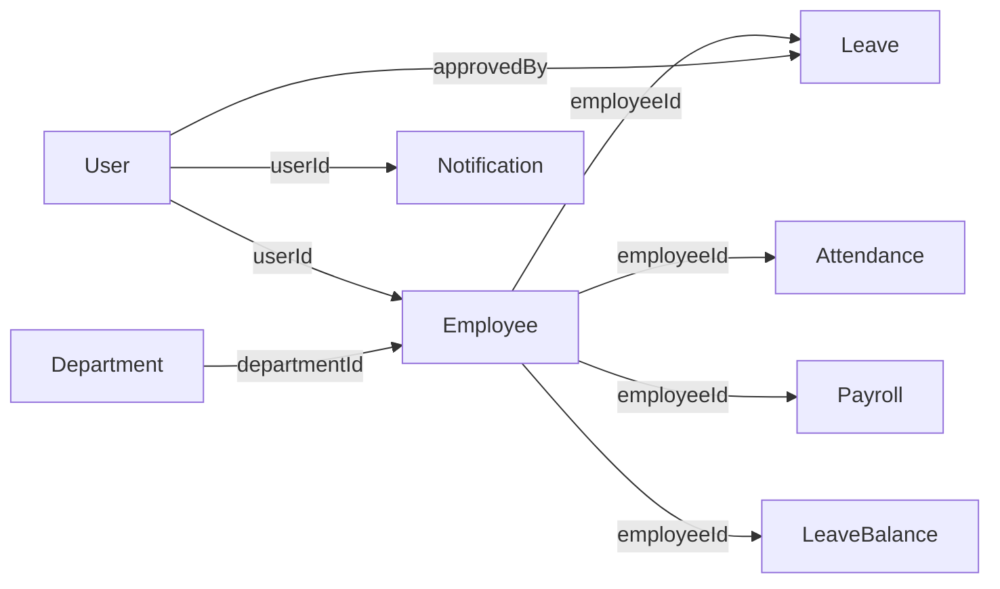

**Quan hệ giữa các bảng:**

| Tiêu chí              | Cách thực hiện                                  |
|-----------------------|--------------------------------------------------|
| Quan hệ               | Khóa ngoại qua JPA `@ManyToOne` / `@OneToOne`    |
| Đọc dữ liệu liên quan | Truy vấn qua entity mapping / repository query   |

---

## 6. Thiết kế Giao diện

### 6.1 Thiết kế API REST

Tất cả API có prefix `/api`, xác thực bằng session (cookie JSESSIONID do Spring Session JDBC quản lý). CSRF được bật (header `X-XSRF-TOKEN`). Chỉ `POST /api/auth/login` và `POST /api/auth/register` là permitAll.

#### 6.1.1 Auth

| Method | Endpoint                     | Request Body                                    | Response               | Status  |
|--------|------------------------------|-------------------------------------------------|------------------------|:-------:|
| POST   | `/api/auth/register`         | `{ email, password }`                           | `{ user, token }`      | 200     |
| POST   | `/api/auth/login`            | `{ email, password }`                           | `{ user, token }`      | 200     |
| GET    | `/api/auth/me`               | -                                               | `{ user }`             | 200     |
| PUT    | `/api/auth/profile`          | `{ name?, email? }`                             | `{ user }`             | 200     |
| POST   | `/api/auth/change-password`  | `{ currentPassword, newPassword }`              | `{ message }`          | 200     |

> **Ghi chú:** Sau khi login thành công, server lưu `userId` + `userRole` vào HttpSession và đặt cookie JSESSIONID (httpOnly). Trường `token` trong response là di sản (legacy), không được dùng để xác thực; mọi request xác thực qua session cookie.

#### 6.1.2 Employees

| Method | Endpoint                            | Query/Params                                     | Request Body                         | Status  |
|--------|-------------------------------------|--------------------------------------------------|--------------------------------------|:-------:|
| GET    | `/api/employees`                    | `?search=&departmentId=&page=&limit=`            | -                                    | 200     |
| GET    | `/api/employees/me`                 | -                                                | -                                    | 200     |
| GET    | `/api/employees/export`             | -                                                | -                                    | 200     |
| GET    | `/api/employees/:id`                | `:id`                                            | -                                    | 200     |
| POST   | `/api/employees`                    | -                                                | CreateEmployeeRequest                | 200     |
| PUT    | `/api/employees/:id`                | `:id`                                            | CreateEmployeeRequest                | 200     |
| DELETE | `/api/employees/:id`                | `:id`                                            | -                                    | 204     |
| POST   | `/api/employees/bulk-delete`        | -                                                | `{ ids: string[] }`                  | 200     |

#### 6.1.3 Leaves

| Method | Endpoint                      | Query/Params     | Request Body                               | Status  |
|--------|-------------------------------|------------------|--------------------------------------------|:-------:|
| GET    | `/api/leaves`                 | `?status=&employeeId=&type=&page=&limit=` | -                          | 200     |
| POST   | `/api/leaves`                 | -                | `{ type, startDate, endDate, reason }`     | 200     |
| GET    | `/api/leaves/:id`             | `:id`            | -                                          | 200     |
| PATCH  | `/api/leaves/:id/status`      | `:id`            | `{ status, rejectionReason? }`             | 200     |

#### 6.1.4 Attendance

| Method | Endpoint                        | Query/Params     | Request Body    | Status  |
|--------|---------------------------------|------------------|-----------------|:-------:|
| GET    | `/api/attendance`               | `?from=&to=&employeeId=&status=` | -       | 200     |
| POST   | `/api/attendance/check-in`      | -                | -               | 200     |
| PATCH  | `/api/attendance/:id/check-out` | `:id`            | -               | 200     |

#### 6.1.5 Departments

| Method | Endpoint                   | Query/Params                     | Request Body         | Status  |
|--------|----------------------------|----------------------------------|----------------------|:-------:|
| GET    | `/api/departments`         | `?search=&page=&limit=`          | -                    | 200     |
| GET    | `/api/departments/:id`     | `:id`                            | -                    | 200     |
| POST   | `/api/departments`         | -                                | CreateDepartmentRequest | 200   |
| PUT    | `/api/departments/:id`     | `:id`                            | CreateDepartmentRequest | 200   |
| DELETE | `/api/departments/:id`     | `:id`                            | -                    | 204     |

#### 6.1.6 Leave Balance

| Method | Endpoint                        | Query/Params | Request Body | Status  |
|--------|---------------------------------|--------------|--------------|:-------:|
| GET    | `/api/leave-balance/my`         | -            | -            | 200     |
| GET    | `/api/leave-balance/:employeeId`| `:employeeId`| -            | 200     |

#### 6.1.7 Notifications

| Method | Endpoint                          | Query/Params | Request Body | Status  |
|--------|-----------------------------------|--------------|--------------|:-------:|
| GET    | `/api/notifications`              | -            | -            | 200     |
| GET    | `/api/notifications/unread-count` | -            | -            | 200     |
| PATCH  | `/api/notifications/read-all`     | -            | -            | 200     |
| PATCH  | `/api/notifications/:id/read`     | `:id`        | -            | 200     |

#### 6.1.8 Payroll

| Method | Endpoint                 | Query/Params                          | Request Body             | Status  |
|--------|--------------------------|---------------------------------------|--------------------------|:-------:|
| GET    | `/api/payroll`           | `?month=&year=&employeeId=&status=&page=&limit=` | -          | 200     |
| POST   | `/api/payroll/process`   | -                                     | `{ employeeIds, month, year }` | 200 |
| PATCH  | `/api/payroll/:id/pay`   | `:id`                                 | -                        | 200     |

### 6.2 Định dạng Response

**Thành công (200/201):**
```json
{
  "data": { ... },
  "meta": { "page": 1, "limit": 20, "total": 100 }
}
```

**Thành công - Danh sách:**
```json
{
  "data": [ ... ],
  "meta": { "page": 1, "limit": 20, "total": 100 }
}
```

**Lỗi (400/401/403/404/500):**
```json
{
  "message": "Description",
  "errors": ["detail 1", "detail 2"],
  "statusCode": 400
}
```

### 6.3 Mã trạng thái HTTP

| Mã  | Ý nghĩa              | Sử dụng khi                                              |
|:---:|----------------------|----------------------------------------------------------|
| 200 | OK                   | GET, PUT, PATCH, DELETE thành công                       |
| 201 | Created              | POST thành công                                          |
| 400 | Bad Request          | Validation lỗi, dữ liệu không hợp lệ                     |
| 401 | Unauthorized         | Chưa đăng nhập hoặc session hết hạn/không hợp lệ              |
| 403 | Forbidden            | User không có quyền truy cập resource                    |
| 404 | Not Found            | Resource không tồn tại                                   |
| 409 | Conflict             | Trùng lặp (email, tên phòng ban)                         |
| 500 | Internal Server Error| Lỗi không xác định                                       |

---

## 7. Thiết kế Xác thực & Phân quyền

### 7.1 Luồng đăng nhập (Session)

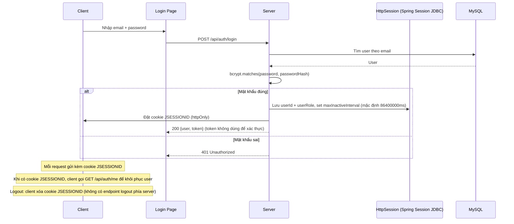

### 7.2 Dữ liệu lưu trong Session

HttpSession (Spring Session JDBC, bảng `sessions`) chứa:

| Attribute | Giá trị ví dụ                        | Mục đích              |
|-----------|--------------------------------------|-----------------------|
| `userId`  | UUID của user                        | Nhận diện người dùng  |
| `userRole`| `admin` / `manager` / `employee`     | Phân quyền theo role  |

- Session max-inactive-interval được lấy từ `jwt.expiration` (mặc định `86400000` ms = 1 ngày). Tên `jwt.secret`/`jwt.expiration` là di sản (legacy); `JWT_SECRET` vẫn bắt buộc khi khởi động server.
- CSRF được bật: header `X-XSRF-TOKEN` (HttpSessionCsrfTokenRepository).

### 7.3 Logic Role Middleware

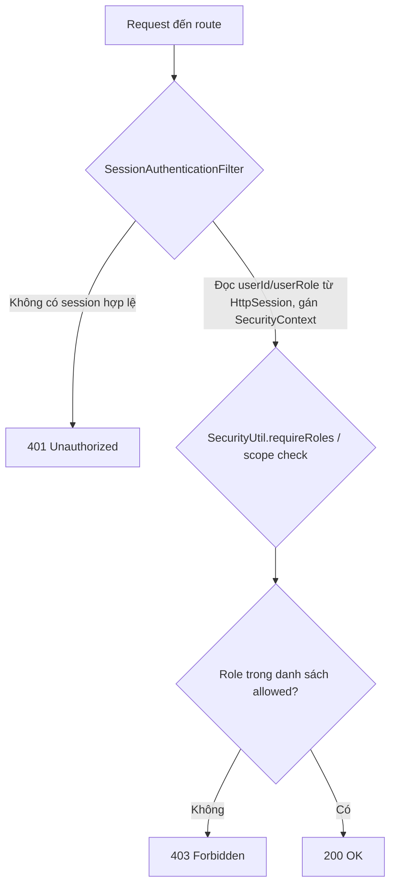

### 7.4 Scoped Data theo Role

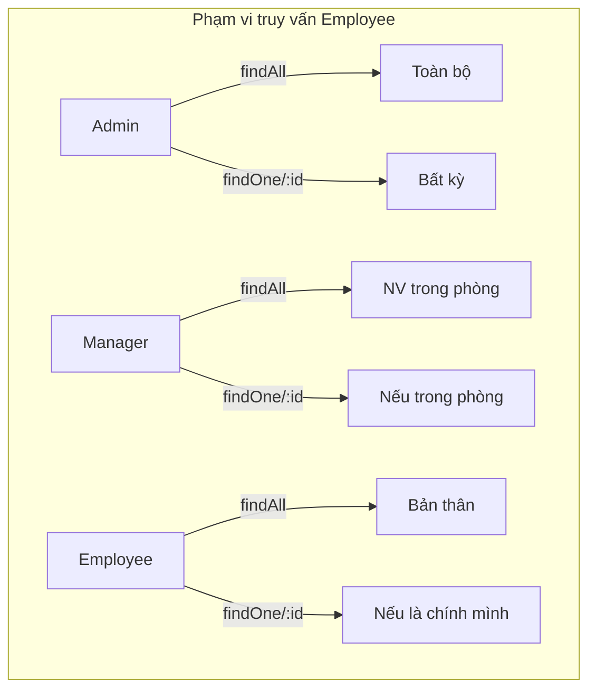

---

## 8. Thiết kế Thông báo (API Polling)

### 8.1 Kiến trúc Polling

```mermaid
graph TB
    subgraph "Server"
        NS[NotificationService]
        NR[NotificationRepository]
        DB[(MySQL 8)]
    end
    subgraph "Client"
        TQ[TanStack Query]
        TS[Toast]
    end
    subgraph "Trigger Events"
        LV[LeaveService - approve/reject]
    end
    LV -->|NotificationService.create| NS
    NS -->|save| NR --> DB
    TQ -->|poll GET /api/notifications/unread-count (30s)| NS
    TQ -->|poll GET /api/notifications (15s)| NS
    TQ -->|thông báo mới| TS
```

### 8.2 Vòng đời Polling

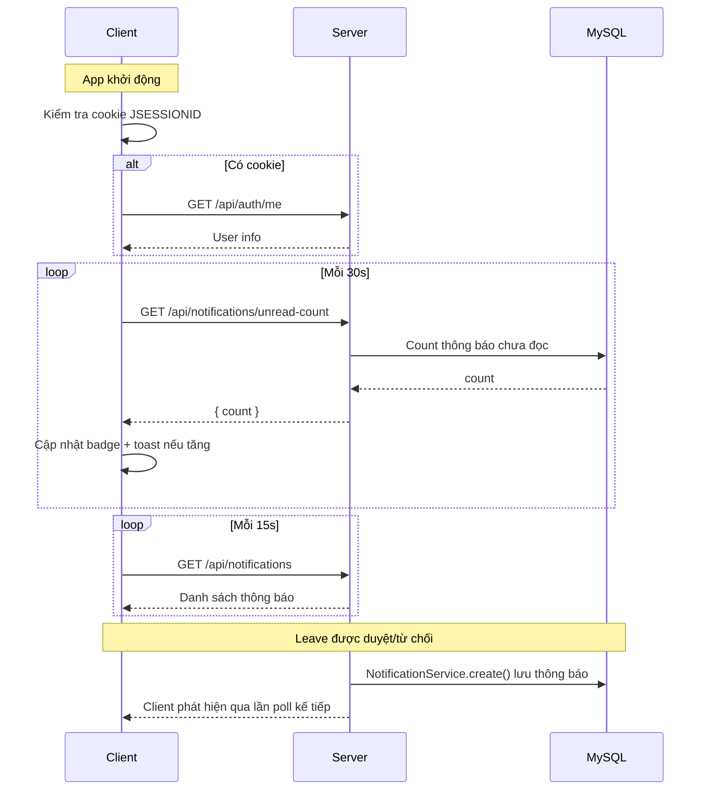

---

## 9. Thiết kế chi tiết Module

### 9.1 Class Diagram - Service Layer

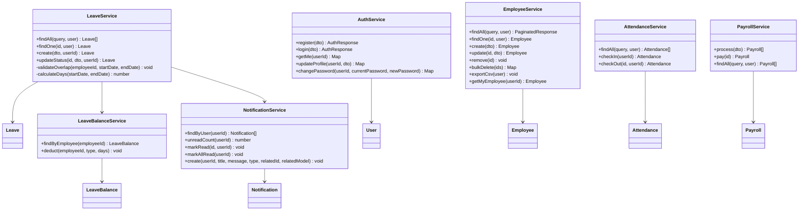

### 9.2 Sequence Diagram - Xử lý đơn nghỉ phép

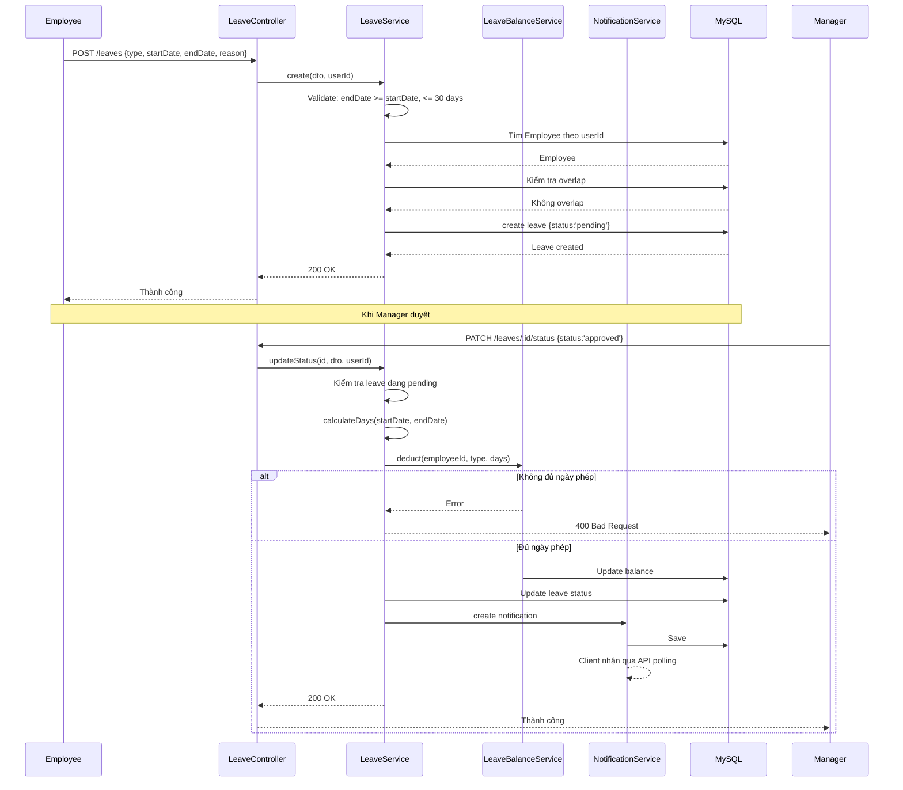

### 9.3 Sequence Diagram - Xử lý lương

```mermaid
sequenceDiagram
    participant A as Admin
    participant C as PayrollController
    participant S as PayrollService
    participant ES as EmployeeRepository
    participant DB as MySQL

    A->>C: POST /payroll/process {employeeIds, month, year}
    C->>S: process(dto) (requireRoles admin)
    loop Mỗi employeeId
        S->>ES: Lấy employee info
        ES-->>S: Employee {salary}
        S->>DB: Kiểm tra bản ghi month/year đã tồn tại?
        alt Đã tồn tại
            S->>S: Skip
        else Chưa tồn tại
            S->>S: Deductions = BHXH 8% + BHYT 1.5% + BHTN 1% + Công đoàn 1%
            S->>S: PIT: 5 bậc lũy tiến (5/10/20/30/35%), giảm trừ gia cảnh 15.500.000 VND
            S->>S: bonus = 0; netPay = basicSalary - totalDeductions
            S->>DB: create payroll {status:'draft'}
        end
    end
    DB-->>S: Payrolls created
    S-->>C: 201 Created
    C-->>A: Danh sách payroll

    A->>C: PATCH /payroll/:id/pay
    C->>S: pay(id)
    S->>DB: update {status:'paid', paidAt:now}
    DB-->>S: Updated
    S-->>C: 200 OK
    C-->>A: Payroll marked as paid
```

### 9.4 Sequence Diagram - Chấm công

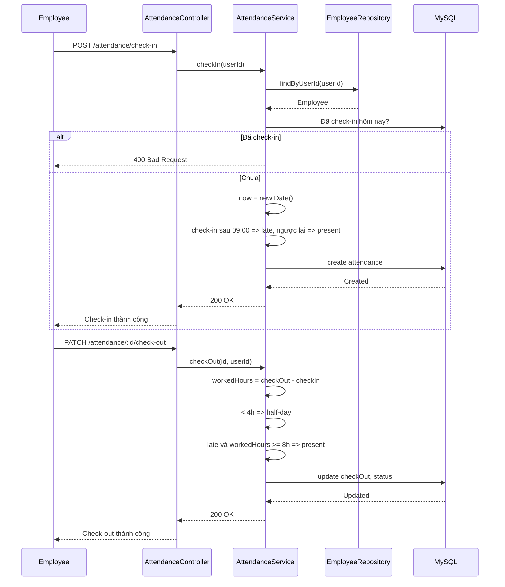

---

## 10. Thiết kế Triển khai

### 10.1 Môi trường Development

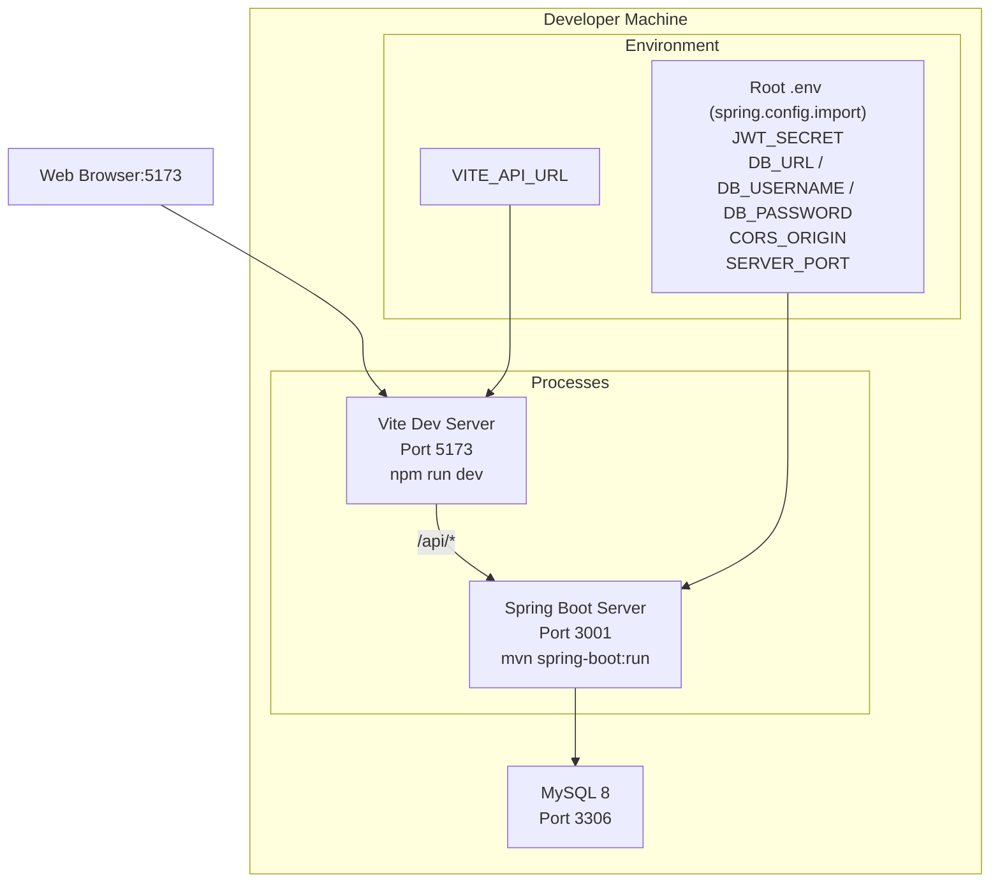

### 10.2 Môi trường Production

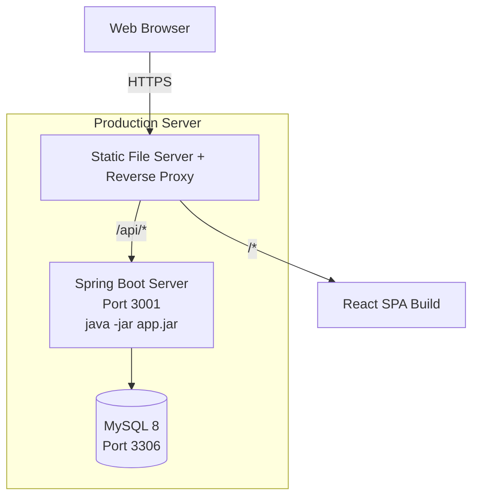

### 10.3 Chi tiết môi trường

| Môi trường  | Client               | Server              | Database           | Mục đích        |
|-------------|----------------------|---------------------|--------------------|------------------|
| Development | Vite Dev (port 5173) | Maven spring-boot:run (port 3001)| MySQL 8 Docker  | Lập trình        |
| Staging     | Build static         | java -jar (port 3001)            | MySQL 8          | Testing + UAT    |
| Production  | Build static + CDN   | java -jar (port 3001)            | MySQL 8          | Production       |

---

## 11. Thiết kế Bảo mật

### 11.1 Các lớp bảo mật

```mermaid
graph TB
    subgraph "Lớp 1: Network"
        CORS[CORS - chỉ origin cụ thể (cors.origin)]
    end
    subgraph "Lớp 2: HTTP"
        HEADERS[Spring Security - Security Headers]
    end
    subgraph "Lớp 3: Authentication"
        SESSION[Session - HttpSession + Spring Session JDBC]
        CSRF[CSRF - X-XSRF-TOKEN header]
    end
    subgraph "Lớp 4: Authorization"
        RBAC[Role-Based Access Control]
    end
    subgraph "Lớp 5: Validation"
        DTO[DTOs + Jakarta Validation]
    end
    subgraph "Lớp 6: Session & Cookie"
        COOKIE[httpOnly JSESSIONID cookie]
    end
    subgraph "Lớp 7: Data"
        BCRYPT[bcrypt - 10 rounds]
    end
    CORS --> HEADERS --> SESSION --> CSRF --> RBAC --> DTO --> COOKIE --> BCRYPT
```

### 11.2 Quy tắc xác thực mật khẩu

- Độ dài: tối thiểu 8, tối đa 128 ký tự
- Không yêu cầu độ phức tạp (không bắt buộc chữ hoa/thường/số/ký tự đặc biệt)
- Mật khẩu được hash bằng bcrypt

---

## 12. Thiết kế Xử lý lỗi

### 12.1 Server-side Error Handling

```mermaid
flowchart TD
    REQ[HTTP Request] --> VAL[Validation Middleware]
    VAL -->|Lỗi| BAD[400 Bad Request]
    VAL -->|OK| SRV[Service]
    SRV -->|Business Error| EXC[Throw exception]
    SRV -->|OK| OK_RESP[200/201]
    EXC --> ERR[GlobalExceptionHandler]
    ERR -->|400| B400[{message, statusCode: 400}]
    ERR -->|401| B401[{message, statusCode: 401}]
    ERR -->|403| B403[{message, statusCode: 403}]
    ERR -->|404| B404[{message, statusCode: 404}]
    ERR -->|500| B500[{message, statusCode: 500}]
```

**Error classes:**

| Class                       | HTTP Status | Khi nào dùng                                         |
|-----------------------------|:-----------:|------------------------------------------------------|
| `BadRequestException`       | 400         | Validation lỗi, dữ liệu không hợp lệ                 |
| `UnauthorizedException`     | 401         | Session thiếu/hết hạn/sai                              |
| `ForbiddenException`        | 403         | Không có quyền                                       |
| `NotFoundException`         | 404         | Resource không tồn tại                               |
| `ConflictException`         | 409         | Trùng lặp dữ liệu                                    |

### 12.2 Client-side Error Handling

```mermaid
flowchart TD
    API[API Call] --> AXI[Axios Interceptor]
    AXI -->|401| CLEAR[Xóa cookie JSESSIONID, redirect /login]
    AXI -->|400| SHOW[Hiển thị validation error]
    AXI -->|403| HIDE[Ẩn chức năng]
    AXI -->|Network Error| RETRY[TanStack Query retry 3 lần]
    AXI -->|Success| UPDATE[Cập nhật cache]
    RETRY -->|Hết lần retry| ERR_STATE[Error state UI]
```

---

## 13. Thiết kế Đa ngôn ngữ

### 13.1 Kiến trúc i18n

```mermaid
graph TB
    subgraph "Language Context"
        LANG[language-context.tsx]
        LANG --> VI[Vietnamese - locales/vi.ts ~430 keys]
        LANG --> T[t(key) function]
    end
    subgraph "Translation Keys"
        T --> COMMON[common.*] & NAV[nav.*] & ROLE[role.*]
        T --> EMP[employees.*] & DEPT[departments.*]
        T --> LEAVE[leaves.*] & ATT[attendance.*] & PAY[payroll.*]
        T --> NOTIF[notifications.*] & LOGIN[login.*]
        T --> PROF[profile.*] & SETT[settings.*] & STAT[status.*]
        T --> VAL[validation.*] & AUTH[auth.*]
        T --> ORG[org_chart.*]
    end
    COMP[React Components] -->|useTranslation()| LANG
    COMP -->|t('key')| T
```

**Lưu trữ:** Hệ thống dùng một locale tiếng Việt duy nhất trong `client/src/locales/vi.ts`; không có chuyển đổi ngôn ngữ.

---

## 14. Ràng buộc và Giả định thiết kế

### 14.1 Ràng buộc kỹ thuật

| ID      | Ràng buộc                                    | Mô tả                                                        |
|---------|----------------------------------------------|--------------------------------------------------------------|
| TC-01   | Spring Boot không Express CLI                     | Dùng Maven `spring-boot:run` thay vì tsx để chạy dev               |
| TC-02   | ESM (`"type": "module"`)                     | Cả client và server đều dùng ES Modules                      |
| TC-03   | Maven build                                    | `pom.xml` quản lý dependencies và build lifecycle            |
| TC-04   | Không sử dụng linter/typecheck script        | Dự án không có ESLint, Prettier, typecheck script            |
| TC-05   | `server/.env` không tracked trong git        | File env đã tồn tại với dev defaults                          |

### 14.2 Giả định thiết kế

1. **Network**: Giả định kết nối mạng ổn định giữa client-server-database
2. **User scale**: Hệ thống được thiết kế cho 50-500+ users, không cần load balancing phức tạp
3. **Data volume**: Tổng số bản ghi < 1 triệu trong 2 năm đầu, không cần sharding
4. **Browser**: Người dùng sử dụng trình duyệt hiện đại (Chrome/Firefox/Edge/Safari 2 phiên bản gần nhất)
5. **Mobile**: Chỉ responsive web, không có native app
6. **Auth**: Xác thực bằng session (cookie JSESSIONID do Spring Session JDBC quản lý) là đủ cho SPA nội bộ doanh nghiệp
7. **File storage**: Hiện không có tính năng upload/tài liệu (Employee không có trường documents)

---

*Tài liệu này được xây dựng theo chuẩn IEEE 1016 và cần được cập nhật khi có thay đổi về thiết kế.*
