# Đặc tả thiết kế phần mềm (SDD)

## Hệ thống Quản lý Nhân sự (HR Management)

---

## Mục lục

1. [Giới thiệu](#1-giới-thiệu)
2. [Kiến trúc tổng thể](#2-kiến-trúc-tổng-thể)
3. [Kiến trúc Client](#3-kiến-trúc-client)
4. [Kiến trúc Server](#4-kiến-trúc-server)
5. [Thiết kế Database](#5-thiết-kế-database)
6. [Thiết kế API](#6-thiết-kế-api)
7. [Xác thực & Phân quyền](#7-xác-thực--phân-quyền)
8. [Thông báo thời gian thực](#8-thông-báo-thời-gian-thực)
9. [Triển khai](#9-triển-khai)

---

## 1. Giới thiệu

### 1.1 Mục đích

Tài liệu này mô tả chi tiết thiết kế kiến trúc phần mềm cho hệ thống **Quản lý Nhân sự (HR Management)**, bao gồm kiến trúc tổng thể, thiết kế client, thiết kế server, cơ sở dữ liệu, API, và các thành phần khác.

### 1.2 Công nghệ sử dụng

| Thành phần | Công nghệ | Phiên bản |
|-----------|-----------|-----------|
| Frontend | React | 18.x |
| UI Framework | shadcn/ui + Tailwind CSS | 4.x |
| State Management | TanStack Query | 5.x |
| Routing | React Router | 6.x |
| Form Validation | React Hook Form + Zod | 7.x / 3.x |
| Charts | Recharts | 2.x |
| Real-time | Socket.IO (client) | 4.x |
| Backend | NestJS | 11.x |
| Database | MongoDB + Mongoose | 8.x |
| Authentication | Passport.js + JWT | - |
| Validation | class-validator + class-transformer | - |


---

## 2. Kiến trúc tổng thể

### 2.1 Kiến trúc hệ thống

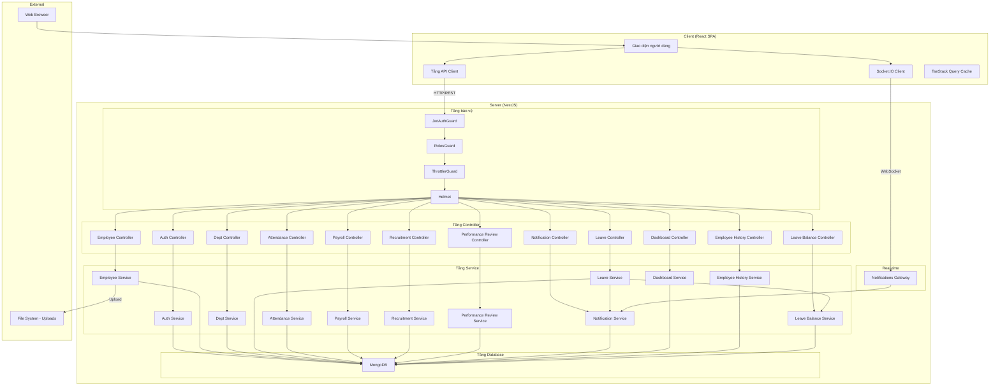

### 2.2 Kiến trúc module (NestJS)

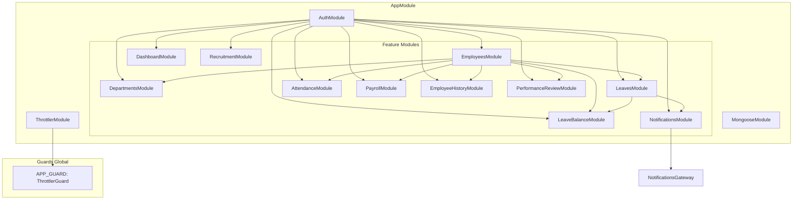

### 2.3 Luồng request điển hình

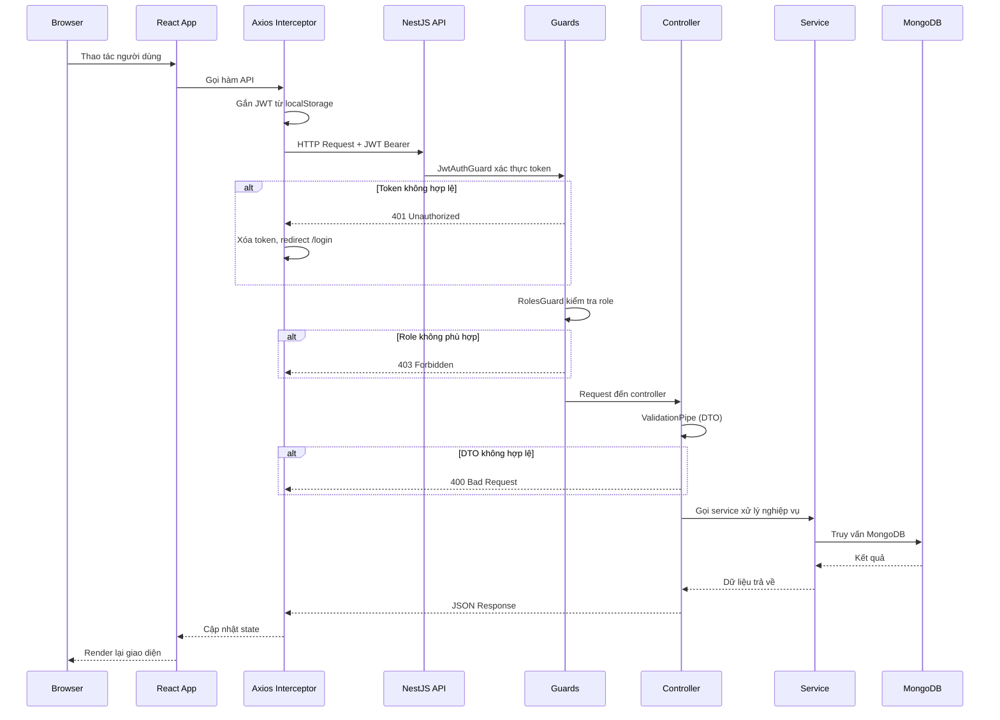

---

## 3. Kiến trúc Client

### 3.1 Component hierarchy

```mermaid
graph TB
    subgraph "Provider Layer"
        QC[QueryClientProvider]
        BR[BrowserRouter]
        AP[AuthProvider]
        LP[LanguageProvider]
    end

    subgraph "Layout"
        AL[AppLayout]
        SID[Sidebar]
        OUT[Outlet]
    end

    subgraph "Shared Components"
        PH[PageHeader]
        SB[StatusBadge]
        SK[Skeleton]
        ES[EmptyState]
        BC[Breadcrumb]
        EB[ErrorBoundary]
        RL[RouteLoading]
        KS[KeyboardShortcuts]
        UT[UnsavedChanges]
    end

    subgraph "UI Components (shadcn)"
        BTN[Button]
        BDG[Badge]
        CRD[Card]
        DLG[Dialog]
        INP[Input]
        LBL[Label]
        SLT[Select]
        TBL[Table]
        TST[Toaster]
        CMD[ConfirmDialog]
        DT[DataTable]
        DTP[DataTablePagination]
        DTC[DataTableColumnHeader]
        DTF[DataTableFacetedFilter]
    end

    subgraph "Pages"
        LOGIN[Login Page]
        DASH[Dashboard Page]
        EMPL[Employees List]
        EMPD[Employee Detail]
        DEPT[Departments List]
        ORG[Org Chart]
        PROF[Profile Page]
        NOTI[Notifications List]
        NF[Not Found]

        subgraph "Leave Pages"
            ML[My Leaves]
            LA[Leave Approvals]
        end

        subgraph "Attendance Pages"
            MAT[My Attendance]
            ATR[Attendance Report]
        end

        subgraph "Payroll Pages"
            MYP[My Payroll]
            PYM[Payroll Management]
        end

        subgraph "Recruitment Pages"
            JBP[Job Postings]
            CAD[Candidates]
        end

        subgraph "Performance Pages"
            MPR[My Reviews]
            PRM[Review Management]
        end
    end

    QC --> BR
    BR --> AP
    AP --> LP
    LP --> AL
    AL --> SID
    AL --> OUT

    OUT --> LOGIN
    OUT --> DASH
    OUT --> EMPL
    OUT --> EMPD
    OUT --> DEPT
    OUT --> ORG
    OUT --> PROF
    OUT --> NOTI
    OUT --> NF
    OUT --> ML
    OUT --> LA
    OUT --> MAT
    OUT --> ATR
    OUT --> MYP
    OUT --> PYM
    OUT --> JBP
    OUT --> CAD
    OUT --> MPR
    OUT --> PRM

    EMPL --> DT
    EMPD --> PH
    EMPD --> SB
    DEPT --> DT
    ML --> DT
    LA --> DT
    MAT --> SB
    ATR --> DT
    MYP --> DT
    PYM --> DT
    JBP --> DT
    CAD --> DT
    MPR --> CRD
    PRM --> DT
    PRM --> SB

    DT --> DTP
    DT --> DTC
    DT --> DTF

    AL --> KS
    AL --> RL
    AL --> UT
    AL --> EB
    AL --> TST
```

### 3.2 Luồng dữ liệu client

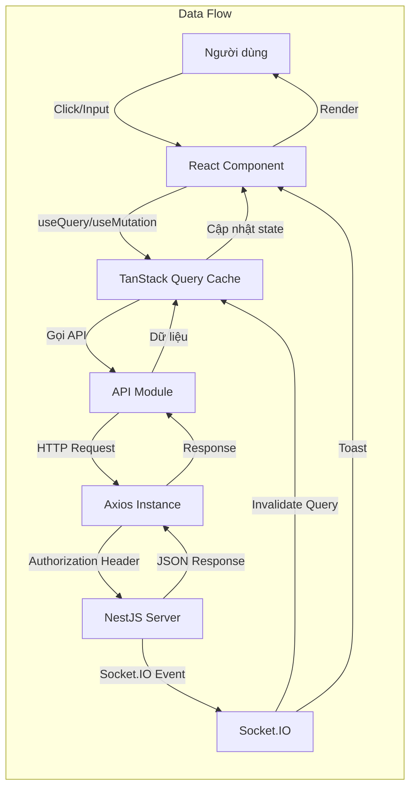

### 3.3 Chi tiết Route

```mermaid
graph TB
    ROOT[/]
    LOGIN[/login]
    DASH[/dashboard]
    EMP[/employees]
    EMPID[/employees/:id]
    PROF[/profile]
    DEPT[/departments]
    ORG[/org-chart]
    LEAVES[/leaves]
    LEAVEA[/leaves/approvals]
    ATT[/attendance]
    ATTR[/attendance/report]
    PAY[/payroll]
    PAYM[/payroll/manage]
    NOTI[/notifications]
    RECJ[/recruitment/job-postings]
    RECC[/recruitment/candidates]
    PRF[/performance-reviews]
    PRFM[/performance-reviews/manage]
    NF404["* (404)"]

    ROOT -->|redirect| DASH
    LOGIN -->|public| LOGIN
    DASH -->|admin/manager/employee| DASH
    EMP -->|admin/manager| EMP
    EMPID -->|admin/manager/employee| EMPID
    PROF -->|admin/manager/employee| PROF
    DEPT -->|admin/manager| DEPT
    ORG -->|admin/manager| ORG
    LEAVES -->|admin/manager/employee| LEAVES
    LEAVEA -->|admin/manager| LEAVEA
    ATT -->|admin/manager/employee| ATT
    ATTR -->|admin/manager| ATTR
    PAY -->|admin/manager/employee| PAY
    PAYM -->|admin| PAYM
    NOTI -->|admin/manager/employee| NOTI
    RECJ -->|admin/manager| RECJ
    RECC -->|admin/manager| RECC
    PRF -->|admin/manager/employee| PRF
    PRFM -->|admin/manager| PRFM
    NF404 -->|any| NF404
```

### 3.4 Các hooks chính

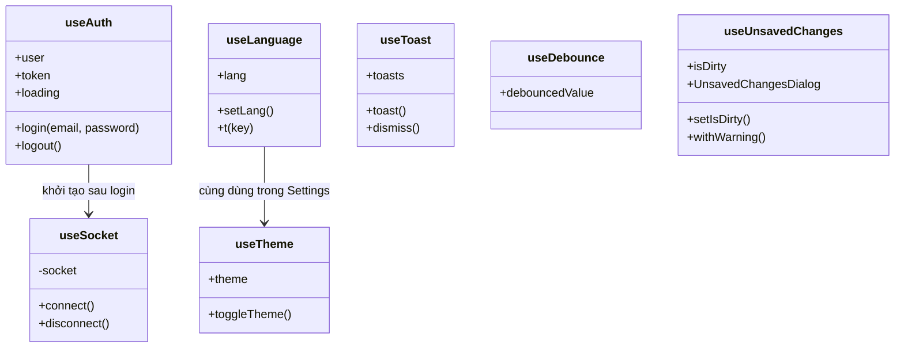

---

## 4. Kiến trúc Server

### 4.1 Module NestJS

```mermaid
graph TB
    subgraph AppModule
        direction TB
        AM[AppModule]
        AM -->|imports| TM[ThrottlerModule]
        AM -->|imports| MM[MongooseModule]
        AM -->|imports| AuthM[AuthModule]
        AM -->|providers| SS[StartupSeedService]
        AM -->|providers| TG[ThrottlerGuard Global]
    end

    subgraph AuthModule
        direction TB
        AUTHM[AuthModule]
        AUTHM -->|controllers| AC[AuthController]
        AUTHM -->|providers| AS[AuthService]
        AUTHM -->|providers| JS[JwtStrategy]
        AUTHM -->|exports| AS
        AUTHM -->|exports| JWT[JwtModule]
        AUTHM -->|exports| PM[PassportModule]
    end

    subgraph EmployeesModule
        EPM[EmployeesModule]
        EPM -->|controllers| EC[EmployeesController]
        EPM -->|providers| ES[EmployeesService]
        EPM -->|exports| ES
    end

    subgraph LeavesModule
        LVM[LeavesModule]
        LVM -->|controllers| LC[LeavesController]
        LVM -->|providers| LS[LeavesService]
    end

    subgraph NotificationsModule
        NM[NotificationsModule]
        NM -->|controllers| NC[NotificationsController]
        NM -->|providers| NS[NotificationsService]
        NM -->|providers| NG[NotificationsGateway]
        NM -->|exports| NS
        NM -->|exports| NG
    end

    subgraph LeaveBalanceModule
        LBM[LeaveBalanceModule]
        LBM -->|controllers| LBC[LeaveBalanceController]
        LBM -->|providers| LBS[LeaveBalanceService]
        LBM -->|exports| LBS
    end

    subgraph Other Modules
        DM[DepartmentsModule]
        AM2[AttendanceModule]
        PM2[PayrollModule]
        DBM[DashboardModule]
        EHM[EmployeeHistoryModule]
        RM[RecruitmentModule]
        PRM[PerformanceReviewModule]
    end

    AUTHM -->|exported to| EPM
    AUTHM -->|exported to| LVM
    AUTHM -->|exported to| NM
    AUTHM -->|exported to| LBM
    AUTHM -->|exported to| DM
    AUTHM -->|exported to| AM2
    AUTHM -->|exported to| PM2
    AUTHM -->|exported to| DBM
    AUTHM -->|exported to| EHM
    AUTHM -->|exported to| RM
    AUTHM -->|exported to| PRM

    EPM -->|imported by| LVM
    EPM -->|imported by| LBM
    EPM -->|imported by| AM2
    EPM -->|imported by| PM2
    EPM -->|imported by| DBM
    EPM -->|imported by| EHM
    EPM -->|imported by| PRM

    LVM -->|imports| LBM
    LVM -->|imports| NM
    LBM -->|exports to| LVM
    NM -->|exports to| LVM
```

### 4.2 Guards chain

```mermaid
graph LR
    REQ[HTTP Request] --> JG[JwtAuthGuard]
    JG -->|xác thực JWT| REQUSER[req.user = {id, email, role}]
    REQUSER --> RG[RolesGuard]
    RG -->|@Roles(admin) | CHECK{role trong danh sách?}
    CHECK -->|Có| CTL[Controller]
    CHECK -->|Không| 403[403 Forbidden]
    JG -->|Token lỗi| 401[401 Unauthorized]
    CTL --> VP[ValidationPipe]
    VP -->|DTO hợp lệ| SRV[Service]
    VP -->|DTO lỗi| 400[400 Bad Request]
    SRV --> DB[(MongoDB)]
```

### 4.3 Cấu trúc Controller mẫu (LeavesController)

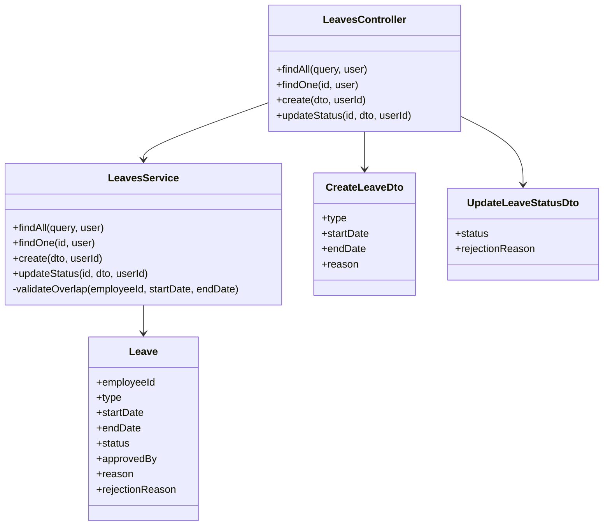

### 4.4 File seed

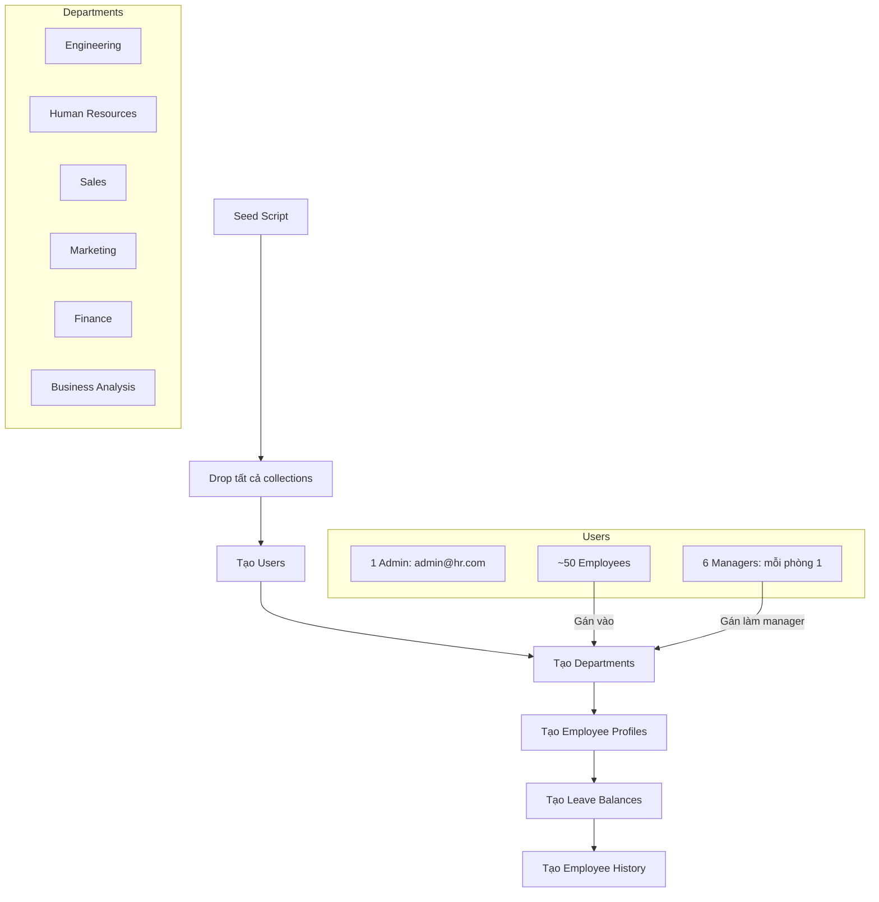

---

## 5. Thiết kế Database

### 5.1 Entity Relationship Diagram

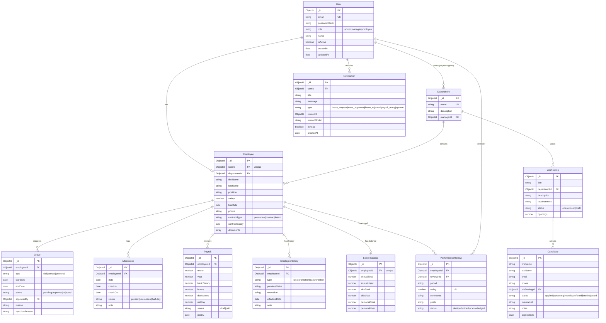

### 5.2 Database Indexes

```mermaid
graph TB
    subgraph "Employee Collection"
        EI1[index: departmentId] -->|Truy vấn nhân viên theo phòng| Q1[Query: findByDepartment]
    end

    subgraph "Leave Collection"
        LI1[index: employeeId + status] -->|Truy vấn đơn theo nhân viên và trạng thái| Q2[Query: findByEmployeeAndStatus]
        LI2[index: employeeId + startDate + endDate] -->|Kiểm tra chồng chéo| Q3[Query: overlappingLeaves]
    end

    subgraph "Attendance Collection"
        AI1[index: employeeId + date unique] -->|1 bản ghi/ngày| Q4[Query: findByEmployeeAndDate]
    end

    subgraph "Payroll Collection"
        PI1[index: employeeId + month + year unique] -->|Chống trùng lặp| Q5[Query: findByEmployeeMonthYear]
    end

    subgraph "Notification Collection"
        NI1[index: userId + isRead + createdAt] -->|Truy vấn thông báo| Q6[Query: findByUserUnread]
    end

    subgraph "EmployeeHistory Collection"
        EHI1[index: employeeId + effectiveDate] -->|Lịch sử giảm dần| Q7[Query: historyTimeline]
    end

    subgraph "User Collection"
        UI1[index: email unique] -->|Login| Q8[Query: findByEmail]
    end
```

### 5.3 Document embedding strategy

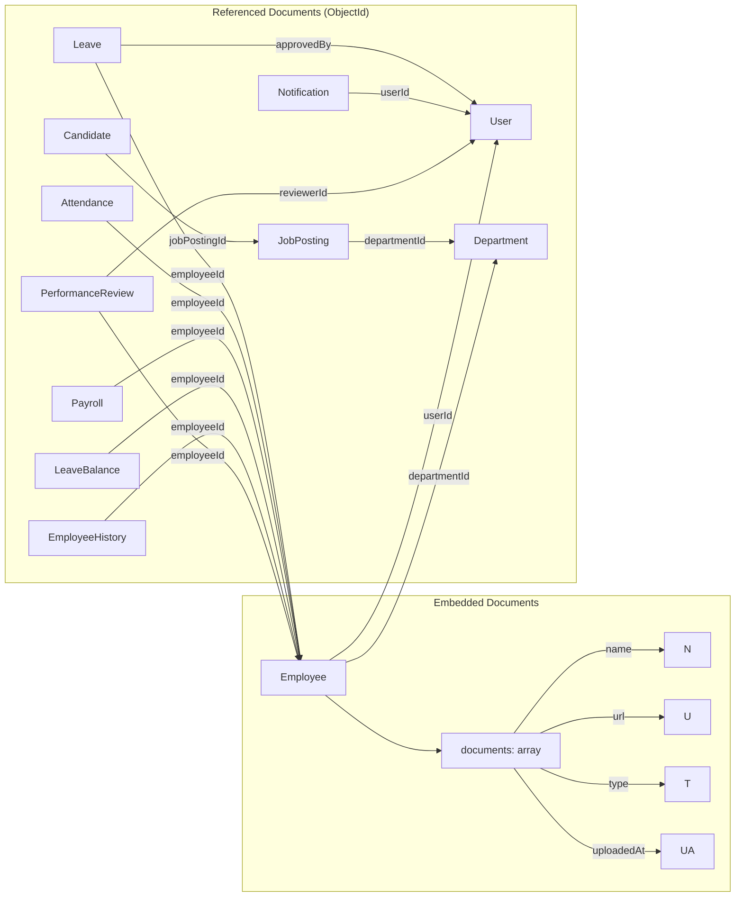

---

## 6. Thiết kế API

### 6.1 RESTful API design

Tất cả API đều có prefix `/api` và trả về JSON. Authentication qua `Authorization: Bearer <JWT>`.

```mermaid
graph TB
    subgraph "API Groups"
        AUTH[/api/auth]
        EMP[/api/employees]
        DEPT[/api/departments]
        LEAVE[/api/leaves]
        ATT[/api/attendance]
        PAY[/api/payroll]
        DASH[/api/dashboard]
        HIST[/api/employees/*/history]
        LB[/api/leave-balance]
        NOTIF[/api/notifications]
        JP[/api/job-postings]
        CAND[/api/candidates]
        PR[/api/performance-reviews]
    end

    AUTH -->|POST| REGISTER[register]
    AUTH -->|POST| LOGIN[login]
    AUTH -->|GET| ME[getMe]
    AUTH -->|PUT| PROFILE[updateProfile]
    AUTH -->|POST| CPass[changePassword]

    EMP -->|GET| EList[findAll + pagination]
    EMP -->|GET /:id| EOne[findOne]
    EMP -->|POST| ECreate[create]
    EMP -->|PUT /:id| EUpdate[update]
    EMP -->|DELETE /:id| EDelete[delete]
    EMP -->|POST /bulk-delete| EBulk[bulkDelete]
    EMP -->|GET /export| ECSV[exportCsv]
    EMP -->|POST /:id/documents| EDocAdd[addDocument]
    EMP -->|DELETE /:id/documents/:docId| EDocDel[removeDocument]

    DEPT -->|GET| DList[findAll]
    DEPT -->|GET /org-chart| DOrg[getOrgChart]
    DEPT -->|GET /:id| DOne[findOne]
    DEPT -->|POST| DCreate[create]
    DEPT -->|PUT /:id| DUpdate[update]
    DEPT -->|DELETE /:id| DDelete[delete]

    LEAVE -->|GET| LList[findAll]
    LEAVE -->|POST| LCreate[create]
    LEAVE -->|GET /:id| LOne[findOne]
    LEAVE -->|PATCH /:id/status| LStatus[updateStatus]

    ATT -->|GET| AList[findAll]
    ATT -->|POST /check-in| ACheckIn[checkIn]
    ATT -->|PATCH /:id/check-out| ACheckOut[checkOut]
```

### 6.2 Response format

**Thành công:**
```json
{
  "data": { ... },
  "meta": {
    "page": 1,
    "limit": 20,
    "total": 100
  }
}
```

**Lỗi:**
```json
{
  "message": "Validation failed",
  "errors": ["email must be an email"],
  "statusCode": 400
}
```

---

## 7. Xác thực & Phân quyền

### 7.1 JWT Flow

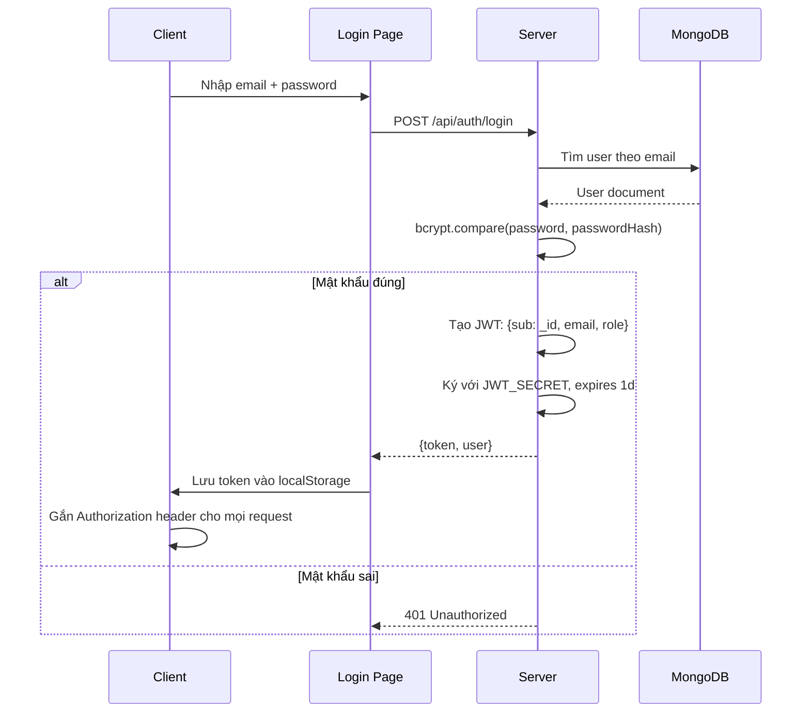

### 7.2 JWT Payload

```json
{
  "sub": "507f1f77bcf86cd799439011",
  "email": "admin@hr.com",
  "role": "admin",
  "iat": 1718611200,
  "exp": 1718697600
}
```

### 7.3 RolesGuard logic

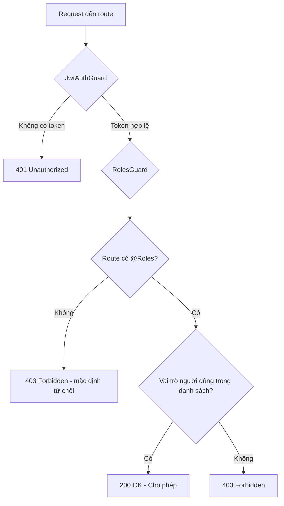

### 7.4 Scoped data theo role

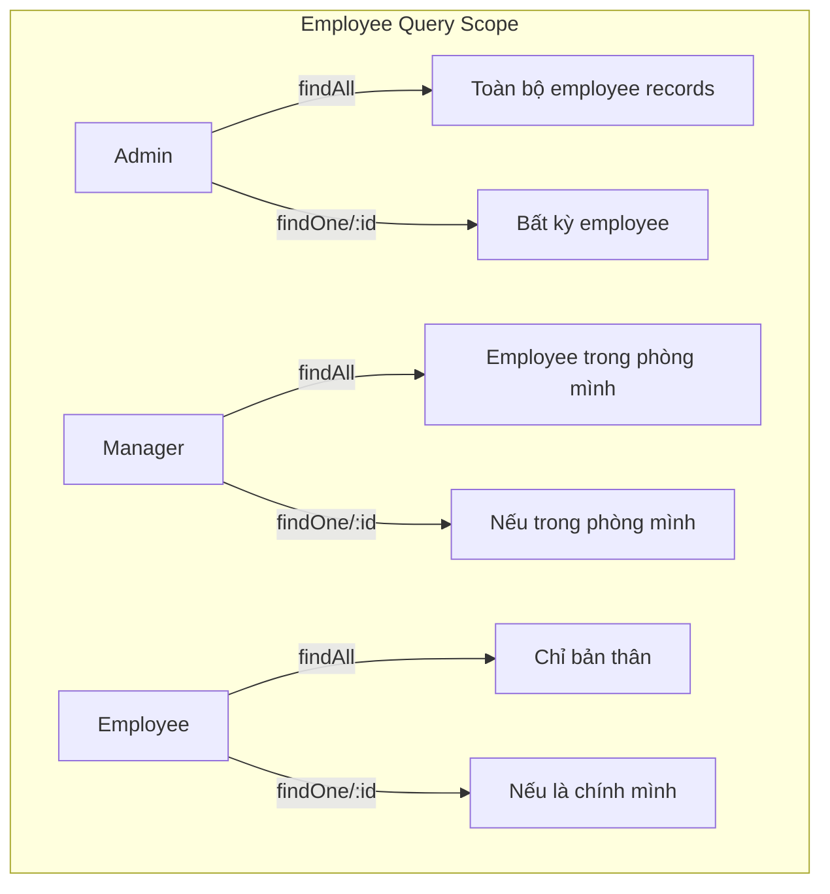

---

## 8. Thông báo thời gian thực

### 8.1 Socket.IO Architecture

```mermaid
graph TB
    subgraph "Server"
        NS[NotificationsService]
        GW[NotificationsGateway]
        GW --> ROOM[user:{userId} room]
    end

    subgraph "Client"
        SC[Socket.IO Client]
        SH[useSocket Hook]
        TQ[TanStack Query]
        TS[Toast]
    end

    subgraph "Trigger Events"
        LV[Leave Service - approve/reject]
    end

    LV -->|create notification| NS
    NS -->|save to DB| DB[(MongoDB)]
    NS -->|emit event| GW
    GW -->|sendNotification| ROOM
    ROOM -->|notification event| SC
    SC -->|nhận event| SH
    SH -->|invalidate query| TQ
    SH -->|show toast| TS
    TQ -->|refetch| API[GET /api/notifications]
    API -->|updated list| UI[Giao diện]
```

### 8.2 Connection lifecycle

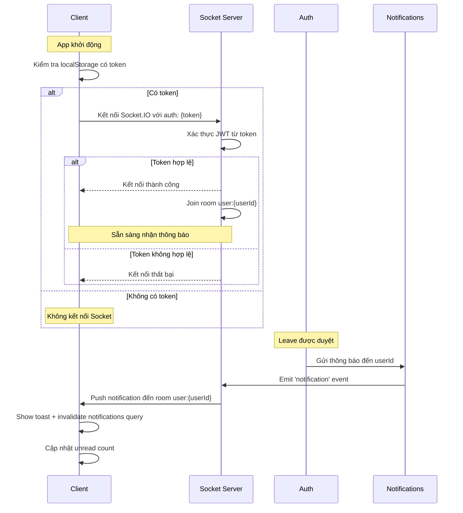

---


## 10. Component thiết kế chi tiết

### 10.1 Class Diagram - Service Layer

```mermaid
classDiagram
    class AuthService {
        +register(dto) AuthResponse
        +login(dto) AuthResponse
        +getMe(userId) User
        +updateProfile(userId, dto) User
        +changePassword(userId, currentPassword, newPassword) void
        -generateToken(user) string
    }

    class EmployeesService {
        +findAll(query, user) PaginatedResult
        +findOne(id, user) Employee
        +create(dto) Employee
        +update(id, dto) Employee
        +remove(id) void
        +bulkDelete(ids) void
        +exportCsv(user) Buffer
        +addDocument(id, file) Employee
        +removeDocument(id, docId) Employee
        +findByUserId(userId) Employee
    }

    class LeavesService {
        +findAll(query, user) Leave[]
        +findOne(id, user) Leave
        +create(dto, userId) Leave
        +updateStatus(id, dto, userId) Leave
        -validateOverlap(employeeId, startDate, endDate) void
        -calculateDays(startDate, endDate) number
    }

    class AttendanceService {
        +findAll(query, user) Attendance[]
        +checkIn(userId) Attendance
        +checkOut(id, userId) Attendance
        -determineStatus(checkInTime) string
    }

    class DashboardService {
        +getDashboard(user) object
        -adminDashboard() object
        -managerDashboard(userId) object
        -employeeDashboard(userId) object
    }

    class NotificationsService {
        +findByUser(userId, limit) Notification[]
        +unreadCount(userId) number
        +markRead(id, userId) void
        +markAllRead(userId) void
        +create(data) Notification
    }

    AuthService --> User
    EmployeesService --> Employee
    LeavesService --> Leave
    AttendanceService --> Attendance
    DashboardService --> DashboardService
    NotificationsService --> Notification
```

### 10.2 Sequence Diagram - Xử lý đơn nghỉ phép

```mermaid
sequenceDiagram
    participant E as Employee
    participant C as LeavesController
    participant S as LeavesService
    participant LB as LeaveBalanceService
    participant N as NotificationsService
    participant DB as MongoDB

    E->>C: POST /leaves {type, startDate, endDate, reason}
    C->>S: create(dto, userId)
    
    S->>S: Validate: endDate >= startDate
    S->>S: Validate: duration <= 30 days
    S->>DB: Tìm Employee theo userId
    DB-->>S: Employee
    
    S->>DB: Kiểm tra đơn chồng chéo
    DB-->>S: Không có overlap
    
    S->>DB: create leave with status='pending'
    DB-->>S: Leave created
    
    S-->>C: 201 Created {leave}
    C-->>E: Response thành công

    Note over E,DB: Khi Manager duyệt
    Manager->>C: PATCH /leaves/:id/status {status: 'approved'}
    C->>S: updateStatus(id, dto, userId)
    
    S->>S: Kiểm tra leave đang 'pending'
    S->>S: calculateDays(startDate, endDate)
    S->>LB: deduct(employeeId, type, days)
    
    alt Không đủ ngày phép
        LB-->>S: Error - insufficient balance
        S-->>Manager: 400 Bad Request
    else Đủ ngày phép
        LB->>DB: Update leave balance
        DB-->>LB: Success
        
        S->>DB: Update leave status = 'approved'
        DB-->>S: Leave updated
        
        S->>N: create notification for employee
        N->>DB: Save notification
        N-->>S: Notification created
        N->>N: Emit real-time via Socket.IO
        
        S-->>C: Leave approved
        C-->>Manager: Success
    end
```

### 10.3 Sequence Diagram - Xử lý lương hàng tháng

```mermaid
sequenceDiagram
    participant A as Admin
    participant C as PayrollController
    participant S as PayrollService
    participant ES as EmployeesService
    participant DB as MongoDB

    A->>C: POST /payroll/process {employeeIds, month, year, bonuses, deductions}
    C->>S: process(dto)
    
    loop Mỗi employeeId
        S->>ES: Lấy thông tin nhân viên
        ES-->>S: Employee {salary, ...}
        
        S->>DB: Kiểm tra payroll đã tồn tại
        alt Đã tồn tại
            S->>S: Skip employee
        else Chưa tồn tại
            S->>S: netPay = salary + bonus - deductions
            S->>S: netPay = max(0, netPay)
            S->>DB: create payroll {status: 'draft'}
        end
    end
    
    DB-->>S: Payrolls created
    S-->>C: 201 Created {payrolls}
    C-->>A: Danh sách payroll

    A->>C: PATCH /payroll/:id/pay
    C->>S: pay(id)
    S->>DB: update {status: 'paid', paidAt: now}
    DB-->>S: Updated
    S-->>C: 200 OK
    C-->>A: Payroll marked as paid
```

### 10.4 Sequence Diagram - Chấm công

```mermaid
sequenceDiagram
    participant E as Employee
    participant C as AttendanceController
    participant S as AttendanceService
    participant ES as EmployeesService
    participant DB as MongoDB

    E->>C: POST /attendance/check-in
    C->>S: checkIn(userId)
    S->>ES: findByUserId(userId)
    ES-->>S: Employee
    
    S->>DB: Kiểm tra đã check-in hôm nay?
    alt Đã check-in
        S-->>E: 400 Bad Request - already checked in
    else Chưa check-in
        S->>S: now = new Date()
        S->>S: if now.hours < 9 => status = 'present'
        S->>S: if now.hours >= 9 => status = 'late'
        S->>DB: create attendance {date, checkIn, status}
        DB-->>S: Attendance created
        S-->>C: 201 Created {attendance}
        C-->>E: Check-in thành công
    end

    E->>C: PATCH /attendance/:id/check-out
    C->>S: checkOut(id, userId)
    S->>S: Kiểm tra attendance thuộc về user
    S->>S: workedHours = checkout - checkin
    S->>S: if workedHours < 4 => status = 'half-day'
    S->>S: if status='late' && workedHours >= 8 => status = 'present'
    S->>DB: update checkOut, status
    DB-->>S: Updated
    S-->>C: 200 OK
    C-->>E: Check-out thành công
```

---

## 11. Biểu đồ Deployment

### 11.1 Development environment

```mermaid
graph TB
    subgraph "Developer Machine"
        MCON["MongoDB 8<br/>Port 27017"]

        subgraph "Node Processes"
            SRV["NestJS Server<br/>Port 3001<br/>npm run dev (tsx)"]
            CLT["Vite Dev Server<br/>Port 5173<br/>npm run dev"]
        end

        subgraph "Environment Variables"
            ENV["server/.env<br/>JWT_SECRET<br/>MONGODB_URI<br/>CORS_ORIGIN<br/>PORT"]
            CLT_ENV["client/.env<br/>VITE_API_URL"]
        end
    end

    BROWSER[Web Browser<br/>localhost:5173] --> CLT
    CLT --> SRV
    SRV --> MCON
    ENV --> SRV
    CLT_ENV --> CLT
```

### 11.2 Production-like environment

```mermaid
graph TB
    subgraph "Production Server"
        MONGODB[MongoDB 8<br/>Port 27017]
        SERVER[NestJS Server<br/>Port 3001]
        NGINX[Static File Server<br/>Serves React build + reverse proxy]
    end

    BROWSER[Web Browser] -->|HTTPS| NGINX
    NGINX -->|/api/*| SERVER
    NGINX -->|/*| REACT_BUILD[React SPA Build Files]
    SERVER --> MONGODB
```

---

## 12. Security Design

### 12.1 Security layers

```mermaid
graph TB
    subgraph "Lớp 1: Network"
        CORS[CORS - chỉ cho phép origin cụ thể]
        RATE[Rate Limiting - 60 req/phút]
    end

    subgraph "Lớp 2: HTTP"
        HELMET[Helmet - Security Headers]
        CORS --> HELMET
        RATE --> HELMET
    end

    subgraph "Lớp 3: Authentication"
        JWT[JWT - JSON Web Token]
        HELMET --> JWT
    end

    subgraph "Lớp 4: Authorization"
        RBAC[Role-Based Access Control]
        JWT --> RBAC
    end

    subgraph "Lớp 5: Validation"
        DTO[class-validator DTOs]
        RBAC --> DTO
    end

    subgraph "Lớp 6: Input Safety"
        ESCAPE[Regex escape cho search input]
        SIZE[File upload: max 5MB]
        DTO --> ESCAPE
        DTO --> SIZE
    end

    subgraph "Lớp 7: Data"
        BCRYPT[bcrypt - 10 rounds]
        ESCAPE --> BCRYPT
        SIZE --> BCRYPT
    end
```

### 12.2 Password validation rules

```regex
/(?=.*[a-z])(?=.*[A-Z])(?=.*\d)/
```

- Tối thiểu 8 ký tự
- Tối đa 128 ký tự
- Ít nhất 1 chữ hoa
- Ít nhất 1 chữ thường
- Ít nhất 1 chữ số

---

## 13. Xử lý lỗi

### 13.1 Error handling flow

```mermaid
flowchart TD
    REQ[HTTP Request] --> CTL[Controller]
    CTL --> VP[ValidationPipe]
    
    VP -->|DTO lỗi| BAD[400 Bad Request<br/>Trả về lỗi validation]
    VP -->|OK| SRV[Service]
    
    SRV -->|Lỗi nghiệp vụ| SRV_ERR[Throw exception<br/>vd: BadRequestException]
    SRV_ERR --> FLT[NestJS Exception Filter]
    SRV -->|OK| RESP[200/201 Response]
    
    FLT -->|400| BAD_ERR[{message, statusCode: 400}]
    FLT -->|401| UNAUTH[{message, statusCode: 401}]
    FLT -->|403| FORBID[{message, statusCode: 403}]
    FLT -->|404| NOTFOUND[{message, statusCode: 404}]
    FLT -->|500| INT_ERR[{message, statusCode: 500}]
```

### 13.2 Client-side error handling

```mermaid
flowchart TD
    API[API Call] --> AXI[Axios]
    AXI -->|401| CLEAR[Xóa token, redirect /login]
    AXI -->|400| SHOW[Hiển thị validation error]
    AXI -->|403| HIDE[Ẩn chức năng không có quyền]
    AXI -->|Network Error| RETRY[TanStack Query retry]
    AXI -->|Success| UPDATE[Cập nhật cache]
    RETRY -->|Hết lần retry| ERR_STATE[Hiển thị error state]
```

---

## 14. Tính năng đa ngôn ngữ

### 14.1 Kiến trúc i18n

```mermaid
graph TB
    subgraph "Language Context"
        LANG[language-context.tsx]
        LANG --> EN[English Object ~830 keys]
        LANG --> VI[Vietnamese Object ~830 keys]
        LANG --> T[t(key) function]
    end

    subgraph "Translation Keys Structure"
        T --> COMMON[common.*]
        T --> NAV[nav.*]
        T --> ROLE[role.*]
        T --> DASH[dashboard.*]
        T --> EMP[employees.*]
        T --> DEPT[departments.*]
        T --> LEAVE[leaves.*]
        T --> ATT[attendance.*]
        T --> PAY[payroll.*]
        T --> REC[recruitment.*]
        T --> PR[performance_reviews.*]
        T --> NOTIF[notifications.*]
        T --> LOGIN[login.*]
        T --> PROF[profile.*]
        T --> SETT[settings.*]
        T --> STAT[status.*]
        T --> VAL[validation.*]
        T --> AUTH[auth.*]
        T --> HIST[history.*]
        T --> ORG[org_chart.*]
    end

    COMP[React Components] -->|useLanguage()| LANG
    COMP -->|t('key')| T
```

---

## 15. Kết luận

Hệ thống Quản lý Nhân sự được thiết kế theo kiến trúc **client-server** với **React + NestJS + MongoDB**. Hệ thống áp dụng:

- **RBAC** với 3 vai trò (admin, manager, employee) để kiểm soát truy cập
- **JWT** cho xác thực không trạng thái
- **Socket.IO** cho thông báo thời gian thực
- **TanStack Query** cho quản lý cache và đồng bộ dữ liệu client-server

Thiết kế module hóa giúp dễ dàng mở rộng, bảo trì và thêm tính năng mới.
