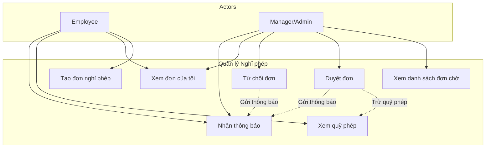
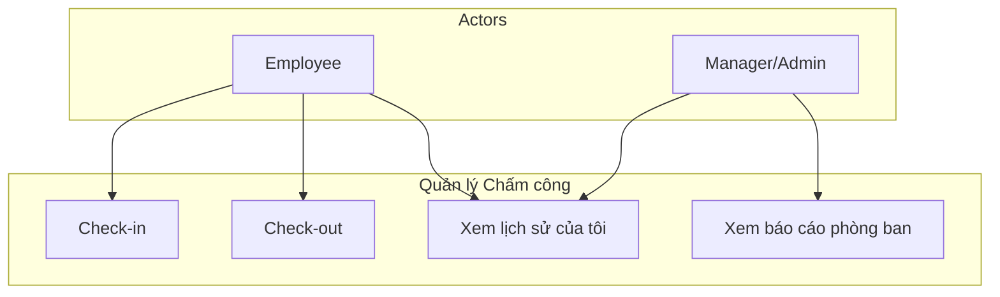
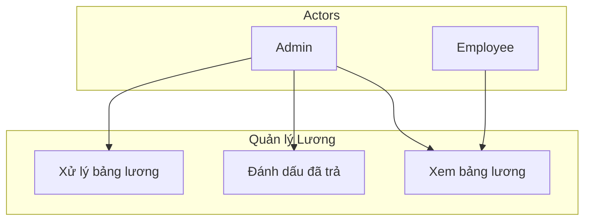
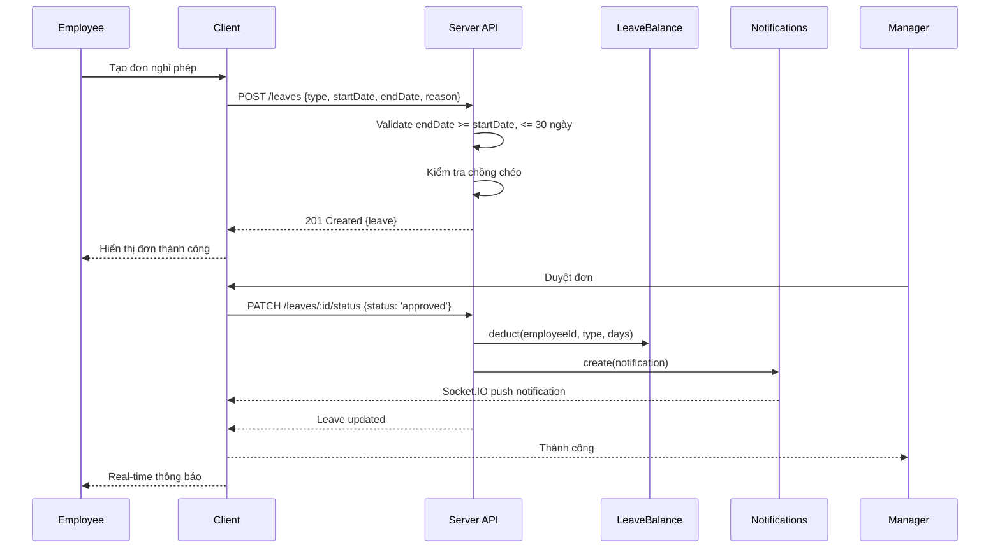
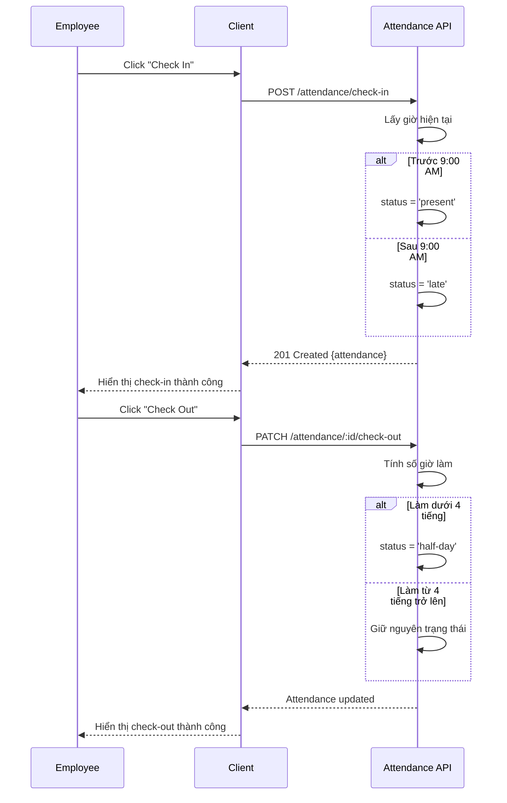
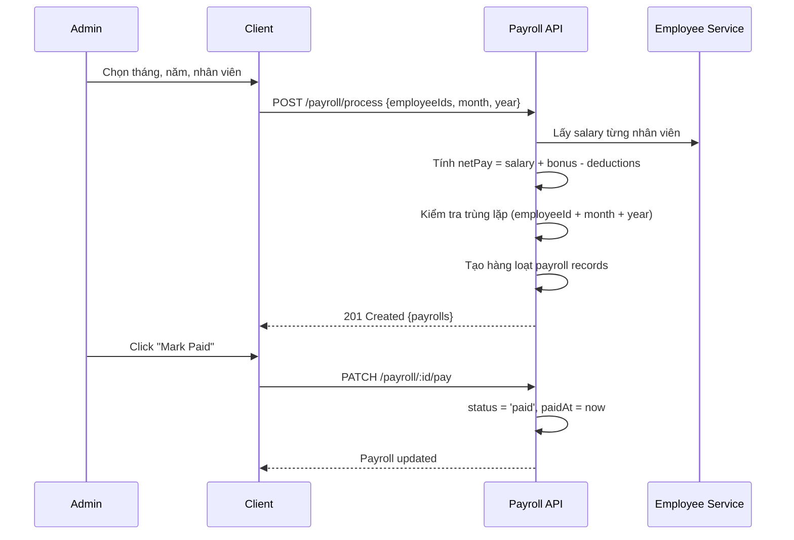
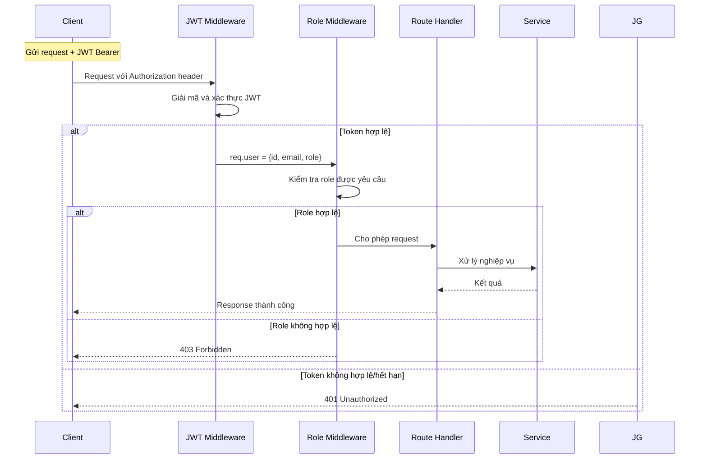

# Đặc tả yêu cầu phần mềm (SRS)

## Hệ thống Quản lý Nhân sự (HR Management)

---

## Mục lục

1. [Giới thiệu](#1-giới-thiệu)
2. [Mô tả tổng thể](#2-mô-tả-tổng-thể)
3. [Yêu cầu chức năng](#3-yêu-cầu-chức-năng)
4. [Yêu cầu phi chức năng](#4-yêu-cầu-phi-chức-năng)
5. [Mô hình dữ liệu](#5-mô-hình-dữ-liệu)
6. [Biểu đồ use case](#6-biểu-đồ-use-case)
7. [Ma trận phân quyền](#7-ma-trận-phân-quyền)
8. [Luồng nghiệp vụ chính](#8-luồng-nghiệp-vụ-chính)
9. [API Endpoints](#9-api-endpoints)

---

## 1. Giới thiệu

### 1.1 Mục đích

Tài liệu này mô tả chi tiết các yêu cầu chức năng và phi chức năng cho hệ thống Quản lý Nhân sự (HR Management). Hệ thống được xây dựng nhằm số hóa và tự động hóa toàn bộ quy trình nhân sự trong doanh nghiệp, từ quản lý hồ sơ, nghỉ phép, chấm công, tính lương đến tuyển dụng và đánh giá hiệu suất.

### 1.2 Phạm vi

Hệ thống bao gồm các phân hệ chính sau:

- **Xác thực và Phân quyền**: Đăng ký, đăng nhập, quản lý phiên làm việc, kiểm soát truy cập dựa trên vai trò (RBAC).
- **Quản lý Nhân viên**: Thêm, sửa, xóa, tìm kiếm, xuất dữ liệu nhân viên; quản lý tài liệu đính kèm.
- **Quản lý Phòng ban**: Tổ chức phòng ban, gán trưởng phòng, sơ đồ tổ chức dạng cây.
- **Quản lý Nghỉ phép**: Tạo đơn, phê duyệt, theo dõi quỹ phép, kiểm tra chồng chéo.
- **Quản lý Chấm công**: Check-in/check-out, tự động phân loại trạng thái (đúng giờ, trễ, nửa ngày).
- **Quản lý Bảng lương**: Tính lương hàng tháng, quản lý trạng thái thanh toán.
- **Quản lý Tuyển dụng**: Đăng tin tuyển dụng, theo dõi ứng viên qua các vòng.
- **Đánh giá Hiệu suất**: Tạo, cập nhật, xem đánh giá hiệu suất nhân viên.
- **Dashboard và Thống kê**: Báo cáo tổng quan theo từng vai trò.
- **Thông báo thời gian thực**: Thông báo đẩy qua Socket.IO.
- **Lịch sử nhân viên**: Timeline các thay đổi về lương, chức vụ, phòng ban.

### 1.3 Định nghĩa và từ viết tắt

| Thuật ngữ | Ý nghĩa |
|-----------|---------|
| HR | Human Resources (Nhân sự) |
| JWT | JSON Web Token -- chuẩn xác thực dạng token |
| RBAC | Role-Based Access Control -- phân quyền dựa trên vai trò |
| SPA | Single Page Application -- ứng dụng trang đơn |
| REST | Representational State Transfer -- kiến trúc API |
| CRUD | Create, Read, Update, Delete -- bốn thao tác dữ liệu cơ bản |
| Socket.IO | Thư viện WebSocket cho giao tiếp thời gian thực |

---

## 2. Mô tả tổng thể

### 2.1 Góc nhìn sản phẩm

Hệ thống là một ứng dụng web SPA với kiến trúc client-server phân tách rõ ràng:

- **Client (React 18)**: Giao diện người dùng, chạy trên trình duyệt, port 5173.
- **Server (Express)**: API backend xử lý nghiệp vụ, port 3001.
- **Database (MongoDB)**: Lưu trữ dữ liệu, chạy local.

Client giao tiếp với Server qua REST API với xác thực JWT Bearer token. Server giao tiếp với MongoDB qua Mongoose ODM. Ngoài ra, Server còn hỗ trợ WebSocket qua Socket.IO để đẩy thông báo thời gian thực đến Client.

```
┌──────────────┐    HTTP/REST    ┌──────────────┐    Mongoose    ┌───────────┐
│   Client     │◄──────────────►│   Server     │◄──────────────►│  MongoDB  │
│  (React 18)  │   JWT Bearer   │  (Express)   │                │  (NoSQL)  │
│  Port 5173   │   + Socket.IO  │  Port 3001   │                │  Local    │
└──────────────┘                └──────────────┘               └───────────┘
```

### 2.2 Đặc điểm người dùng

Hệ thống phục vụ ba vai trò người dùng, mỗi vai trò có quyền hạn và phạm vi truy cập khác nhau:

| Vai trò | Mô tả | Số lượng dự kiến |
|---------|-------|------------------|
| Admin | Quản trị viên, có toàn quyền trên toàn bộ hệ thống | 1-3 người |
| Manager | Trưởng phòng, quản lý nhân viên trong phòng ban của mình | 5-20 người |
| Employee | Nhân viên, chỉ xem và quản lý thông tin cá nhân | 50-500+ người |

### 2.3 Ràng buộc và giả định

- Server yêu cầu biến môi trường `JWT_SECRET` để khởi động -- nếu thiếu, server sẽ báo lỗi và thoát.
- Mật khẩu phải có tối thiểu 8 ký tự, bao gồm chữ hoa, chữ thường và chữ số.
- File upload giới hạn 5MB mỗi file. Chỉ chấp nhận các định dạng: JPEG, PNG, GIF, PDF, DOC, DOCX.
- API bị giới hạn tốc độ tối đa 60 request/phút cho mỗi địa chỉ IP.
- Cần chạy lệnh seed dữ liệu trước khi sử dụng lần đầu để tạo tài khoản mẫu và dữ liệu ban đầu.

---

## 3. Yêu cầu chức năng

### 3.1 Phân hệ Xác thực và Phân quyền

| Mã | Yêu cầu | Mô tả |
|----|---------|-------|
| FR-AUTH-01 | Đăng ký tài khoản | Người dùng đăng ký với email và mật khẩu. Tài khoản mới luôn có role la employee. |
| FR-AUTH-02 | Đăng nhập | Người dùng đăng nhập với email và mật khẩu. Server trả ve JWT token neu thanh cong. |
| FR-AUTH-03 | Xem thông tin cá nhân | Người dùng xem profile của chính mình thông qua token JWT. |
| FR-AUTH-04 | Cập nhật profile | Người dùng cập nhật tên và email của chính mình. |
| FR-AUTH-05 | Đổi mật khẩu | Đổi mật khẩu, yêu cầu xác thực mật khẩu hiện tại trước khi thay đổi. |
| FR-AUTH-06 | Đăng xuất | Xóa token JWT khỏi localStorage (xử lý phía client). |
| FR-AUTH-07 | Bảo vệ API | Tất cả API (ngoại trừ đăng ký và đăng nhập) đều yêu cầu JWT hợp lệ. |
| FR-AUTH-08 | Phân quyền API | Kiểm tra vai trò người dùng trước khi cho phép truy cập API. |

### 3.2 Phân hệ Quản lý Nhân viên

| Mã | Yêu cầu | Mô tả |
|----|---------|-------|
| FR-EMP-01 | Danh sách nhân viên | Admin và Manager xem danh sách nhân viên với tìm kiếm, lọc, phân trang. |
| FR-EMP-02 | Xem chi tiết nhân viên | Xem thông tin cá nhân, hợp đồng, tài liệu, lịch sử thay đổi. |
| FR-EMP-03 | Thêm nhân viên mới | Admin thêm nhân viên với đầy đủ thông tin bắt buộc. |
| FR-EMP-04 | Cập nhật nhân viên | Admin chỉnh sửa thông tin nhân viên. |
| FR-EMP-05 | Xóa nhân viên | Admin xóa một nhân viên. |
| FR-EMP-06 | Xóa hàng loạt | Admin xóa tối đa 100 nhân viên cùng lúc. |
| FR-EMP-07 | Export CSV | Admin và Manager xuất danh sách nhân viên ra file CSV. |
| FR-EMP-08 | Upload tài liệu | Admin upload tài liệu cho nhân viên (hợp đồng, CV, chứng chỉ). |
| FR-EMP-09 | Xóa tài liệu | Admin xóa tài liệu đã upload của nhân viên. |
| FR-EMP-10 | Xem lịch sử | Xem timeline các thay đổi: lương, thăng chức, chuyển phòng. |
| FR-EMP-11 | Thêm lịch sử | Admin và Manager thêm ghi chép lịch sử cho nhân viên. |

### 3.3 Phân hệ Quản lý Phòng ban

| Mã | Yêu cầu | Mô tả |
|----|---------|-------|
| FR-DEPT-01 | Danh sách phòng ban | Admin và Manager xem danh sách phòng ban. |
| FR-DEPT-02 | Xem chi tiết phòng ban | Xem thông tin chi tiết, danh sách nhân viên, trưởng phòng. |
| FR-DEPT-03 | Thêm phòng ban | Admin thêm phòng ban mới. |
| FR-DEPT-04 | Sửa phòng ban | Admin cập nhật thông tin và gán trưởng phòng. |
| FR-DEPT-05 | Xóa phòng ban | Admin xóa phòng ban. |
| FR-DEPT-06 | Sơ đồ tổ chức | Xem sơ đồ tổ chức dạng cây với các phòng ban và nhân viên. |

### 3.4 Phân hệ Quản lý Nghỉ phép

| Mã | Yêu cầu | Mô tả |
|----|---------|-------|
| FR-LEAVE-01 | Danh sách đơn | Employee xem đơn của mình; Manager xem đơn phòng mình; Admin xem tất cả. |
| FR-LEAVE-02 | Tạo đơn nghỉ phép | Employee tạo đơn với loại nghỉ (phép năm, ốm, cá nhân), ngày bắt đầu, ngày kết thúc, lý do. |
| FR-LEAVE-03 | Kiểm tra chồng chéo | Hệ thống tự động kiểm tra đơn mới không trùng ngày với đơn đã được duyệt. |
| FR-LEAVE-04 | Giới hạn thời gian | Một đơn nghỉ phép tối đa 30 ngày. |
| FR-LEAVE-05 | Duyệt/Từ chối đơn | Admin hoặc Manager duyệt hoặc từ chối đơn đang chờ xử lý. |
| FR-LEAVE-06 | Trừ ngày phép | Khi duyệt, hệ thống tự động trừ số ngày đã nghỉ từ quỹ phép của nhân viên. |
| FR-LEAVE-07 | Thông báo phê duyệt | Gửi thông báo cho nhân viên khi đơn được duyệt hoặc từ chối. |
| FR-LEAVE-08 | Xem quỹ phép | Xem số ngày phép còn lại theo từng loại (phép năm, ốm, cá nhân). |

### 3.5 Phân hệ Quản lý Chấm công

| Mã | Yêu cầu | Mô tả |
|----|---------|-------|
| FR-ATT-01 | Check-in | Employee check-in đầu giờ, hệ thống tự động xác định trạng thái. |
| FR-ATT-02 | Check-out | Employee check-out cuối giờ, hệ thống tính số giờ đã làm. |
| FR-ATT-03 | Xác định trạng thái | Check-in trước 9:00 AM được xếp là present, sau 9:00 AM là late. |
| FR-ATT-04 | Nửa ngày | Nếu tổng thời gian làm việc dưới 4 tiếng, trạng thái chuyển thành half-day. |
| FR-ATT-05 | Lịch sử chấm công | Employee xem lịch sử check-in/check-out của bản thân. |
| FR-ATT-06 | Báo cáo chấm công | Admin và Manager xem báo cáo tổng hợp của phòng ban. |

### 3.6 Phân hệ Quản lý Bảng lương

| Mã | Yêu cầu | Mô tả |
|----|---------|-------|
| FR-PAY-01 | Xem bảng lương | Employee xem lương của mình. Admin và Manager xem lương của nhân viên. |
| FR-PAY-02 | Xử lý bảng lương | Admin chọn nhân viên, tháng, năm để hệ thống tự động tính toán. |
| FR-PAY-03 | Công thức tính | NetPay = BasicSalary + Bonus - Deductions. Kết quả tối thiểu là 0. |
| FR-PAY-04 | Chống trùng lặp | Hệ thống không tạo bảng lương mới nếu đã tồn tại cho cùng nhân viên và kỳ. |
| FR-PAY-05 | Đánh dấu đã trả | Admin đánh dấu bảng lương đã thanh toán, ghi lại thời gian thanh toán. |

### 3.7 Phân hệ Dashboard

| Mã | Yêu cầu | Mô tả |
|----|---------|-------|
| FR-DASH-01 | Admin Dashboard | Hiển thị tổng số nhân viên, phòng ban, đơn nghỉ phép đang chờ, chấm công hôm nay, tổng lương tháng, biểu đồ nhân viên theo phòng ban. |
| FR-DASH-02 | Manager Dashboard | Hiển thị tên phòng ban quản lý, số nhân viên, đơn chờ duyệt, tình trạng chấm công, quỹ lương phòng. |
| FR-DASH-03 | Employee Dashboard | Hiển thị thống kê nghỉ phép (pending/approved/rejected), chấm công, lương gần nhất, các đơn sắp tới. |

### 3.8 Phân hệ Tuyển dụng

| Mã | Yêu cầu | Mô tả |
|----|---------|-------|
| FR-REC-01 | Quản lý tin tuyển dụng | CRUD tin tuyển dụng với các trường: title, department, description, requirements, status, openings. |
| FR-REC-02 | Quản lý ứng viên | CRUD ứng viên với thông tin cá nhân, trạng thái, hồ sơ đính kèm. |
| FR-REC-03 | Theo dõi trạng thái | Cập nhật trạng thái ứng viên qua các giai đoạn: applied, screening, interview, offered, hired, rejected. |
| FR-REC-04 | Lọc ứng viên | Lọc danh sách ứng viên theo tin tuyển dụng và trạng thái. |

### 3.9 Phân hệ Đánh giá Hiệu suất

| Mã | Yêu cầu | Mô tả |
|----|---------|-------|
| FR-PRF-01 | Tạo đánh giá | Admin và Manager tạo đánh giá hiệu suất cho nhân viên. |
| FR-PRF-02 | Xem đánh giá | Employee xem đánh giá của mình; Manager xem đánh giá của phòng. |
| FR-PRF-03 | Cập nhật đánh giá | Cập nhật rating, comments, goals, status. |
| FR-PRF-04 | Xóa đánh giá | Admin xóa đánh giá hiệu suất. |

### 3.10 Phân hệ Thông báo

| Mã | Yêu cầu | Mô tả |
|----|---------|-------|
| FR-NOT-01 | Thông báo trong ứng dụng | Tạo thông báo khi đơn nghỉ phép được duyệt/từ chối, bảng lương sẵn sàng. |
| FR-NOT-02 | Thời gian thực | Thông báo được đẩy đến client ngay lập tức qua Socket.IO. |
| FR-NOT-03 | Đánh dấu đã đọc | Người dùng đánh dấu từng thông báo hoặc tất cả thông báo là đã đọc. |
| FR-NOT-04 | Đếm chưa đọc | Hiển thị số thông báo chưa đọc trên sidebar. |

### 3.11 Phân hệ Giao diện và Cài đặt

| Mã | Yêu cầu | Mô tả |
|----|---------|-------|
| FR-UI-01 | Đa ngôn ngữ | Hỗ trợ tiếng Anh và tiếng Việt. Người dùng chuyển đổi trong Settings. |
| FR-UI-02 | Dark mode | Cho phép chuyển đổi giữa giao diện sáng và tối. |
| FR-UI-03 | Sidebar thông minh | Menu điều hướng tự động thay đổi theo vai trò người dùng. |
| FR-UI-04 | Phím tắt | Hỗ trợ phím tắt để điều hướng nhanh (G + phím chức năng). |
| FR-UI-05 | Responsive | Giao diện tự động thích ứng với màn hình desktop và mobile. |

---

## 4. Yêu cầu phi chức năng

| Mã | Yêu cầu | Mô tả | Chỉ tiêu |
|----|---------|-------|----------|
| NFR-01 | Hiệu năng | API phải phản hồi nhanh, đáp ứng được nhiều người dùng đồng thời. | Thời gian phản hồi dưới 500ms cho 95% request. |
| NFR-02 | Bảo mật mật khẩu | Mật khẩu phải được bảo vệ bằng thuật toán mã hóa mạnh. | Sử dụng bcrypt với 10 salt rounds. |
| NFR-03 | Bảo mật phiên | Token JWT phải có thời hạn để giảm rủi ro nếu bị lộ. | Token hết hạn sau 1 ngày (JWT_EXPIRES_IN = 1d). |
| NFR-04 | Rate limiting | Giới hạn số lượng request để chống tấn công DDoS và spam. | Tối đa 60 request/phút cho mỗi IP. |
| NFR-05 | File upload | Kiểm soát kích thước và loại file để bảo vệ server. | Tối đa 5MB, chỉ nhận JPEG/PNG/GIF/PDF/DOC/DOCX. |
| NFR-06 | Bảo mật HTTP | Sử dụng helmet middleware để thiết lập các header bảo mật. | Cross-Origin-Resource-Policy, X-Frame-Options, etc. |
| NFR-07 | Validation đầu vào | Tất cả dữ liệu đầu vào phải được kiểm tra trước khi xử lý. | Zod validation + express-validator middleware. |
| NFR-08 | CORS | Chỉ cho phép các domain được ủy quyền gọi API. | Cấu hình CORS_ORIGIN, mặc định là localhost:5173. |
| NFR-09 | Database indexing | Đánh index cho các trường thường xuyên được truy vấn. | Compound indexes trên employeeId, status, date. |


---

## 5. Mô hình dữ liệu

Hệ thống sử dụng MongoDB làm cơ sở dữ liệu. Dưới đây là cấu trúc chi tiết của từng collection.

### 5.1 User -- Người dùng

Lưu trữ thông tin xác thực và phân quyền. Tách biệt với hồ sơ nhân viên để đảm bảo bảo mật.

```json
{
  "_id": "ObjectId",
  "email": "string (duy nhat, bat buoc)",
  "passwordHash": "string (bat buoc)",
  "role": "enum: admin|manager|employee (bat buoc)",
  "name": "string (khong bat buoc)",
  "isActive": "boolean (mac dinh: true)",
  "createdAt": "Date",
  "updatedAt": "Date"
}
```

### 5.2 Employee -- Nhân viên

Thông tin hồ sơ nhân viên. Mỗi User có thể có 0 hoac 1 Employee record. Documents chứa danh sach file dinh kem.

```json
{
  "_id": "ObjectId",
  "userId": "ObjectId -> User (duy nhat, bat buoc)",
  "departmentId": "ObjectId -> Department (bat buoc)",
  "firstName": "string (bat buoc)",
  "lastName": "string (bat buoc)",
  "position": "string (bat buoc)",
  "salary": "number (toi thieu 0, bat buoc)",
  "hireDate": "Date (bat buoc)",
  "phone": "string (khong bat buoc)",
  "contractType": "enum: permanent|contract|intern (khong bat buoc)",
  "contractExpiry": "Date (khong bat buoc)",
  "documents": [
    {
      "name": "string",
      "url": "string",
      "type": "string",
      "uploadedAt": "Date"
    }
  ]
}
```

### 5.3 Department -- Phòng ban

Phòng ban trong công ty. Moi phong co the co mot truong phong (managerId tro den User).

```json
{
  "_id": "ObjectId",
  "name": "string (duy nhat, bat buoc)",
  "description": "string (khong bat buoc)",
  "managerId": "ObjectId -> User (khong bat buoc)"
}
```

### 5.4 Leave -- Đơn nghỉ phép

Đơn xin nghỉ phép cua nhan vien. Trang thai bat dau la pending, sau do duoc duyet hoac tu choi.

```json
{
  "_id": "ObjectId",
  "employeeId": "ObjectId -> Employee (bat buoc)",
  "type": "enum: sick|annual|personal (bat buoc)",
  "startDate": "Date (bat buoc)",
  "endDate": "Date (bat buoc)",
  "status": "enum: pending|approved|rejected (mac dinh: pending)",
  "approvedBy": "ObjectId -> User (khong bat buoc)",
  "reason": "string (khong bat buoc)",
  "rejectionReason": "string (khong bat buoc)"
}
```

### 5.5 Attendance -- Chấm công

Ban ghi check-in/check-out hang ngay. Trang thai duoc tu dong tinh toan dua tren gio check-in va tong thoi gian lam viec.

```json
{
  "_id": "ObjectId",
  "employeeId": "ObjectId -> Employee (bat buoc)",
  "date": "Date (bat buoc)",
  "checkIn": "Date (khong bat buoc)",
  "checkOut": "Date (khong bat buoc)",
  "status": "enum: present|late|absent|half-day (bat buoc)",
  "note": "string (khong bat buoc)"
}
```

### 5.6 Payroll -- Bảng lương

Bảng lương theo thang. Duoc tao o trang thai draft, sau do admin danh dau la paid khi da thanh toan.

```json
{
  "_id": "ObjectId",
  "employeeId": "ObjectId -> Employee (bat buoc)",
  "month": "number 1-12 (bat buoc)",
  "year": "number (bat buoc)",
  "basicSalary": "number (toi thieu 0, bat buoc)",
  "bonus": "number (mac dinh: 0)",
  "deductions": "number (mac dinh: 0)",
  "netPay": "number (toi thieu 0, bat buoc)",
  "status": "enum: draft|paid (mac dinh: draft)",
  "paidAt": "Date (khong bat buoc)"
}
```

### 5.7 LeaveBalance -- Quỹ nghỉ phép

Quỹ phép của nhân viên. Tu dong tao khi duoc truy van lan dau. Bi tru khi don nghi phep duoc duyet.

```json
{
  "_id": "ObjectId",
  "employeeId": "ObjectId -> Employee (duy nhat, bat buoc)",
  "annualTotal": "number (mac dinh: 12)",
  "annualUsed": "number (mac dinh: 0)",
  "sickTotal": "number (mac dinh: 30)",
  "sickUsed": "number (mac dinh: 0)",
  "personalTotal": "number (mac dinh: 3)",
  "personalUsed": "number (mac dinh: 0)"
}
```

### 5.8 EmployeeHistory -- Lịch sử nhân viên

Ghi lai cac thay doi ve luong, chuc vu, phong ban cua nhan vien. Tao dong bo khi co thay doi tu Employee.

```json
{
  "_id": "ObjectId",
  "employeeId": "ObjectId -> Employee (bat buoc)",
  "type": "enum: raise|promotion|transfer|other (bat buoc)",
  "previousValue": "string (khong bat buoc)",
  "newValue": "string (bat buoc)",
  "effectiveDate": "Date (bat buoc)",
  "note": "string (khong bat buoc)"
}
```

### 5.9 Notification -- Thông báo

Thong bao trong ung dung. Duoc tao tu dong boi cac su kien: duyet don, tu choi don, luong san sang.

```json
{
  "_id": "ObjectId",
  "userId": "ObjectId -> User (bat buoc)",
  "title": "string (bat buoc)",
  "message": "string (khong bat buoc)",
  "type": "enum: leave_request|leave_approved|leave_rejected|payroll_ready|system (bat buoc)",
  "relatedId": "ObjectId (khong bat buoc)",
  "relatedModel": "string (khong bat buoc)",
  "isRead": "boolean (mac dinh: false)",
  "createdAt": "Date"
}
```

### 5.10 JobPosting -- Tin tuyển dụng

Tin tuyen dung cua cong ty. Co the o trang thai open, closed, hoac draft.

```json
{
  "_id": "ObjectId",
  "title": "string (bat buoc)",
  "departmentId": "ObjectId -> Department (bat buoc)",
  "description": "string (khong bat buoc)",
  "requirements": "string (khong bat buoc)",
  "status": "enum: open|closed|draft (mac dinh: open)",
  "openings": "number (mac dinh: 1)"
}
```

### 5.11 Candidate -- Ứng viên

Ung vien dang ky cho mot vi tri tuyen dung cu the. Trang thai theo doi qua cac vong tuyen dung.

```json
{
  "_id": "ObjectId",
  "firstName": "string (bat buoc)",
  "lastName": "string (bat buoc)",
  "email": "string (bat buoc)",
  "phone": "string (khong bat buoc)",
  "jobPostingId": "ObjectId -> JobPosting (bat buoc)",
  "status": "enum: applied|screening|interview|offered|hired|rejected (mac dinh: applied)",
  "resumeUrl": "string (khong bat buoc)",
  "notes": "string (khong bat buoc)",
  "appliedDate": "Date"
}
```

### 5.12 PerformanceReview -- Đánh giá hiệu suất

Danh gia hieu suat nhan vien theo ky (quy/thang). Ghi nhan diem, nhan xet, muc tieu.

```json
{
  "_id": "ObjectId",
  "employeeId": "ObjectId -> Employee (bat buoc)",
  "reviewerId": "ObjectId -> User (bat buoc)",
  "period": "string (bat buoc, vi du: '2026-Q1')",
  "rating": "number 1-5 (khong bat buoc)",
  "comments": "string (khong bat buoc)",
  "goals": "string (khong bat buoc)",
  "status": "enum: draft|submitted|acknowledged (mac dinh: draft)"
}
```

---

## 6. Biểu đồ use case

### 6.1 Use case tổng thể

Ba vai trò người dùng (Employee, Manager, Admin) tương tác với hệ thống qua các use case chính. Trong đó:

- **Employee** (đường liền): Đăng nhập, Chấm công, Xem Dashboard, Xem Thông báo.
- **Employee** (đường đứt): Xem thông tin nhân viên (bản thân), Quản lý nghỉ phép, Xem lương.
- **Manager** (đường liền): Đăng nhập, Xem Dashboard, Xem Thông báo, Xem Sơ đồ tổ chức.
- **Manager** (đường đứt): Quản lý nhân viên phòng mình, Duyệt đơn, Xem lương phòng, v.v.
- **Admin** (đường liền): Tất cả chức năng.

```mermaid
graph TB
    subgraph Actors
        A[Admin]
        M[Manager]
        E[Employee]
    end

    subgraph "Hệ thống HR Management"
        UC1[Đăng nhập/Đăng ký]
        UC2[Quản lý Nhân viên]
        UC3[Quản lý Phòng ban]
        UC4[Quản lý Nghỉ phép]
        UC5[Chấm công]
        UC6[Quản lý Lương]
        UC7[Quản lý Tuyển dụng]
        UC8[Đánh giá Hiệu suất]
        UC9[Xem Dashboard]
        UC10[Xem Thông báo]
        UC11[Xem Sơ đồ tổ chức]
        UC12[Xem Lịch sử NV]
    end

    A --> UC1
    A --> UC2
    A --> UC3
    A --> UC4
    A --> UC5
    A --> UC6
    A --> UC7
    A --> UC8
    A --> UC9
    A --> UC10
    A --> UC11
    A --> UC12

    M --> UC1
    M -.-> UC2
    M -.-> UC3
    M -.-> UC4
    M -.-> UC5
    M -.-> UC6
    M -.-> UC7
    M -.-> UC8
    M --> UC9
    M --> UC10
    M --> UC11
    M --> UC12

    E --> UC1
    E -.-> UC2
    E -.-> UC4
    E --> UC5
    E -.-> UC6
    E --> UC9
    E --> UC10
```



### 6.2 Use case Nghỉ phép

Employee tạo đơn nghỉ phép, Manager/Admin duyệt hoặc từ chối. Khi duyệt, hệ thống tự động trừ quỹ phép và gửi thông báo.



### 6.3 Use case Chấm công

Employee check-in đầu giờ và check-out cuối giờ. Hệ thống tự động phân loại trạng thái dựa trên giờ check-in và tổng thời gian làm việc.



### 6.4 Use case Lương

Admin xử lý bảng lương hàng tháng và đánh dấu đã trả. Employee chỉ xem được lương của bản thân.



---

## 7. Ma trận phân quyền

### 7.1 Quyền truy cập API

Cac ky hieu su dung: **Co** = Co quyen, **Khong** = Khong co quyen, **Gioi han** = Chi trong pham vi phong ban hoac ban than.

| Chức năng | Admin | Manager | Employee |
|-----------|:-----:|:-------:|:--------:|
| **Xac thuc** | | | |
| Đăng ký | - | - | Khong (public) |
| Đăng nhập | - | - | Khong (public) |
| Xem profile | Co | Co | Co |
| Cập nhật profile | Co | Co | Co |
| Đổi mật khẩu | Co | Co | Co |
| **Nhân viên** | | | |
| Danh sách | Co | Co (phong minh) | Khong |
| Xem chi tiết | Co | Co (phong minh) | Co (ban than) |
| Thêm/Sửa/Xóa | Co | Khong | Khong |
| Upload/Xóa tài liệu | Co | Khong | Khong |
| Bulk delete | Co | Khong | Khong |
| Export CSV | Co | Co (phong minh) | Khong |
| **Phòng ban** | | | |
| CRUD phòng ban | Co | Khong | Khong |
| Xem danh sách | Co | Co | Khong |
| Sơ đồ tổ chức | Co | Co | Khong |
| **Nghỉ phép** | | | |
| Tạo đơn | Khong | Khong | Co |
| Duyệt/Từ chối | Co | Co (phong minh) | Khong |
| Danh sách | Co | Co (phong minh) | Co (ban than) |
| **Chấm công** | | | |
| Check-in/out | Khong | Khong | Co |
| Danh sách | Co | Co (phong minh) | Co (ban than) |
| Báo cáo | Co | Co (phong minh) | Khong |
| **Lương** | | | |
| Xử lý lương | Co | Khong | Khong |
| Xem lương | Co | Co (phong minh) | Co (ban than) |
| Đánh dấu đã trả | Co | Khong | Khong |
| **Tuyển dụng** | | | |
| CRUD tin tuyển dụng | Co | Khong | Khong |
| CRUD ứng viên | Co | Co | Khong |
| **Đánh giá hiệu suất** | | | |
| Tạo/Sửa đánh giá | Co | Co | Khong |
| Xóa đánh giá | Co | Khong | Khong |
| Xem đánh giá | Co | Co (phong minh) | Co (ban than) |
| **Thông báo** | Co | Co | Co |
| **Dashboard** | Co (toan he thong) | Co (phong minh) | Co (ca nhan) |
| **Lịch sử nhân viên** | Co | Co (phong minh) | Co (ban than) |

### 7.2 Quyền truy cập giao diện

Menu sidebar thay đổi theo vai trò để tránh hiển thị các chức năng không có quyền truy cập.

| Menu sidebar | Admin | Manager | Employee |
|--------------|:-----:|:-------:|:--------:|
| Dashboard | Co | Co | Co |
| Employees | Co | Co | Khong |
| Departments | Co | Co | Khong |
| Org Chart | Co | Co | Khong |
| Leaves | Khong (dung approvals) | Khong (dung approvals) | Co |
| Leave Approvals | Co | Co | Khong |
| Attendance | Khong (dung report) | Khong (dung report) | Co |
| Attendance Report | Co | Co | Khong |
| Payroll | Khong (dung manage) | Khong (dung manage) | Co |
| Payroll Management | Co | Khong | Khong |
| Job Postings | Co | Co | Khong |
| Candidates | Co | Co | Khong |
| Performance Reviews | Khong (dung manage) | Khong (dung manage) | Co |
| Review Management | Co | Co | Khong |

---

## 8. Luồng nghiệp vụ chính

### 8.1 Luồng nghỉ phép

Quy trình từ khi Employee tạo đơn đến khi Manager/Admin phê duyệt và hệ thống tự động trừ quỹ phép, gửi thông báo.



### 8.2 Luồng chấm công hàng ngày

Employee check-in đầu giờ và check-out cuối giờ. Hệ thống tự động tính toán trạng thái dựa trên quy tắc thời gian.



### 8.3 Luồng xử lý lương

Admin chọn tháng, năm và danh sách nhân viên, hệ thống tự động tính netPay và tạo bảng lương ở trạng thái draft.



### 8.4 Luồng xác thực API

Mỗi request đến server đều đi qua hai lớp middleware: JWT Middleware (xác thực token) và Role Middleware (kiểm tra vai trò).



---

## 9. API Endpoints

### 9.1 Auth

| Method | Endpoint | Mô tả |
|--------|----------|-------|
| POST | `/api/auth/register` | Đăng ký tài khoản mới |
| POST | `/api/auth/login` | Đăng nhập, nhận JWT token |
| GET | `/api/auth/me` | Xem profile của người dùng hiện tại |
| PUT | `/api/auth/profile` | Cập nhật thông tin cá nhân |
| POST | `/api/auth/change-password` | Đổi mật khẩu |

### 9.2 Employees

| Method | Endpoint | Mô tả |
|--------|----------|-------|
| GET | `/api/employees` | Danh sách nhân viên (có phân trang, tìm kiếm, lọc) |
| GET | `/api/employees/export` | Xuất danh sách nhân viên ra file CSV |
| GET | `/api/employees/:id` | Chi tiết nhân viên |
| POST | `/api/employees` | Thêm nhân viên mới |
| PUT | `/api/employees/:id` | Cập nhật thông tin nhân viên |
| DELETE | `/api/employees/:id` | Xóa nhân viên |
| POST | `/api/employees/bulk-delete` | Xóa hàng loạt nhân viên (tối đa 100) |
| POST | `/api/employees/:id/documents` | Upload tài liệu cho nhân viên |
| DELETE | `/api/employees/:id/documents/:docId` | Xóa tài liệu của nhân viên |

### 9.3 Departments

| Method | Endpoint | Mô tả |
|--------|----------|-------|
| GET | `/api/departments` | Danh sách phòng ban |
| GET | `/api/departments/org-chart` | Sơ đồ tổ chức dạng cây |
| GET | `/api/departments/:id` | Chi tiết phòng ban |
| POST | `/api/departments` | Thêm phòng ban mới |
| PUT | `/api/departments/:id` | Cập nhật thông tin phòng ban |
| DELETE | `/api/departments/:id` | Xóa phòng ban |

### 9.4 Leaves

| Method | Endpoint | Mô tả |
|--------|----------|-------|
| GET | `/api/leaves` | Danh sách đơn nghỉ phép |
| POST | `/api/leaves` | Tạo đơn nghỉ phép mới |
| GET | `/api/leaves/:id` | Chi tiết đơn nghỉ phép |
| PATCH | `/api/leaves/:id/status` | Duyệt hoặc từ chối đơn |

### 9.5 Attendance

| Method | Endpoint | Mô tả |
|--------|----------|-------|
| GET | `/api/attendance` | Danh sách chấm công |
| POST | `/api/attendance/check-in` | Check-in đầu giờ |
| PATCH | `/api/attendance/:id/check-out` | Check-out cuối giờ |

### 9.6 Payroll

| Method | Endpoint | Mô tả |
|--------|----------|-------|
| GET | `/api/payroll` | Danh sách bảng lương |
| POST | `/api/payroll/process` | Xử lý và tạo bảng lương |
| PATCH | `/api/payroll/:id/pay` | Đánh dấu bảng lương đã thanh toán |

### 9.7 Recruitment

| Method | Endpoint | Mô tả |
|--------|----------|-------|
| GET | `/api/job-postings` | Danh sách tin tuyển dụng |
| POST | `/api/job-postings` | Thêm tin tuyển dụng |
| GET/PUT/DELETE | `/api/job-postings/:id` | Chi tiết/Sửa/Xóa tin tuyển dụng |
| GET | `/api/candidates` | Danh sách ứng viên |
| POST | `/api/candidates` | Thêm ứng viên |
| GET/PUT/DELETE | `/api/candidates/:id` | Chi tiết/Sửa/Xóa ứng viên |

### 9.8 Performance Reviews

| Method | Endpoint | Mô tả |
|--------|----------|-------|
| GET | `/api/performance-reviews` | Danh sách đánh giá hiệu suất |
| POST | `/api/performance-reviews` | Thêm đánh giá mới |
| GET/PUT/DELETE | `/api/performance-reviews/:id` | Chi tiết/Sửa/Xóa đánh giá |

### 9.9 Notifications

| Method | Endpoint | Mô tả |
|--------|----------|-------|
| GET | `/api/notifications` | Danh sách thông báo |
| GET | `/api/notifications/unread-count` | Số thông báo chưa đọc |
| PATCH | `/api/notifications/:id/read` | Đánh dấu một thông báo đã đọc |
| PATCH | `/api/notifications/read-all` | Đánh dấu tất cả thông báo đã đọc |

### 9.10 Dashboard

| Method | Endpoint | Mô tả |
|--------|----------|-------|
| GET | `/api/dashboard` | Thống kê dashboard theo vai trò |

### 9.11 Employee History

| Method | Endpoint | Mô tả |
|--------|----------|-------|
| GET | `/api/employees/:employeeId/history` | Xem lịch sử thay đổi của nhân viên |
| POST | `/api/employees/:employeeId/history` | Thêm ghi chép lịch sử cho nhân viên |

### 9.12 Leave Balance

| Method | Endpoint | Mô tả |
|--------|----------|-------|
| GET | `/api/leave-balance/my` | Xem quỹ phép của tôi |
| GET | `/api/leave-balance/:employeeId` | Xem quỹ phép của nhân viên |
