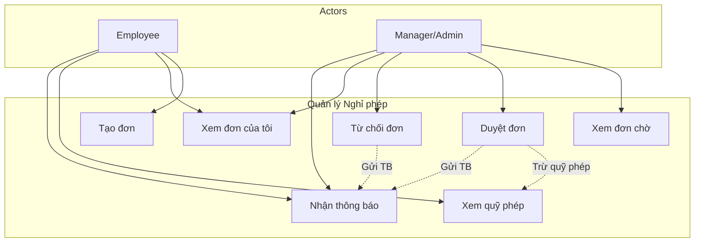
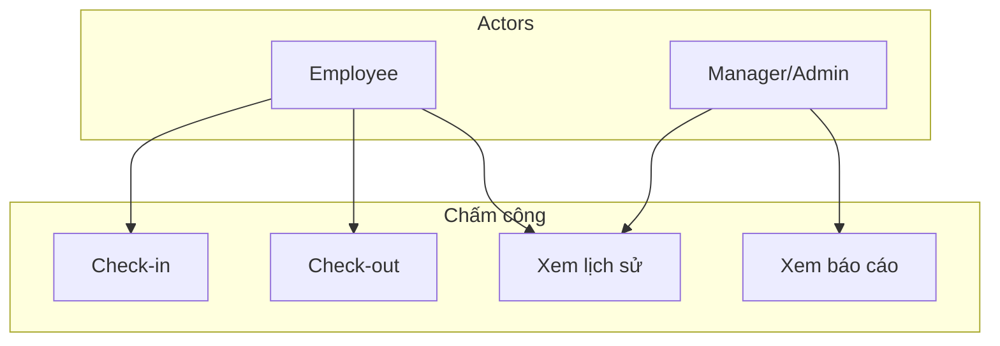
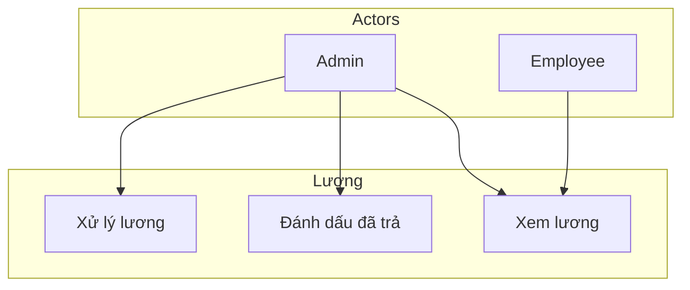
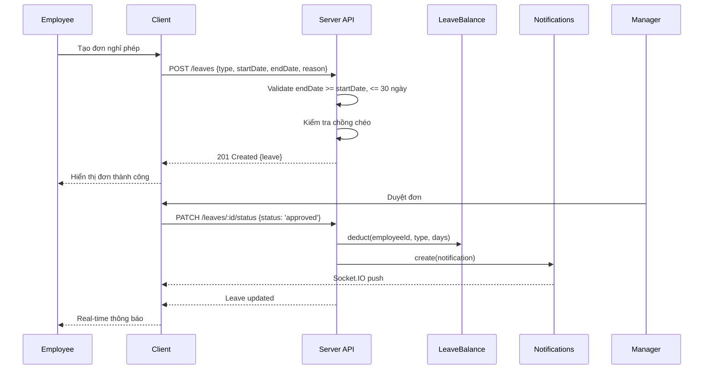
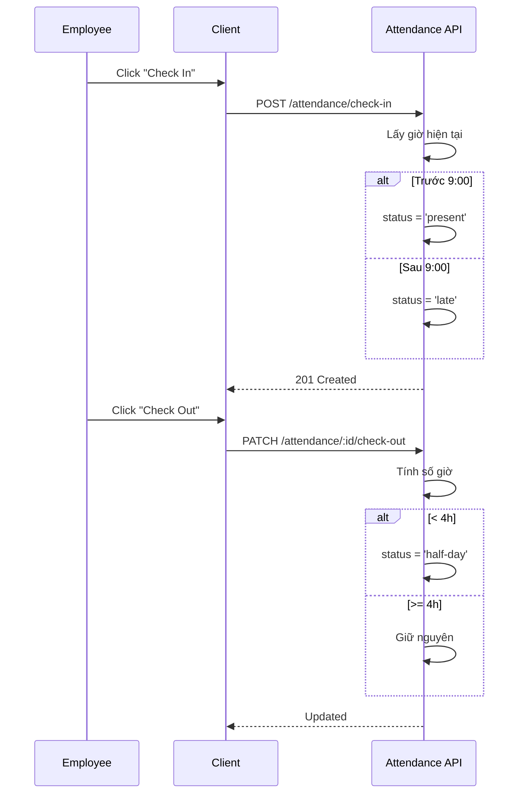
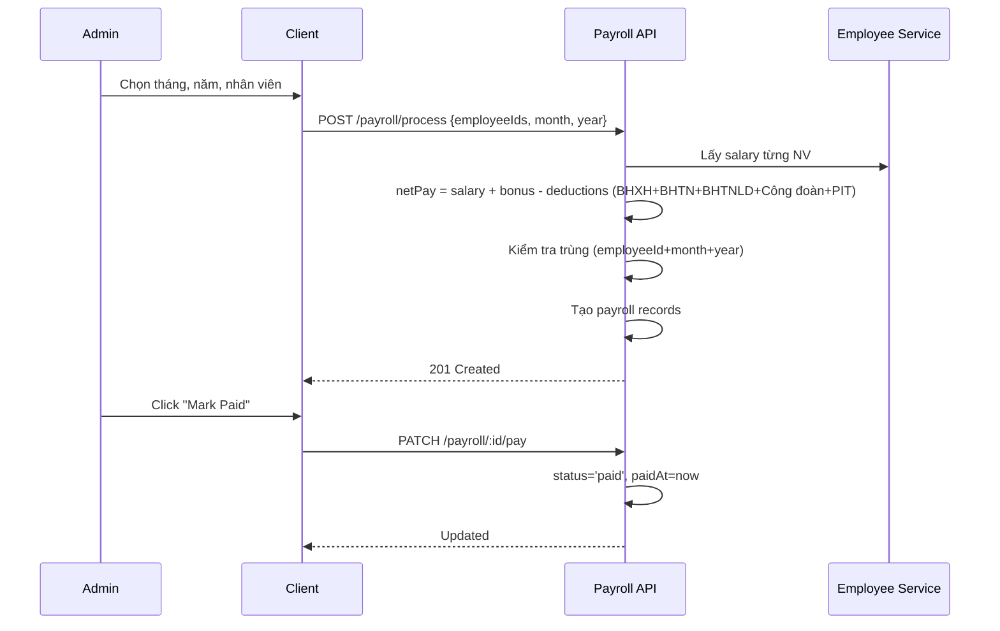
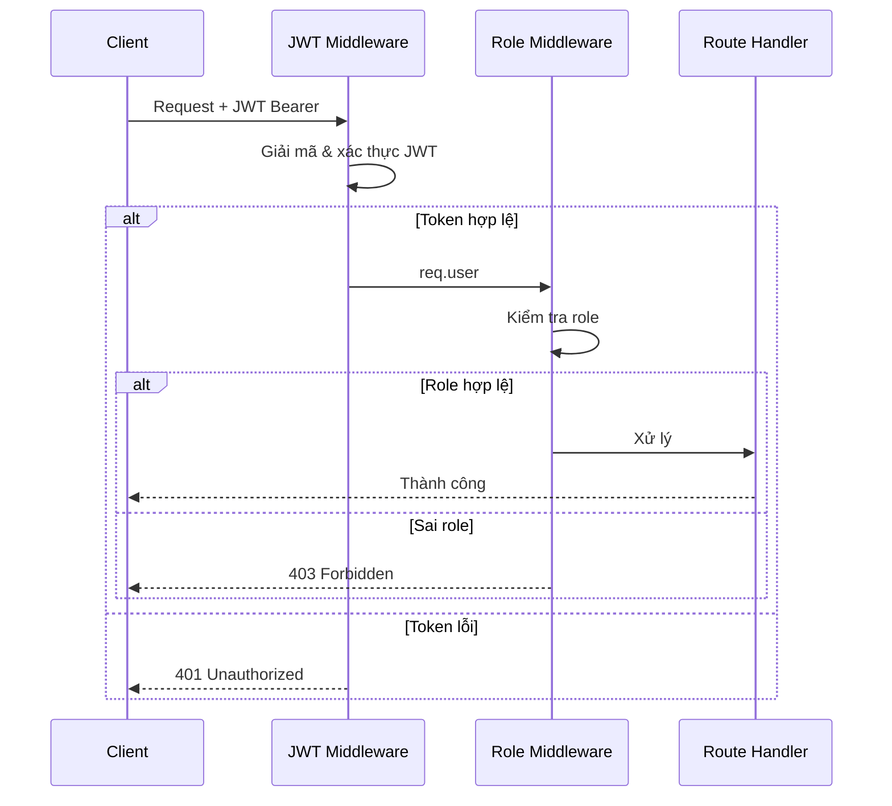

```mermaid
graph TB
    subgraph Actors
        A[Admin]
        M[Manager]
        E[Employee]
    end

    subgraph "Hệ thống HR Management"
        UC1[Đăng nhập/Đăng ký]
        UC2[Quản lý Nhân viên]
        UC3[Quản lý Phòng ban]
        UC4[Quản lý Nghỉ phép]
        UC5[Chấm công]
        UC6[Quản lý Lương]
        UC7[Quản lý Tuyển dụng]
        UC8[Đánh giá Hiệu suất]
        UC9[Xem Dashboard]
        UC10[Xem Thông báo]
        UC11[Xem Sơ đồ tổ chức]
        UC12[Xem Lịch sử NV]
    end

    A --> UC1
    A --> UC2
    A --> UC3
    A --> UC4
    A --> UC5
    A --> UC6
    A --> UC7
    A --> UC8
    A --> UC9
    A --> UC10
    A --> UC11
    A --> UC12

    M --> UC1
    M -.-> UC2
    M -.-> UC3
    M -.-> UC4
    M -.-> UC5
    M -.-> UC6
    M -.-> UC7
    M -.-> UC8
    M --> UC9
    M --> UC10
    M --> UC11
    M --> UC12

    E --> UC1
    E -.-> UC2
    E -.-> UC4
    E --> UC5
    E -.-> UC6
    E --> UC9
    E --> UC10
```

# Đặc tả Yêu cầu Phần mềm (SRS)

## Hệ thống Quản lý Nhân sự (HR Management)

| Phiên bản | Ngày       | Người soạn | Mô tả                            |
| --------- | ---------- | ---------- | -------------------------------- |
| 1.0       | 17/06/2026 | HR Team    | Phiên bản đầu tiên               |
| 2.0       | 22/06/2026 | HR Team    | Cập nhật theo IEEE 830/ISO 29148 |
| 2.1       | 22/06/2026 | Dev Team   | Ghi chú trạng thái triển khai     |

> **Trạng thái triển khai:** Auth, Employees, Departments, Leaves, Attendance, Payroll, Dashboard, LeaveBalance, Notifications, EmployeeHistory đã triển khai (Spring Boot + MySQL). Recruitment (JobPostings, Candidates), Performance Reviews, Socket.IO chưa triển khai (API và giao diện đang kế hoạch).
>
> > **Ghi chú công nghệ thực tế:** Hệ thống được triển khai với **Spring Boot 4.1 + MySQL 8** (JPA/Hibernate) thay vì Express + MongoDB như thiết kế ban đầu. Các tham chiếu đến Express/MongoDB trong tài liệu đã được cập nhật tương ứng.

---

## Mục lục

1. [Giới thiệu](#1-giới-thiệu)
   1.1 [Mục đích](#11-mục-đích)
   1.2 [Phạm vi](#12-phạm-vi)
   1.3 [Định nghĩa, từ viết tắt và chữ viết tắt](#13-định-nghĩa-từ-viết-tắt-và-chữ-viết-tắt)
   1.4 [Tài liệu tham khảo](#14-tài-liệu-tham-khảo)
   1.5 [Tổng quan tài liệu](#15-tổng-quan-tài-liệu)
2. [Mô tả tổng thể](#2-mô-tả-tổng-thể)
   2.1 [Góc nhìn sản phẩm](#21-góc-nhìn-sản-phẩm)
   2.2 [Chức năng sản phẩm](#22-chức-năng-sản-phẩm)
   2.3 [Đặc điểm người dùng](#23-đặc-điểm-người-dùng)
   2.4 [Ràng buộc](#24-ràng-buộc)
   2.5 [Giả định và phụ thuộc](#25-giả-định-và-phụ-thuộc)
   2.6 [Phân bổ yêu cầu](#26-phân-bổ-yêu-cầu)
3. [Yêu cầu cụ thể](#3-yêu-cầu-cụ-thể)
   3.1 [Yêu cầu giao diện ngoài](#31-yêu-cầu-giao-diện-ngoài)
   3.2 [Yêu cầu chức năng](#32-yêu-cầu-chức-năng)
   3.3 [Yêu cầu hiệu năng](#33-yêu-cầu-hiệu-năng)
   3.4 [Yêu cầu cơ sở dữ liệu](#34-yêu-cầu-cơ-sở-dữ-liệu)
   3.5 [Ràng buộc thiết kế](#35-ràng-buộc-thiết-kế)
   3.6 [Thuộc tính hệ thống phần mềm](#36-thuộc-tính-hệ-thống-phần-mềm)
4. [Mô hình dữ liệu](#4-mô-hình-dữ-liệu)
5. [Phân tích use case](#5-phân-tích-use-case)
6. [Ma trận phân quyền](#6-ma-trận-phân-quyền)
7. [Luồng nghiệp vụ chính](#7-luồng-nghiệp-vụ-chính)
8. [API Endpoints](#8-api-endpoints)
9. [Xác minh](#9-xác-minh)
10. [Phụ lục](#10-phụ-lục)

---

## 1. Giới thiệu

### 1.1 Mục đích

Tài liệu này mô tả chi tiết các yêu cầu chức năng và phi chức năng cho hệ thống **Quản lý Nhân sự (HR Management)**. Tài liệu được xây dựng theo chuẩn IEEE 830 / ISO 29148 nhằm đảm bảo tính đầy đủ, nhất quán và khả thi của các yêu cầu, phục vụ cho việc thiết kế, phát triển và kiểm thử hệ thống.

Đối tượng đọc tài liệu: đội phát triển (frontend, backend), kiến trúc sư phần mềm, đội QA, quản lý dự án và các bên liên quan.

### 1.2 Phạm vi

Hệ thống là một ứng dụng web SPA (Single Page Application) quản lý nhân sự toàn diện, bao gồm các phân hệ chính sau:

- **Xác thực và Phân quyền**: Đăng ký, đăng nhập, quản lý phiên làm việc, kiểm soát truy cập dựa trên vai trò (RBAC) với JWT.
- **Quản lý Nhân viên**: Thêm, sửa, xóa, tìm kiếm, phân trang, xuất CSV, quản lý tài liệu đính kèm, lịch sử thay đổi.
- **Quản lý Phòng ban**: Tổ chức phòng ban, gán trưởng phòng, sơ đồ tổ chức dạng cây.
- **Quản lý Nghỉ phép**: Tạo đơn (annual/sick/personal), phê duyệt/từ chối, kiểm tra chồng chéo, tự động trừ quỹ phép, tối đa 30 ngày/đơn.
- **Quản lý Chấm công**: Check-in/check-out, tự động phân loại trạng thái (present, late, half-day, absent).
- **Quản lý Bảng lương**: Tính lương hàng tháng (netPay = basicSalary + bonus - deductions, bao gồm BHSS 8%, BHTN 1%, BHTNLD 0.5%, Công đoàn 2.5%, thuế TNCN lũy tiến 7 bậc), chống trùng lặp, quản lý trạng thái thanh toán.
- **Quản lý Tuyển dụng**: Đăng tin tuyển dụng, theo dõi ứng viên qua các vòng (applied → screening → interview → offered → hired/rejected).
- **Đánh giá Hiệu suất**: Tạo, cập nhật, xem đánh giá (rating 1-5, comments, goals, status: draft → submitted → acknowledged).
- **Dashboard và Thống kê**: Báo cáo tổng quan theo từng vai trò (admin/manager/employee) với biểu đồ.
- **Thông báo thời gian thực**: Thông báo đẩy qua Socket.IO, đánh dấu đã đọc, đếm chưa đọc.
- **Lịch sử nhân viên**: Timeline các thay đổi về lương, chức vụ, phòng ban (raise/promotion/transfer/other).
- **Giao diện & Trải nghiệm**: Đa ngôn ngữ (EN/VI), dark mode, responsive, phím tắt.

Hệ thống KHÔNG bao gồm: tích hợp bảo hiểm xã hội, tích hợp thuế, chấm công vân tay/khuôn mặt, ứng dụng mobile native, email/SMS gateway, quản lý đào tạo, cổng thông tin ứng viên tự apply.

### 1.3 Định nghĩa, từ viết tắt và chữ viết tắt

| Thuật ngữ | Ý nghĩa                                                    |
| --------- | ---------------------------------------------------------- |
| HR        | Human Resources - Nhân sự                                  |
| JWT       | JSON Web Token - chuẩn xác thực dạng token                 |
| RBAC      | Role-Based Access Control - phân quyền dựa trên vai trò    |
| SPA       | Single Page Application - ứng dụng trang đơn               |
| REST      | Representational State Transfer - kiến trúc API            |
| CRUD      | Create, Read, Update, Delete - bốn thao tác dữ liệu cơ bản |
| Socket.IO | Thư viện WebSocket cho giao tiếp thời gian thực            |
| ODM       | Object Document Mapping - ánh xạ đối tượng-tài liệu        |
| MVP       | Minimum Viable Product - sản phẩm tối thiểu khả dụng       |
| UUID      | Universally Unique Identifier                              |
| API       | Application Programming Interface                          |
| CORS      | Cross-Origin Resource Sharing                              |
| DDoS      | Distributed Denial of Service                              |
| UAT       | User Acceptance Testing - kiểm thử chấp nhận người dùng    |

### 1.4 Tài liệu tham khảo

| Tài liệu           | Mô tả                                                                              |
| ------------------ | ---------------------------------------------------------------------------------- |
| IEEE Std 830-1998  | IEEE Recommended Practice for Software Requirements Specifications                 |
| ISO/IEC 29148:2018 | Systems and software engineering — Life cycle processes — Requirements engineering |
| BRD.md             | Tài liệu Yêu cầu Nghiệp vụ (Business Requirements Document)                        |
| SDD.md             | Đặc tả Thiết kế Phần mềm (Software Design Description)                             |
| US.md              | User Stories                                                                       |
| UC.md              | Đặc tả Use Case                                                                    |
| PP.md              | Kế hoạch Dự án (Project Plan)                                                      |
| UM.md              | Hướng dẫn Sử dụng (User Manual)                                                    |

### 1.5 Tổng quan tài liệu

Tài liệu gồm 10 phần chính:

- **Phần 1 - Giới thiệu**: Cung cấp mục đích, phạm vi, định nghĩa và tài liệu tham khảo.
- **Phần 2 - Mô tả tổng thể**: Mô tả góc nhìn sản phẩm, chức năng, đặc điểm người dùng, ràng buộc và giả định.
- **Phần 3 - Yêu cầu cụ thể**: Chi tiết các yêu cầu giao diện ngoài, chức năng, hiệu năng, cơ sở dữ liệu, ràng buộc thiết kế và thuộc tính hệ thống.
- **Phần 4 - Mô hình dữ liệu**: Cấu trúc chi tiết các bảng MySQL.
- **Phần 5 - Phân tích use case**: Biểu đồ use case tổng thể và chi tiết.
- **Phần 6 - Ma trận phân quyền**: Chi tiết quyền truy cập API và giao diện.
- **Phần 7 - Luồng nghiệp vụ chính**: Sequence diagram các quy trình chính.
- **Phần 8 - API Endpoints**: Danh sách đầy đủ các REST API.
- **Phần 9 - Xác minh**: Phương pháp xác minh từng yêu cầu.
- **Phần 10 - Phụ lục**: Thông tin bổ sung.

---

## 2. Mô tả tổng thể

### 2.1 Góc nhìn sản phẩm

Hệ thống là một ứng dụng web SPA với kiến trúc client-server phân tách rõ ràng, giao tiếp qua REST API với xác thực JWT Bearer token và WebSocket (Socket.IO) cho thông báo thời gian thực.

```
┌──────────────┐    HTTP/REST    ┌──────────────┐   JPA/Hibernate ┌────────────┐
│   Client     │◄──────────────►│   Server     │◄───────────────►│  MySQL 8   │
│   (React 19)  │   JWT Bearer   │ (Spring Boot)│                 │ (Relational)│
│  Port 5173   │   + Socket.IO  │  Port 3001   │                 │  Local     │
└──────────────┘                └──────────────┘                └────────────┘
```

- **Client (React 19)**: Giao diện người dùng, chạy trên trình duyệt, port 5173 (dev). Sử dụng HeroUI v3, Tailwind CSS, @phosphor-icons/react, TanStack Query, React Router.
- **Server (Spring Boot)**: API backend xử lý nghiệp vụ, port 3001. Sử dụng Spring Data JPA, Spring Security, JWT (jjwt), Socket.IO, Jakarta Validation.
- **Database (MySQL 8)**: Lưu trữ dữ liệu quan hệ, chạy local (dev) hoặc cloud (production).

### 2.2 Chức năng sản phẩm

Hệ thống cung cấp các chức năng chính sau, được tổ chức thành 11 phân hệ:

| Phân hệ               | Mô tả                                                                 |
| --------------------- | --------------------------------------------------------------------- |
| Xác thực & Phân quyền | Đăng nhập, đăng ký, quản lý profile, đổi mật khẩu, JWT, RBAC          |
| Quản lý Nhân viên     | CRUD, tìm kiếm, lọc, phân trang, export CSV, upload tài liệu, history |
| Quản lý Phòng ban     | CRUD, gán manager, sơ đồ tổ chức dạng cây                             |
| Quản lý Nghỉ phép     | Tạo đơn, duyệt/từ chối, quỹ phép, kiểm tra chồng chéo, thông báo      |
| Quản lý Chấm công     | Check-in/out, tự động phân loại, báo cáo                              |
| Quản lý Bảng lương    | Tính lương tháng, chống trùng lặp, đánh dấu đã trả                    |
| Dashboard             | Thống kê theo vai trò với biểu đồ (bar, pie)                          |
| Tuyển dụng            | Quản lý tin tuyển dụng, ứng viên, theo dõi trạng thái                 |
| Đánh giá Hiệu suất    | Tạo/xem/sửa/xóa đánh giá, quản lý theo kỳ                             |
| Thông báo             | In-app real-time qua Socket.IO, đánh dấu đã đọc, đếm chưa đọc         |
| Giao diện & UX        | Đa ngôn ngữ (EN/VI), dark mode, responsive, phím tắt                  |

### 2.3 Đặc điểm người dùng

| Vai trò  | Mô tả                                       | Số lượng dự kiến | Kỹ năng yêu cầu                |
| -------- | ------------------------------------------- | :--------------: | ------------------------------ |
| Admin    | Quản trị viên, toàn quyền trên hệ thống     |       1-3        | CNTT cơ bản, quản trị hệ thống |
| Manager  | Trưởng phòng, quản lý nhân viên trong phòng |       5-20       | Sử dụng web, quản lý đội nhóm  |
| Employee | Nhân viên thông thường                      |     50-500+      | Sử dụng web cơ bản             |

### 2.4 Ràng buộc

| Mã     | Ràng buộc                                                      | Loại       |
| ------ | -------------------------------------------------------------- | ---------- |
| CON-01 | Server yêu cầu `JWT_SECRET` trong biến môi trường để khởi động | Kỹ thuật   |
| CON-02 | Mật khẩu tối thiểu 8 ký tự, gồm chữ hoa + thường + số          | Bảo mật    |
| CON-03 | File upload tối đa 5MB, chỉ JPEG/PNG/GIF/PDF/DOC/DOCX          | Kỹ thuật   |
| CON-04 | API giới hạn 60 request/phút/IP                                | Hiệu năng  |
| CON-05 | Chạy seed script trước lần đầu sử dụng                         | Triển khai |
| CON-06 | Sử dụng Spring Boot (Maven), Java 25, JPA/Hibernate             | Kiến trúc  |
| CON-07 | Client dùng Vite, path alias `@/` → `./src/*`                  | Kiến trúc  |
| CON-08 | Server dùng path alias `@/*` → `src/*`                         | Kiến trúc  |

### 2.5 Giả định và phụ thuộc

**Giả định:**

1. Người dùng có kiến thức cơ bản về sử dụng web
2. Hạ tầng mạng nội bộ đủ ổn định cho ứng dụng web
3. Dữ liệu nhân sự hiện tại có sẵn ở dạng số hóa (Excel)
4. Ban lãnh đạo cam kết hỗ trợ quá trình chuyển đổi
5. Nhân viên được trang bị máy tính/điện thoại có trình duyệt web hiện đại
6. Trình duyệt hỗ trợ JavaScript (ES6+), WebSocket và localStorage

**Phụ thuộc:**

1. Phòng IT cung cấp server hoặc cloud infrastructure
2. Phòng Nhân sự cung cấp dữ liệu mẫu và quy trình nghiệp vụ
3. Phòng Tài chính phê duyệt ngân sách
4. Quyết định từ Ban Giám đốc về việc áp dụng hệ thống
5. MySQL phiên bản 8+ (cho transaction support)

### 2.6 Phân bổ yêu cầu

| Yêu cầu               | BRD    | SRS      | SDD     | Sprint |
| --------------------- | ------ | -------- | ------- | :----: |
| Xác thực & Phân quyền | BR-001 | FR-AUTH  | §3-7    |   1    |
| Quản lý Nhân viên     | BR-001 | FR-EMP   | §3-4    |   1    |
| Quản lý Phòng ban     | BR-010 | FR-DEPT  | §3-4    |   1    |
| Quản lý Nghỉ phép     | BR-020 | FR-LEAVE | §3-4-10 |   2    |
| Quản lý Chấm công     | BR-030 | FR-ATT   | §3-4-10 |   2    |
| Quản lý Bảng lương    | BR-040 | FR-PAY   | §3-4-10 |   3    |
| Dashboard             | BR-070 | FR-DASH  | §3-4    |   3    |
| Thông báo             | BR-080 | FR-NOT   | §8      |   4    |
| Tuyển dụng            | BR-050 | FR-REC   | §3-4    |   5    |
| Đánh giá Hiệu suất    | BR-060 | FR-PRF   | §3-4    |   5    |
| Giao diện & UX        | BR-090 | FR-UI    | §3      |   6    |

---

## 3. Yêu cầu cụ thể

### 3.1 Yêu cầu giao diện ngoài

#### 3.1.1 Giao diện người dùng

| Mã       | Yêu cầu                                                               | Mức ưu tiên |
| -------- | --------------------------------------------------------------------- | :---------: |
| FR-UI-01 | Hỗ trợ 2 ngôn ngữ: tiếng Anh và tiếng Việt, chuyển đổi trong Settings |   Should    |
| FR-UI-02 | Hỗ trợ dark mode, chuyển đổi giữa light và dark                       |    Could    |
| FR-UI-03 | Sidebar thông minh tự động thay đổi theo vai trò người dùng           |    Must     |
| FR-UI-04 | Phím tắt điều hướng nhanh (G + phím chức năng)                        |    Could    |
| FR-UI-05 | Giao diện responsive, thích ứng desktop và mobile                     |   Should    |
| FR-UI-06 | Skeleton loading cho mọi danh sách và chi tiết                        |   Should    |
| FR-UI-07 | Empty state khi không có dữ liệu                                      |   Should    |
| FR-UI-08 | Error boundary toàn cục, hiển thị fallback UI khi crash               |    Must     |
| FR-UI-09 | Unsaved changes guard khi rời form có dữ liệu chưa lưu                |   Should    |

#### 3.1.2 Giao diện API (REST)

Tất cả API có prefix `/api`, trả về JSON. Authentication qua `Authorization: Bearer <JWT>`.

**Response format - Thành công:**

```json
{
  "data": { ... },
  "meta": {
    "page": 1,
    "limit": 20,
    "total": 100
  }
}
```

**Response format - Lỗi:**

```json
{
  "message": "Validation failed",
  "errors": ["email must be an email"],
  "statusCode": 400
}
```

#### 3.1.3 Giao diện giao tiếp (Socket.IO)

Kết nối WebSocket qua Socket.IO với JWT handshake. Client join room `user:{userId}` để nhận thông báo cá nhân.

### 3.2 Yêu cầu chức năng

#### 3.2.1 Phân hệ Xác thực và Phân quyền

| Mã         | Yêu cầu                  | Mô tả                                                             | Mức ưu tiên |
| ---------- | ------------------------ | ----------------------------------------------------------------- | :---------: |
| FR-AUTH-01 | Đăng ký tài khoản        | Người dùng đăng ký với email và mật khẩu. Role mặc định: employee |    Could    |
| FR-AUTH-02 | Đăng nhập                | Email + mật khẩu, server trả về JWT token                         |    Must     |
| FR-AUTH-03 | Xem thông tin cá nhân    | GET /api/auth/me, trả về thông tin user từ JWT                    |    Must     |
| FR-AUTH-04 | Cập nhật profile         | PUT /api/auth/profile: cập nhật name, email                       |    Must     |
| FR-AUTH-05 | Đổi mật khẩu             | POST /api/auth/change-password, yêu cầu xác thực mật khẩu cũ      |    Must     |
| FR-AUTH-06 | Đăng xuất                | Xóa JWT khỏi localStorage (phía client)                           |    Must     |
| FR-AUTH-07 | Bảo vệ API bằng JWT      | Tất cả API (trừ register, login) yêu cầu JWT hợp lệ               |    Must     |
| FR-AUTH-08 | Phân quyền API theo role | RolesGuard kiểm tra role trước khi cho phép truy cập API          |    Must     |
| FR-AUTH-09 | Demo accounts            | Nút demo tự động điền thông tin admin/manager/employee            |   Should    |

#### 3.2.2 Phân hệ Quản lý Nhân viên

| Mã        | Yêu cầu                | Mô tả                                                     | Mức ưu tiên |
| --------- | ---------------------- | --------------------------------------------------------- | :---------: |
| FR-EMP-01 | Danh sách nhân viên    | Admin/Manager xem danh sách với tìm kiếm, lọc, phân trang |    Must     |
| FR-EMP-02 | Xem chi tiết nhân viên | Thông tin cá nhân, hợp đồng, tài liệu, lịch sử thay đổi   |    Must     |
| FR-EMP-03 | Thêm nhân viên mới     | Admin thêm với đầy đủ thông tin bắt buộc                  |    Must     |
| FR-EMP-04 | Cập nhật nhân viên     | Admin chỉnh sửa thông tin nhân viên                       |    Must     |
| FR-EMP-05 | Xóa nhân viên          | Admin xóa một nhân viên                                   |    Must     |
| FR-EMP-06 | Xóa hàng loạt          | Admin xóa tối đa 100 nhân viên cùng lúc                   |    Could    |
| FR-EMP-07 | Export CSV             | Admin/Manager xuất danh sách ra file CSV                  |    Could    |
| FR-EMP-08 | Upload tài liệu        | Admin upload (hợp đồng, CV, chứng chỉ), tối đa 5MB/file   |   Should    |
| FR-EMP-09 | Xóa tài liệu           | Admin xóa tài liệu đã upload                              |   Should    |
| FR-EMP-10 | Xem lịch sử            | Timeline các thay đổi: raise, promotion, transfer         |    Must     |
| FR-EMP-11 | Thêm lịch sử           | Admin/Manager thêm ghi chép lịch sử cho nhân viên         |    Must     |

#### 3.2.3 Phân hệ Quản lý Phòng ban

| Mã         | Yêu cầu                | Mô tả                                                 | Mức ưu tiên |
| ---------- | ---------------------- | ----------------------------------------------------- | :---------: |
| FR-DEPT-01 | Danh sách phòng ban    | Admin/Manager xem danh sách phòng ban                 |    Must     |
| FR-DEPT-02 | Xem chi tiết phòng ban | Thông tin, danh sách nhân viên, trưởng phòng          |    Must     |
| FR-DEPT-03 | Thêm phòng ban         | Admin thêm phòng ban mới                              |    Must     |
| FR-DEPT-04 | Sửa phòng ban          | Admin cập nhật thông tin, gán trưởng phòng            |    Must     |
| FR-DEPT-05 | Xóa phòng ban          | Admin xóa phòng ban                                   |    Must     |
| FR-DEPT-06 | Sơ đồ tổ chức          | Xem sơ đồ tổ chức dạng cây với phòng ban và nhân viên |   Should    |

#### 3.2.4 Phân hệ Quản lý Nghỉ phép

| Mã          | Yêu cầu               | Mô tả                                                     | Mức ưu tiên |
| ----------- | --------------------- | --------------------------------------------------------- | :---------: |
| FR-LEAVE-01 | Danh sách đơn         | Employee: đơn của mình; Manager: đơn phòng; Admin: tất cả |    Must     |
| FR-LEAVE-02 | Tạo đơn nghỉ phép     | Loại (annual/sick/personal), ngày, lý do                  |    Must     |
| FR-LEAVE-03 | Kiểm tra chồng chéo   | Tự động kiểm tra không trùng ngày với đơn approved        |    Must     |
| FR-LEAVE-04 | Giới hạn thời gian    | Một đơn tối đa 30 ngày                                    |    Must     |
| FR-LEAVE-05 | Duyệt/Từ chối đơn     | Admin/Manager duyệt hoặc từ chối đơn pending              |    Must     |
| FR-LEAVE-06 | Trừ ngày phép tự động | Khi duyệt, tự động trừ từ quỹ phép nhân viên              |    Must     |
| FR-LEAVE-07 | Thông báo phê duyệt   | Gửi thông báo real-time cho nhân viên                     |   Should    |
| FR-LEAVE-08 | Xem quỹ phép          | Xem số ngày phép còn lại theo từng loại                   |    Must     |
| FR-LEAVE-09 | Kiểm tra đủ quỹ phép  | Báo lỗi nếu không đủ ngày phép khi duyệt                  |    Must     |

#### 3.2.5 Phân hệ Quản lý Chấm công

| Mã        | Yêu cầu                      | Mô tả                                          | Mức ưu tiên |
| --------- | ---------------------------- | ---------------------------------------------- | :---------: |
| FR-ATT-01 | Check-in                     | Employee check-in, tự động xác định trạng thái |    Must     |
| FR-ATT-02 | Check-out                    | Employee check-out, tính số giờ đã làm         |    Must     |
| FR-ATT-03 | Xác định trạng thái check-in | Trước 9:00 → present, sau 9:00 → late          |    Must     |
| FR-ATT-04 | Nửa ngày                     | Làm < 4h → half-day                            |    Must     |
| FR-ATT-05 | Lịch sử chấm công            | Employee xem lịch sử check-in/out của bản thân |    Must     |
| FR-ATT-06 | Báo cáo chấm công            | Admin/Manager xem báo cáo tổng hợp phòng ban   |   Should    |

#### 3.2.6 Phân hệ Quản lý Bảng lương

| Mã        | Yêu cầu          | Mô tả                                                         | Mức ưu tiên |
| --------- | ---------------- | ------------------------------------------------------------- | :---------: |
| FR-PAY-01 | Xem bảng lương   | Employee: lương mình; Manager: phòng; Admin: tất cả           |    Must     |
| FR-PAY-02 | Xử lý bảng lương | Admin chọn nhân viên, tháng, năm, hệ thống tự động tính       |    Must     |
| FR-PAY-03 | Công thức tính   | NetPay = BasicSalary + Bonus - Deductions (tối thiểu 0)       |    Must     |
| FR-PAY-04 | Chống trùng lặp  | Không tạo mới nếu đã tồn tại cho cùng employee + month + year |    Must     |
| FR-PAY-05 | Đánh dấu đã trả  | Admin đánh dấu paid, ghi lại paidAt                           |    Must     |

#### 3.2.7 Phân hệ Dashboard

| Mã         | Yêu cầu            | Mô tả                                                                                   | Mức ưu tiên |
| ---------- | ------------------ | --------------------------------------------------------------------------------------- | :---------: |
| FR-DASH-01 | Admin Dashboard    | Tổng NV, phòng ban, đơn chờ, chấm công hôm nay, tổng lương tháng, biểu đồ NV theo phòng |    Must     |
| FR-DASH-02 | Manager Dashboard  | Tên phòng, số NV, đơn chờ duyệt, chấm công, quỹ lương phòng                             |    Must     |
| FR-DASH-03 | Employee Dashboard | Thống kê nghỉ phép, chấm công, lương gần nhất, đơn sắp tới                              |    Must     |

#### 3.2.8 Phân hệ Tuyển dụng

| Mã        | Yêu cầu                | Mô tả                                                                | Mức ưu tiên |
| --------- | ---------------------- | -------------------------------------------------------------------- | :---------: |
| FR-REC-01 | Quản lý tin tuyển dụng | CRUD: title, department, description, requirements, status, openings |   Should    |
| FR-REC-02 | Quản lý ứng viên       | CRUD: thông tin cá nhân, trạng thái, hồ sơ đính kèm                  |   Should    |
| FR-REC-03 | Theo dõi trạng thái    | applied → screening → interview → offered → hired/rejected           |   Should    |
| FR-REC-04 | Lọc ứng viên           | Lọc theo tin tuyển dụng và trạng thái                                |   Should    |

#### 3.2.9 Phân hệ Đánh giá Hiệu suất

| Mã        | Yêu cầu           | Mô tả                                                              | Mức ưu tiên |
| --------- | ----------------- | ------------------------------------------------------------------ | :---------: |
| FR-PRF-01 | Tạo đánh giá      | Admin/Manager tạo cho nhân viên (draft)                            |   Should    |
| FR-PRF-02 | Xem đánh giá      | Employee: của mình; Manager: phòng                                 |   Should    |
| FR-PRF-03 | Cập nhật đánh giá | Rating, comments, goals, status (draft → submitted → acknowledged) |   Should    |
| FR-PRF-04 | Xóa đánh giá      | Admin xóa                                                          |    Could    |

#### 3.2.10 Phân hệ Thông báo

| Mã        | Yêu cầu                  | Mô tả                                  | Mức ưu tiên |
| --------- | ------------------------ | -------------------------------------- | :---------: |
| FR-NOT-01 | Thông báo trong ứng dụng | Khi duyệt/từ chối đơn, lương sẵn sàng  |    Must     |
| FR-NOT-02 | Thời gian thực           | Đẩy qua Socket.IO ngay lập tức         |   Should    |
| FR-NOT-03 | Đánh dấu đã đọc          | Đánh dấu từng cái hoặc tất cả          |    Must     |
| FR-NOT-04 | Đếm chưa đọc             | Badge trên sidebar, cập nhật real-time |    Must     |

#### 3.2.11 Phân hệ Lịch sử nhân viên

| Mã         | Yêu cầu      | Mô tả                                                     | Mức ưu tiên |
| ---------- | ------------ | --------------------------------------------------------- | :---------: |
| FR-HIST-01 | Xem lịch sử  | Timeline các thay đổi (raise, promotion, transfer, other) |    Must     |
| FR-HIST-02 | Thêm lịch sử | Admin/Manager thêm ghi chép lịch sử                       |    Must     |

### 3.3 Yêu cầu hiệu năng

| Mã          | Yêu cầu                         | Chỉ tiêu                                       | Mức ưu tiên |
| ----------- | ------------------------------- | ---------------------------------------------- | :---------: |
| NFR-PERF-01 | Thời gian phản hồi API          | Dưới 500ms cho 95% request                     |    Must     |
| NFR-PERF-02 | Số lượng người dùng đồng thời   | Hỗ trợ tối thiểu 100 người dùng đồng thời      |    Must     |
| NFR-PERF-03 | Thời gian tải trang danh sách   | Dưới 2 giây cho 1000 bản ghi                   |   Should    |
| NFR-PERF-04 | Thời gian xử lý lương hàng loạt | Dưới 30 giây cho 500 nhân viên                 |   Should    |
| NFR-PERF-05 | Database indexing               | Compound indexes trên employeeId, status, date |    Must     |
| NFR-PERF-06 | TanStack Query caching          | Tự động cache, stale time tối thiểu 30 giây    |    Must     |

### 3.4 Yêu cầu cơ sở dữ liệu

| Mã        | Yêu cầu                                               | Mô tả                                     | Mức ưu tiên |
| --------- | ----------------------------------------------------- | ----------------------------------------- | :---------: |
| NFR-DB-01 | MySQL 8 làm hệ thống quản trị CSDL                     | Quan hệ, ACID, phù hợp dữ liệu tài chính  |    Must     |
| NFR-DB-02 | JPA/Hibernate ORM                                     | Ánh xạ object-quan hệ, schema auto-update |    Must     |
| NFR-DB-03 | Unique index trên email (User)                        | Đảm bảo email không trùng lặp             |    Must     |
| NFR-DB-04 | Unique compound index employeeId+month+year (Payroll) | Chống tạo trùng lặp bảng lương            |    Must     |
| NFR-DB-05 | Unique compound index employeeId+date (Attendance)    | Một bản ghi chấm công/ngày                |    Must     |
| NFR-DB-06 | Index employeeId+status (Leave)                       | Truy vấn đơn theo nhân viên và trạng thái |   Should    |

### 3.5 Ràng buộc thiết kế

| Mã        | Ràng buộc                              | Mô tả                                                    | Mức ưu tiên |
| --------- | -------------------------------------- | -------------------------------------------------------- | :---------: |
| CON-DS-01 | Kiến trúc client-server phân tách      | React SPA giao tiếp với Spring Boot API qua REST         |    Must     |
| CON-DS-02 | Tách biệt User và Employee             | Auth credentials riêng biệt với HR profile data          |    Must     |
| CON-DS-03 | JWT trong localStorage                 | Đơn giản cho SPA, httpOnly cookies an toàn hơn           |    Must     |
| CON-DS-04 | ESM (ES Modules)                       | `"type": "module"` trong client (Vite/TypeScript)       |    Must     |
| CON-DS-05 | Server dùng Maven + Java               | Build và dependency management qua pom.xml               |    Must     |
| CON-DS-06 | Controller/Service/Repository pattern  | Tách biệt rõ giữa controller, service, repository layers  |    Must     |

### 3.6 Thuộc tính hệ thống phần mềm

#### 3.6.1 Bảo mật

| Mã         | Yêu cầu                          | Chỉ tiêu                                      | Mức ưu tiên |
| ---------- | -------------------------------- | --------------------------------------------- | :---------: |
| NFR-SEC-01 | Mã hóa mật khẩu                  | bcrypt với 10 salt rounds                     |    Must     |
| NFR-SEC-02 | JWT expiration                   | Token hết hạn sau 1 ngày (JWT_EXPIRES_IN=1d)  |    Must     |
| NFR-SEC-03 | Rate limiting                    | Tối đa 60 request/phút/IP                     |    Must     |
| NFR-SEC-04 | HTTP security headers            | Spring Security headers: X-Frame-Options, CSP, etc |    Must     |
| NFR-SEC-05 | Input validation                 | Bean Validation (Jakarta Validation) + Spring validation |    Must     |
| NFR-SEC-06 | CORS                             | Chỉ cho phép origin được ủy quyền             |    Must     |
| NFR-SEC-07 | File upload restriction          | Tối đa 5MB, JPEG/PNG/GIF/PDF/DOC/DOCX         |    Must     |
| NFR-SEC-08 | Regex escape cho search input    | Ngăn chặn SQL injection                       |   Should    |
| NFR-SEC-09 | WebSocket auth via JWT handshake | Xác thực trước khi kết nối Socket.IO          |    Must     |

#### 3.6.2 Độ tin cậy

| Mã         | Yêu cầu                  | Chỉ tiêu                                     | Mức ưu tiên |
| ---------- | ------------------------ | -------------------------------------------- | :---------: |
| NFR-REL-01 | Uptime                   | 99.9% trong giờ hành chính                   |   Should    |
| NFR-REL-02 | Data consistency         | JPA transactions (@Transactional) cho critical operations |   Should    |
| NFR-REL-03 | Error handling           | GlobalExceptionHandler (@ControllerAdvice), client error boundary |    Must     |
| NFR-REL-04 | Socket.IO auto-reconnect | Tự động kết nối lại khi mất kết nối          |    Must     |

#### 3.6.3 Khả dụng

| Mã           | Yêu cầu                               | Chỉ tiêu                                             | Mức ưu tiên |
| ------------ | ------------------------------------- | ---------------------------------------------------- | :---------: |
| NFR-AVAIL-01 | Ứng dụng web truy cập qua trình duyệt | Chrome, Firefox, Edge, Safari (2 phiên bản gần nhất) |    Must     |
| NFR-AVAIL-02 | Mobile responsive                     | Layout thích ứng màn hình ≥ 320px                    |   Should    |

#### 3.6.4 Bảo trì

| Mã         | Yêu cầu         | Chỉ tiêu                                       | Mức ưu tiên |
| ---------- | --------------- | ---------------------------------------------- | :---------: |
| NFR-MNT-01 | Module hóa      | Mỗi module độc lập: routes → services → models |    Must     |
| NFR-MNT-02 | Code convention | TypeScript strict mode, ESLint                 |   Should    |
| NFR-MNT-03 | API versioning  | Tất cả API dưới prefix `/api`                  |    Must     |

#### 3.6.5 Khả chuyển

| Mã          | Yêu cầu                      | Chỉ tiêu                               | Mức ưu tiên |
| ----------- | ---------------------------- | -------------------------------------- | :---------: |
| NFR-PORT-01 | Môi trường qua biến cấu hình | .env cho server, VITE\_ env cho client |    Must     |
| NFR-PORT-02 | Cross-platform               | Chạy trên Windows, macOS, Linux        |   Should    |

---

## 4. Mô hình dữ liệu

Hệ thống sử dụng MySQL 8 với 10 tables. Dưới đây là cấu trúc chi tiết (UUID primary keys, quan hệ khóa ngoại).

### 4.1 User (users table)

| Column       | Type          | Constraints                |
|--------------|---------------|---------------------------|
| id           | UUID (BINARY)| PK                         |
| email        | VARCHAR(255)  | UNIQUE, NOT NULL           |
| password_hash| VARCHAR(255)  | NOT NULL                   |
| role         | ENUM('admin','manager','employee') | NOT NULL |
| name         | VARCHAR(255)  | NULLABLE                   |
| is_active    | BOOLEAN       | DEFAULT TRUE               |
| created_at   | DATETIME      | NOT NULL                   |
| updated_at   | DATETIME      | NOT NULL                   |

**Indexes:** `email` (unique)

### 4.2 Employee (employees table)

| Column         | Type          | Constraints                |
|----------------|---------------|---------------------------|
| id             | UUID (BINARY)| PK                         |
| user_id        | UUID (BINARY)| UNIQUE, FK → users(id)     |
| department_id  | UUID (BINARY)| FK → departments(id)       |
| first_name     | VARCHAR(100)  | NOT NULL                   |
| last_name      | VARCHAR(100)  | NOT NULL                   |
| position       | VARCHAR(255)  | NOT NULL                   |
| salary         | DECIMAL(12,0) | NOT NULL                   |
| hire_date      | DATE          | NOT NULL                   |
| phone          | VARCHAR(20)   | NULLABLE                   |
| contract_type  | ENUM('permanent','contract','intern') | NULLABLE |
| contract_expiry| DATE          | NULLABLE                   |

**Indexes:** `department_id`, `user_id` (unique)

> Employee documents stored in separate `employee_documents` table.

### 4.3 Department (departments table)

| Column       | Type          | Constraints                |
|--------------|---------------|---------------------------|
| id           | UUID (BINARY)| PK                         |
| name         | VARCHAR(255)  | UNIQUE, NOT NULL           |
| description  | TEXT          | NULLABLE                   |
| manager_id   | UUID (BINARY)| FK → users(id), NULLABLE   |

**Indexes:** `name` (unique)

### 4.4 Leave (leaves table)

| Column           | Type          | Constraints                |
|------------------|---------------|---------------------------|
| id               | UUID (BINARY)| PK                         |
| employee_id      | UUID (BINARY)| FK → employees(id)         |
| type             | ENUM('sick','annual','personal') | NOT NULL     |
| start_date       | DATE          | NOT NULL                   |
| end_date         | DATE          | NOT NULL                   |
| status           | ENUM('pending','approved','rejected') | DEFAULT 'pending' |
| approved_by      | UUID (BINARY)| FK → users(id), NULLABLE   |
| reason           | TEXT          | NULLABLE                   |
| rejection_reason | TEXT          | NULLABLE                   |

**Indexes:** `employee_id + status`, `employee_id + start_date + end_date`

### 4.5 Attendance (attendances table)

| Column       | Type          | Constraints                |
|--------------|---------------|---------------------------|
| id           | UUID (BINARY)| PK                         |
| employee_id  | UUID (BINARY)| FK → employees(id)         |
| date         | DATE          | NOT NULL                   |
| check_in     | DATETIME      | NULLABLE                   |
| check_out    | DATETIME      | NULLABLE                   |
| status       | ENUM('present','late','absent','half-day') | NOT NULL |

**Indexes:** `employee_id + date` (unique)

### 4.6 Payroll (payrolls table)

| Column        | Type          | Constraints                |
|---------------|---------------|---------------------------|
| id            | UUID (BINARY)| PK                         |
| employee_id   | UUID (BINARY)| FK → employees(id)         |
| month         | TINYINT(2)    | NOT NULL (1-12)            |
| year          | SMALLINT      | NOT NULL                   |
| basic_salary  | DECIMAL(12,0) | NOT NULL                   |
| bonus         | DECIMAL(12,0) | DEFAULT 0                  |
| deductions    | DECIMAL(12,0) | DEFAULT 0                  |
| net_pay       | DECIMAL(12,0) | NOT NULL                   |
| status        | ENUM('draft','paid') | DEFAULT 'draft'      |
| paid_at       | DATETIME      | NULLABLE                   |

**Indexes:** `employee_id + month + year` (unique)

### 4.7 LeaveBalance (leave_balances table)

| Column          | Type          | Constraints                |
|-----------------|---------------|---------------------------|
| id              | UUID (BINARY)| PK                         |
| employee_id     | UUID (BINARY)| UNIQUE, FK → employees(id) |
| annual_total    | INT           | DEFAULT 12                 |
| annual_used     | INT           | DEFAULT 0                  |
| sick_total      | INT           | DEFAULT 30                 |
| sick_used       | INT           | DEFAULT 0                  |
| personal_total  | INT           | DEFAULT 3                  |
| personal_used   | INT           | DEFAULT 0                  |

**Indexes:** `employee_id` (unique)

### 4.8 EmployeeHistory (employee_histories table)

| Column          | Type          | Constraints                |
|-----------------|---------------|---------------------------|
| id              | UUID (BINARY)| PK                         |
| employee_id     | UUID (BINARY)| FK → employees(id)         |
| type            | ENUM('raise','promotion','transfer','other') | NOT NULL |
| previous_value  | VARCHAR(255)  | NULLABLE                   |
| new_value       | VARCHAR(255)  | NOT NULL                   |
| effective_date  | DATE          | NOT NULL                   |
| note            | TEXT          | NULLABLE                   |

**Indexes:** `employee_id + effective_date`

### 4.9 Notification (notifications table)

| Column        | Type          | Constraints                |
|---------------|---------------|---------------------------|
| id            | UUID (BINARY)| PK                         |
| user_id       | UUID (BINARY)| FK → users(id)             |
| title         | VARCHAR(255)  | NOT NULL                   |
| message       | TEXT          | NULLABLE                   |
| type          | ENUM('leave_request','leave_approved','leave_rejected','payroll_ready','system') | NOT NULL |
| related_id    | VARCHAR(36)   | NULLABLE                   |
| related_model | VARCHAR(50)   | NULLABLE                   |
| is_read       | BOOLEAN       | DEFAULT FALSE              |
| created_at    | DATETIME      | NOT NULL                   |

**Indexes:** `user_id + is_read + created_at`

### 4.10 EmployeeDocument (employee_documents table)

| Column       | Type          | Constraints                |
|--------------|---------------|---------------------------|
| id           | UUID (BINARY)| PK                         |
| employee_id  | UUID (BINARY)| FK → employees(id)         |
| name         | VARCHAR(255)  | NOT NULL                   |
| url          | TEXT          | NOT NULL                   |
| type         | VARCHAR(50)   | NOT NULL                   |
| uploaded_at  | DATETIME      | NOT NULL                   |

> JobPosting, Candidate, PerformanceReview — chưa triển khai (kế hoạch).
}
```

---

## 5. Phân tích use case

### 5.1 Biểu đồ use case tổng thể



### 5.2 Use case Nghỉ phép



### 5.3 Use case Chấm công



### 5.4 Use case Lương



---

## 6. Ma trận phân quyền

### 6.1 Quyền truy cập API

| Chức năng              | Admin |  Manager   |   Employee    |
| ---------------------- | :---: | :--------: | :-----------: |
| **Xác thực**           |       |            |               |
| Đăng ký                |   -   |     -      |    Public     |
| Đăng nhập              |   -   |     -      |    Public     |
| Xem profile            |  Có   |     Có     |      Có       |
| Cập nhật profile       |  Có   |     Có     |      Có       |
| Đổi mật khẩu           |  Có   |     Có     |      Có       |
| **Nhân viên**          |       |            |               |
| Danh sách              |  Có   | Có (phòng) |     Không     |
| Xem chi tiết           |  Có   | Có (phòng) | Có (bản thân) |
| Thêm                   |  Có   |   Không    |     Không     |
| Sửa                    |  Có   |   Không    |     Không     |
| Xóa                    |  Có   |   Không    |     Không     |
| Bulk delete            |  Có   |   Không    |     Không     |
| Export CSV             |  Có   | Có (phòng) |     Không     |
| Upload/Xóa document    |  Có   |   Không    |     Không     |
| **Phòng ban**          |       |            |               |
| CRUD                   |  Có   |   Không    |     Không     |
| Xem danh sách          |  Có   |     Có     |     Không     |
| Sơ đồ tổ chức          |  Có   |     Có     |     Không     |
| **Nghỉ phép**          |       |            |               |
| Tạo đơn                | Không |   Không    |      Có       |
| Duyệt/Từ chối          |  Có   | Có (phòng) |     Không     |
| Danh sách              |  Có   | Có (phòng) | Có (bản thân) |
| **Chấm công**          |       |            |               |
| Check-in/out           | Không |   Không    |      Có       |
| Danh sách              |  Có   | Có (phòng) | Có (bản thân) |
| Báo cáo                |  Có   | Có (phòng) |     Không     |
| **Lương**              |       |            |               |
| Xử lý lương            |  Có   |   Không    |     Không     |
| Xem lương              |  Có   | Có (phòng) | Có (bản thân) |
| Đánh dấu đã trả        |  Có   |   Không    |     Không     |
| **Tuyển dụng**         |       |            |               |
| CRUD tin tuyển dụng    |  Có   |   Không    |     Không     |
| CRUD ứng viên          |  Có   |     Có     |     Không     |
| **Đánh giá hiệu suất** |       |            |               |
| Tạo/Sửa                |  Có   |     Có     |     Không     |
| Xóa                    |  Có   |   Không    |     Không     |
| Xem                    |  Có   | Có (phòng) | Có (bản thân) |
| **Thông báo**          |  Có   |     Có     |      Có       |
| **Dashboard**          |  Có   | Có (phòng) | Có (cá nhân)  |
| **Lịch sử NV**         |  Có   | Có (phòng) | Có (bản thân) |

### 6.2 Quyền truy cập giao diện

| Menu sidebar        |   Admin   |  Manager  | Employee |
| ------------------- | :-------: | :-------: | :------: |
| Dashboard           |    Có     |    Có     |    Có    |
| Employees           |    Có     |    Có     |  Không   |
| Departments         |    Có     |    Có     |  Không   |
| Org Chart           |    Có     |    Có     |  Không   |
| Leaves              | Approvals | Approvals |    Có    |
| Attendance          |  Report   |  Report   |    Có    |
| Payroll             |  Manage   |  Manage   |    Có    |
| Job Postings        |    Có     |    Có     |  Không   |
| Candidates          |    Có     |    Có     |  Không   |
| Performance Reviews |  Manage   |  Manage   |    Có    |
| Notifications       |    Có     |    Có     |    Có    |
| Profile             |    Có     |    Có     |    Có    |
| Settings            |    Có     |    Có     |    Có    |

---

## 7. Luồng nghiệp vụ chính

### 7.1 Luồng nghỉ phép



### 7.2 Luồng chấm công



### 7.3 Luồng xử lý lương



### 7.4 Luồng xác thực API



---

## 8. API Endpoints

### 8.1 Auth

| Method | Endpoint                    | Mô tả             | Auth  |
| ------ | --------------------------- | ----------------- | :---: |
| POST   | `/api/auth/register`        | Đăng ký tài khoản | Không |
| POST   | `/api/auth/login`           | Đăng nhập         | Không |
| GET    | `/api/auth/me`              | Xem profile       |  JWT  |
| PUT    | `/api/auth/profile`         | Cập nhật profile  |  JWT  |
| POST   | `/api/auth/change-password` | Đổi mật khẩu      |  JWT  |

### 8.2 Employees

| Method | Endpoint                              | Mô tả                  | Auth |     Role      |
| ------ | ------------------------------------- | ---------------------- | :--: | :-----------: |
| GET    | `/api/employees`                      | Danh sách + phân trang | JWT  | Admin,Manager |
| GET    | `/api/employees/export`               | Export CSV             | JWT  | Admin,Manager |
| GET    | `/api/employees/:id`                  | Chi tiết               | JWT  |      All      |
| POST   | `/api/employees`                      | Thêm mới               | JWT  |     Admin     |
| PUT    | `/api/employees/:id`                  | Cập nhật               | JWT  |     Admin     |
| DELETE | `/api/employees/:id`                  | Xóa                    | JWT  |     Admin     |
| POST   | `/api/employees/bulk-delete`          | Xóa hàng loạt          | JWT  |     Admin     |
| POST   | `/api/employees/:id/documents`        | Upload tài liệu        | JWT  |     Admin     |
| DELETE | `/api/employees/:id/documents/:docId` | Xóa tài liệu           | JWT  |     Admin     |

### 8.3 Departments

| Method | Endpoint                     | Mô tả         | Auth |     Role      |
| ------ | ---------------------------- | ------------- | :--: | :-----------: |
| GET    | `/api/departments`           | Danh sách     | JWT  | Admin,Manager |
| GET    | `/api/departments/org-chart` | Sơ đồ tổ chức | JWT  | Admin,Manager |
| GET    | `/api/departments/:id`       | Chi tiết      | JWT  | Admin,Manager |
| POST   | `/api/departments`           | Thêm mới      | JWT  |     Admin     |
| PUT    | `/api/departments/:id`       | Cập nhật      | JWT  |     Admin     |
| DELETE | `/api/departments/:id`       | Xóa           | JWT  |     Admin     |

### 8.4 Leaves

| Method | Endpoint                 | Mô tả         | Auth |     Role      |
| ------ | ------------------------ | ------------- | :--: | :-----------: |
| GET    | `/api/leaves`            | Danh sách     | JWT  |      All      |
| POST   | `/api/leaves`            | Tạo đơn       | JWT  |   Employee    |
| GET    | `/api/leaves/:id`        | Chi tiết      | JWT  |      All      |
| PATCH  | `/api/leaves/:id/status` | Duyệt/từ chối | JWT  | Admin,Manager |

### 8.5 Attendance

| Method | Endpoint                        | Mô tả     | Auth |   Role   |
| ------ | ------------------------------- | --------- | :--: | :------: |
| GET    | `/api/attendance`               | Danh sách | JWT  |   All    |
| POST   | `/api/attendance/check-in`      | Check-in  | JWT  | Employee |
| PATCH  | `/api/attendance/:id/check-out` | Check-out | JWT  | Employee |

### 8.6 Payroll

| Method | Endpoint               | Mô tả           | Auth | Role  |
| ------ | ---------------------- | --------------- | :--: | :---: |
| GET    | `/api/payroll`         | Danh sách       | JWT  |  All  |
| POST   | `/api/payroll/process` | Xử lý lương     | JWT  | Admin |
| PATCH  | `/api/payroll/:id/pay` | Đánh dấu đã trả | JWT  | Admin |

### 8.7 Job Postings

| Method | Endpoint                | Mô tả     | Auth |     Role      |
| ------ | ----------------------- | --------- | :--: | :-----------: |
| GET    | `/api/job-postings`     | Danh sách | JWT  | Admin,Manager |
| POST   | `/api/job-postings`     | Thêm mới  | JWT  |     Admin     |
| GET    | `/api/job-postings/:id` | Chi tiết  | JWT  | Admin,Manager |
| PUT    | `/api/job-postings/:id` | Cập nhật  | JWT  |     Admin     |
| DELETE | `/api/job-postings/:id` | Xóa       | JWT  |     Admin     |

### 8.8 Candidates

| Method | Endpoint              | Mô tả     | Auth |     Role      |
| ------ | --------------------- | --------- | :--: | :-----------: |
| GET    | `/api/candidates`     | Danh sách | JWT  | Admin,Manager |
| POST   | `/api/candidates`     | Thêm mới  | JWT  | Admin,Manager |
| GET    | `/api/candidates/:id` | Chi tiết  | JWT  | Admin,Manager |
| PUT    | `/api/candidates/:id` | Cập nhật  | JWT  | Admin,Manager |
| DELETE | `/api/candidates/:id` | Xóa       | JWT  |     Admin     |

### 8.9 Performance Reviews

| Method | Endpoint                       | Mô tả     | Auth |     Role      |
| ------ | ------------------------------ | --------- | :--: | :-----------: |
| GET    | `/api/performance-reviews`     | Danh sách | JWT  |      All      |
| POST   | `/api/performance-reviews`     | Thêm mới  | JWT  | Admin,Manager |
| GET    | `/api/performance-reviews/:id` | Chi tiết  | JWT  |      All      |
| PUT    | `/api/performance-reviews/:id` | Cập nhật  | JWT  | Admin,Manager |
| DELETE | `/api/performance-reviews/:id` | Xóa       | JWT  |     Admin     |

### 8.10 Notifications

| Method | Endpoint                          | Mô tả                  | Auth | Role |
| ------ | --------------------------------- | ---------------------- | :--: | :--: |
| GET    | `/api/notifications`              | Danh sách              | JWT  | All  |
| GET    | `/api/notifications/unread-count` | Số chưa đọc            | JWT  | All  |
| PATCH  | `/api/notifications/:id/read`     | Đánh dấu đã đọc        | JWT  | All  |
| PATCH  | `/api/notifications/read-all`     | Đánh dấu tất cả đã đọc | JWT  | All  |

### 8.11 Dashboard

| Method | Endpoint         | Mô tả     | Auth | Role |
| ------ | ---------------- | --------- | :--: | :--: |
| GET    | `/api/dashboard` | Dashboard | JWT  | All  |

### 8.12 Employee History

| Method | Endpoint                             | Mô tả        | Auth |     Role      |
| ------ | ------------------------------------ | ------------ | :--: | :-----------: |
| GET    | `/api/employees/:employeeId/history` | Xem lịch sử  | JWT  |      All      |
| POST   | `/api/employees/:employeeId/history` | Thêm lịch sử | JWT  | Admin,Manager |

### 8.13 Leave Balance

| Method | Endpoint                         | Mô tả            | Auth |     Role      |
| ------ | -------------------------------- | ---------------- | :--: | :-----------: |
| GET    | `/api/leave-balance/my`          | Quỹ phép của tôi | JWT  |   Employee    |
| GET    | `/api/leave-balance/:employeeId` | Quỹ phép của NV  | JWT  | Admin,Manager |

---

## 9. Xác minh

### 9.1 Phương pháp xác minh

| Mã yêu cầu  | Phương pháp xác minh                | Công cụ                            |
| ----------- | ----------------------------------- | ---------------------------------- |
| FR-AUTH-\*  | Kiểm thử chức năng, API test        | Postman, Jest (unit)               |
| FR-EMP-\*   | Kiểm thử CRUD, kiểm tra phân quyền  | Postman, Playwright (E2E)          |
| FR-DEPT-\*  | Kiểm thử CRUD, org-chart API        | Postman, Jest                      |
| FR-LEAVE-\* | Kiểm thử luồng, overlap validation  | Supertest + MongoMemoryServer      |
| FR-ATT-\*   | Kiểm thử check-in/out, auto status  | Supertest + date mocking           |
| FR-PAY-\*   | Kiểm thử tính toán, chống trùng lặp | Supertest, Jest                    |
| FR-DASH-\*  | Kiểm thử API dashboard              | Supertest                          |
| FR-REC-\*   | Kiểm thử CRUD, status flow          | Postman, Playwright                |
| FR-PRF-\*   | Kiểm thử CRUD, role scoping         | Postman, Jest                      |
| FR-NOT-\*   | Kiểm thử Socket.IO events           | Socket.IO client test              |
| NFR-PERF-\* | Kiểm thử hiệu năng                  | k6 / Artillery                     |
| NFR-SEC-\*  | Kiểm thử bảo mật                    | OWASP ZAP, manual review           |
| FR-UI-\*    | Kiểm thử giao diện                  | Playwright, Storybook, manual test |

### 9.2 Tiêu chí chấp nhận

1. 100% chức năng trong scope hoạt động đúng theo các acceptance criteria trong tài liệu US.md
2. Thời gian phản hồi API < 500ms cho 95% request
3. Bảo mật: JWT, bcrypt (10 rounds), Helmet, rate limiting (60 req/min)
4. Hỗ trợ đồng thời 100+ người dùng
5. Không có lỗi critical hoặc blocker trong UAT

---

## 10. Phụ lục

### 10.1 Quy tắc nghiệp vụ (Business Rules)

| Mã     | Quy tắc                                           | Áp dụng cho        |
| ------ | ------------------------------------------------- | ------------------ |
| BR-001 | endDate >= startDate                              | Leave              |
| BR-002 | Số ngày nghỉ <= 30                                | Leave              |
| BR-003 | Không trùng ngày với đơn approved                 | Leave              |
| BR-004 | email là duy nhất trong hệ thống                  | User               |
| BR-005 | Mật khẩu >= 8 ký tự, có chữ hoa + thường + số     | User               |
| BR-006 | netPay = max(0, basicSalary + bonus - deductions), deductions = BHXH(8%) + BHTN(1%) + BHTNLD(0.5%) + Công đoàn(2.5%) + PIT(lũy tiến) | Payroll            |
| BR-007 | Check-in < 9:00 → present, >= 9:00 → late         | Attendance         |
| BR-008 | workedHours < 4h → half-day                       | Attendance         |
| BR-009 | Employee chỉ thấy dữ liệu bản thân                | All scoped queries |
| BR-010 | Manager chỉ thấy dữ liệu phòng mình               | All scoped queries |

### 10.2 Ma trận truy xuất yêu cầu (Requirements Traceability Matrix)

| Yêu cầu SRS | BRD    | Use Case | API Endpoint                        |
| ----------- | ------ | -------- | ----------------------------------- |
| FR-AUTH-01  | BR-001 | UC-02    | POST /api/auth/register             |
| FR-AUTH-02  | BR-001 | UC-01    | POST /api/auth/login                |
| FR-AUTH-03  | BR-001 | UC-03    | GET /api/auth/me                    |
| FR-AUTH-04  | BR-001 | UC-03    | PUT /api/auth/profile               |
| FR-AUTH-05  | BR-001 | UC-03    | POST /api/auth/change-password      |
| FR-EMP-01   | BR-002 | UC-04    | GET /api/employees                  |
| FR-EMP-03   | BR-001 | UC-04    | POST /api/employees                 |
| FR-EMP-07   | BR-005 | UC-04    | GET /api/employees/export           |
| FR-DEPT-01  | BR-010 | UC-05    | GET /api/departments                |
| FR-DEPT-06  | BR-012 | UC-17    | GET /api/departments/org-chart      |
| FR-LEAVE-02 | BR-020 | UC-06    | POST /api/leaves                    |
| FR-LEAVE-05 | BR-022 | UC-07    | PATCH /api/leaves/:id/status        |
| FR-LEAVE-08 | BR-025 | UC-08    | GET /api/leave-balance/my           |
| FR-ATT-01   | BR-030 | UC-09    | POST /api/attendance/check-in       |
| FR-ATT-02   | BR-030 | UC-09    | PATCH /api/attendance/:id/check-out |
| FR-PAY-02   | BR-040 | UC-11    | POST /api/payroll/process           |
| FR-PAY-05   | BR-043 | UC-11    | PATCH /api/payroll/:id/pay          |
| FR-DASH-01  | BR-070 | UC-15    | GET /api/dashboard                  |
| FR-REC-01   | BR-050 | UC-13    | GET/POST /api/job-postings          |
| FR-REC-02   | BR-051 | UC-13    | GET/POST /api/candidates            |
| FR-PRF-01   | BR-060 | UC-14    | POST /api/performance-reviews       |
| FR-NOT-01   | BR-080 | UC-16    | GET /api/notifications              |
| FR-HIST-01  | BR-004 | UC-18    | GET /api/employees/:id/history      |
| FR-HIST-02  | BR-004 | UC-19    | POST /api/employees/:id/history     |

### 10.3 Giới hạn (Limitations)

- Hệ thống chưa hỗ trợ xác thực đa yếu tố (MFA)
- Chưa có cơ chế khôi phục mật khẩu qua email
- File upload lưu trên local filesystem, chưa tích hợp cloud storage (S3, GCS)
- Chưa có audit log chi tiết cho tất cả thao tác
- Chưa hỗ trợ offline mode

---

_Tài liệu này được xây dựng theo chuẩn IEEE 830 / ISO 29148 và cần được cập nhật khi có thay đổi về yêu cầu._
