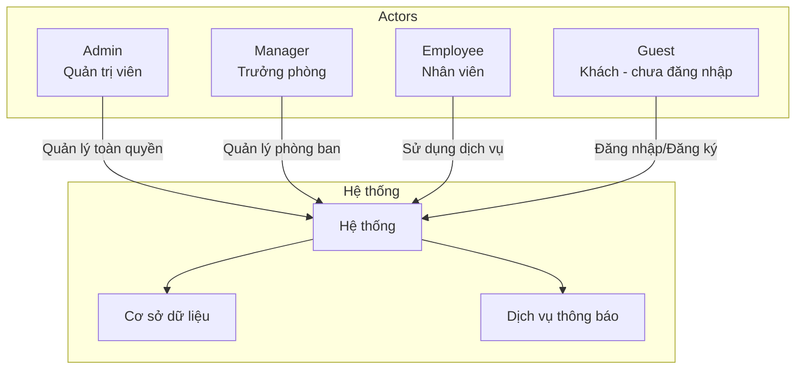
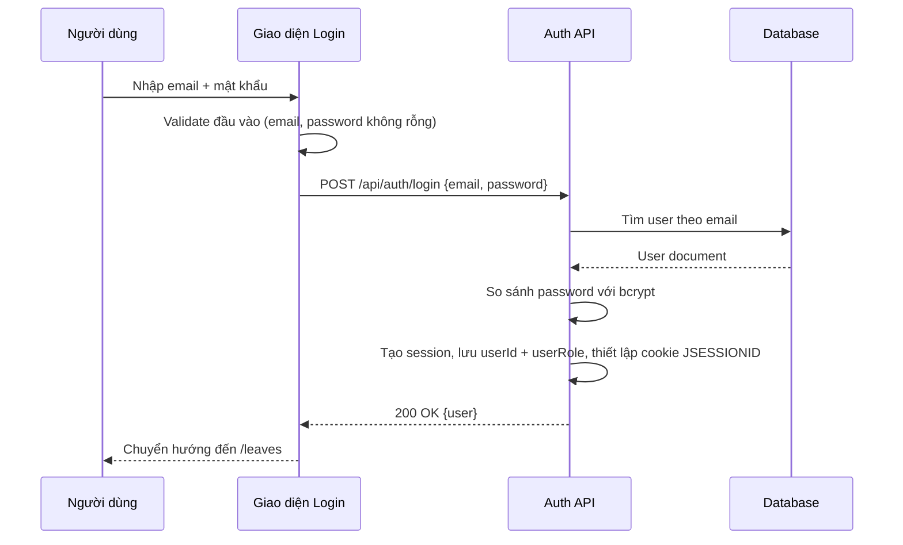
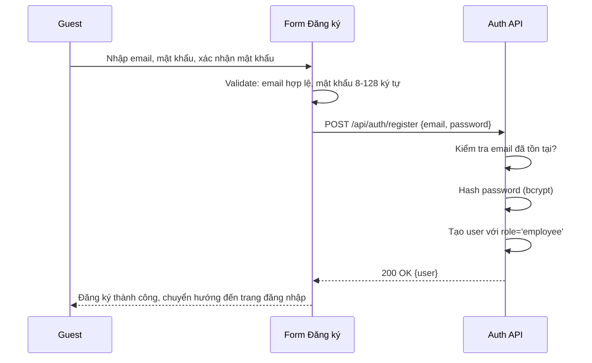
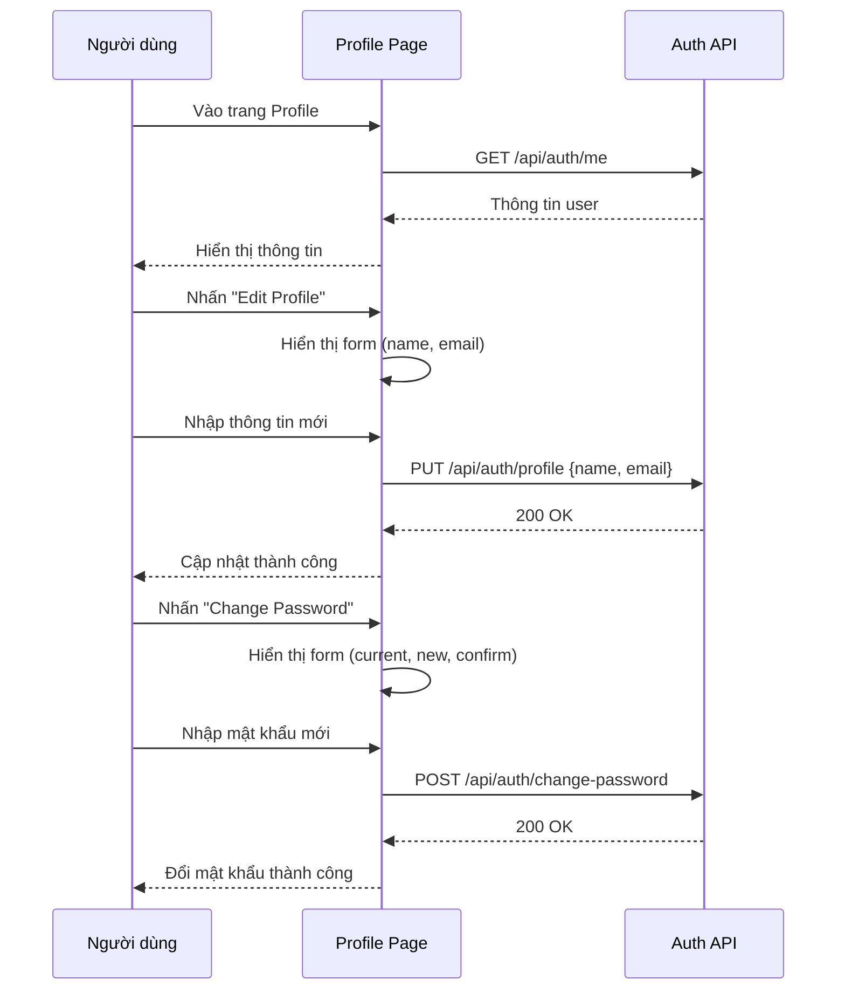
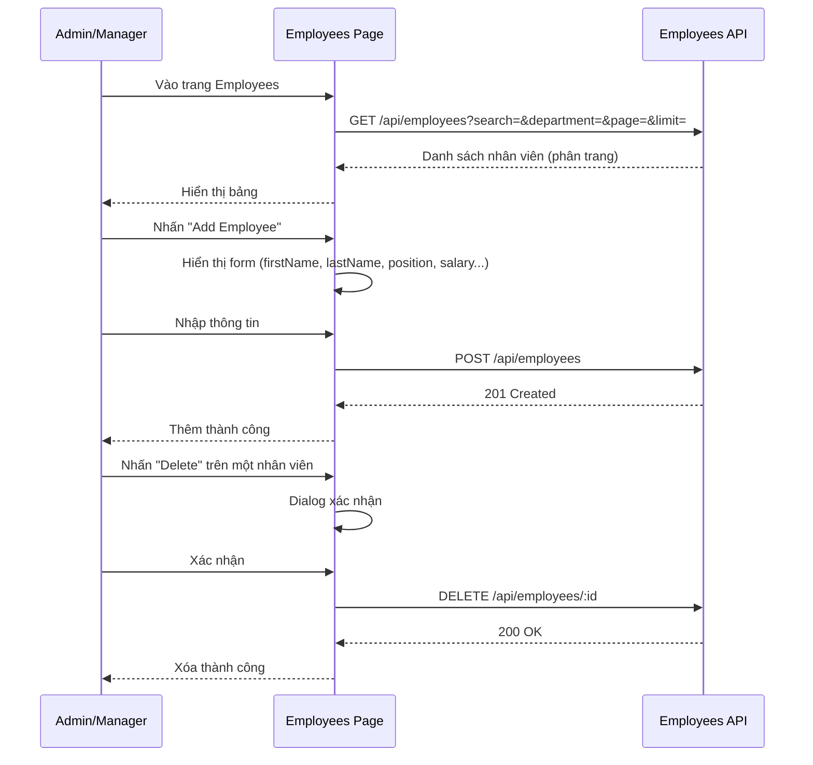
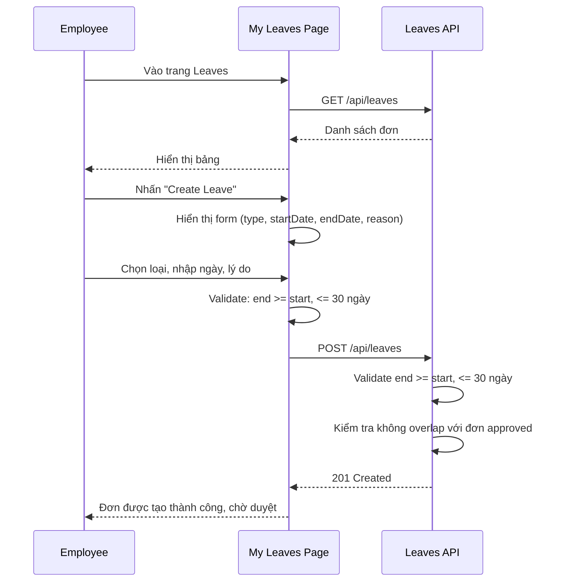
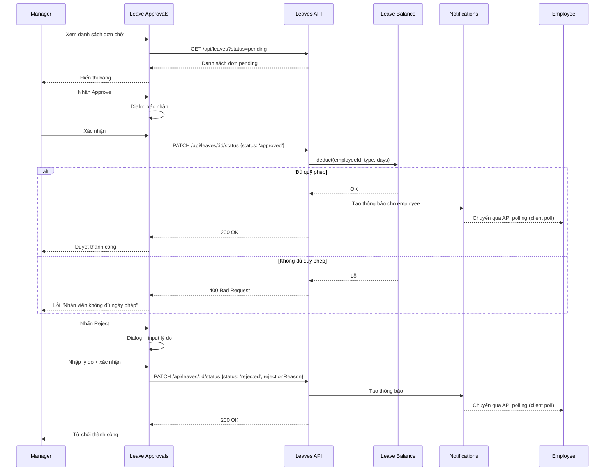
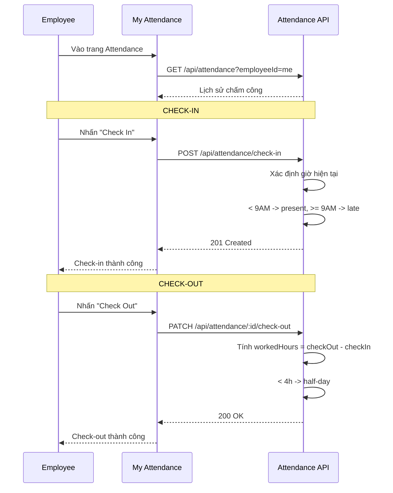

# Đặc tả Use Case

## Hệ thống Quản lý Nhân sự (HR Management)

| Phiên bản | Ngày       | Người soạn | Mô tả                        |
|-----------|------------|------------|------------------------------|
| 1.0       | 17/06/2026 | HR Team    | Phiên bản đầu tiên           |
| 2.0       | 22/06/2026 | HR Team    | Cập nhật cấu trúc chuẩn       |

> **Tuân theo:** Template Use Case chuẩn (Cockburn style) với Preconditions, Postconditions, Basic Flow, Alternative Flows, và Business Rules.

---

## Mục lục

1. [Giới thiệu](#1-giới-thiệu)
   1.1 [Mục đích](#11-mục-đích)
   1.2 [Tài liệu tham khảo](#12-tài-liệu-tham-khảo)
2. [Tổng quan Actors](#2-tổng-quan-actors)
3. [UC-01: Đăng nhập](#3-uc-01-đăng-nhập)
4. [UC-02: Đăng ký](#4-uc-02-đăng-ký)
5. [UC-03: Quản lý hồ sơ cá nhân](#5-uc-03-quản-lý-hồ-sơ-cá-nhân)
6. [UC-04: Quản lý nhân viên (Admin)](#6-uc-04-quản-lý-nhân-viên-admin)
7. [UC-05: Quản lý phòng ban](#7-uc-05-quản-lý-phòng-ban)
8. [UC-06: Tạo đơn nghỉ phép](#8-uc-06-tạo-đơn-nghỉ-phép)
9. [UC-07: Duyệt/Từ chối đơn nghỉ phép](#9-uc-07-duyệttừ-chối-đơn-nghỉ-phép)
10. [UC-08: Xem quỹ nghỉ phép](#10-uc-08-xem-quỹ-nghỉ-phép)
11. [UC-09: Check-in/Check-out](#11-uc-09-check-incheck-out)
12. [UC-10: Xem báo cáo chấm công](#12-uc-10-xem-báo-cáo-chấm-công)
13. [UC-11: Xử lý bảng lương](#13-uc-11-xử-lý-bảng-lương)
14. [UC-12: Xem bảng lương](#14-uc-12-xem-bảng-lương)
15. [UC-13: Quản lý tuyển dụng](#15-uc-13-quản-lý-tuyển-dụng)
16. [UC-14: Đánh giá hiệu suất](#16-uc-14-đánh-giá-hiệu-suất)
17. [UC-15: Xem Dashboard](#17-uc-15-xem-dashboard)
18. [UC-16: Quản lý thông báo](#18-uc-16-quản-lý-thông-báo)
19. [UC-17: Xem sơ đồ tổ chức](#19-uc-17-xem-sơ-đồ-tổ-chức)
20. [UC-18: Xem lịch sử nhân viên](#20-uc-18-xem-lịch-sử-nhân-viên)
21. [UC-19: Quản lý lịch sử nhân viên](#21-uc-19-quản-lý-lịch-sử-nhân-viên)
22. [Phụ lục: Ma trận Use Case - Role](#22-phụ-lục-ma-trận-use-case---role)

---

## 1. Giới thiệu

### 1.1 Mục đích

Tài liệu này đặc tả chi tiết các use case của hệ thống Quản lý Nhân sự (HR Management). Mỗi use case được mô tả với đầy đủ: actor, tiền điều kiện, hậu điều kiện, luồng chính, luồng thay thế, quy tắc nghiệp vụ và biểu đồ sequence.

### 1.2 Tài liệu tham khảo

| Tài liệu      | Mô tả                                        |
|---------------|----------------------------------------------|
| BRD.md        | Tài liệu Yêu cầu Nghiệp vụ                   |
| SRS.md        | Đặc tả Yêu cầu Phần mềm                      |
| US.md         | User Stories                                 |

---

## 1. Tổng quan Actors



### 1.1 Mô tả Actors

| Actor    | Mô tả                                                           | Đặc điểm                                |
|----------|-----------------------------------------------------------------|-----------------------------------------|
| Admin    | Quản trị viên hệ thống, có toàn quyền trên tất cả chức năng      | CRUD tất cả dữ liệu, xử lý lương        |
| Manager  | Trưởng phòng, quản lý nhân viên trong phòng ban của mình         | Duyệt đơn, báo cáo phòng, quản lý đội   |
| Employee | Nhân viên thông thường                                           | Quản lý thông tin cá nhân, nghỉ phép    |
| Guest    | Người dùng chưa đăng nhập                                        | Chỉ được đăng nhập/đăng ký              |

### 1.2 Biểu đồ use case tổng thể

```mermaid
graph TB
    subgraph Actors
        G[Guest]
        E[Employee]
        M[Manager]
        A[Admin]
    end

    subgraph "Hệ thống HR Management"
        UC1[Đăng nhập]
        UC2[Đăng ký]
        UC3[Quản lý hồ sơ cá nhân]
        UC4[Quản lý nhân viên]
        UC5[Quản lý phòng ban]
        UC6[Tạo đơn nghỉ phép]
        UC7[Duyệt/Từ chối đơn]
        UC8[Xem quỹ phép]
        UC9[Check-in/Check-out]
        UC10[Xem báo cáo chấm công]
        UC11[Xử lý bảng lương]
        UC12[Xem bảng lương]
        UC13[Quản lý tuyển dụng]
        UC14[Đánh giá hiệu suất]
        UC15[Xem Dashboard]
        UC16[Quản lý thông báo]
        UC17[Xem sơ đồ tổ chức]
        UC18[Xem lịch sử nhân viên]
        UC19[Thêm lịch sử nhân viên]
    end

    G --> UC1
    G --> UC2

    E --> UC1
    E --> UC3
    E --> UC6
    E --> UC8
    E --> UC9
    E --> UC12
    E --> UC14
    E --> UC15
    E --> UC16
    E --> UC18

    M --> UC1
    M --> UC3
    M --> UC4
    M --> UC5
    M --> UC7
    M --> UC10
    M --> UC12
    M --> UC13
    M --> UC14
    M --> UC15
    M --> UC16
    M --> UC17
    M --> UC18
    M --> UC19

    A --> UC1
    A --> UC3
    A --> UC4
    A --> UC5
    A --> UC7
    A --> UC10
    A --> UC11
    A --> UC12
    A --> UC13
    A --> UC14
    A --> UC15
    A --> UC16
    A --> UC17
    A --> UC18
    A --> UC19
```



> **Ghi chú:** UC-13 (Tuyển dụng), UC-14 (Đánh giá hiệu suất), UC-15 (Dashboard), UC-18/UC-19 (Lịch sử nhân viên) chưa được triển khai trong hệ thống hiện tại.

---

## 2. UC-01: Đăng nhập

### 2.1 Thông tin cơ bản

| Trường         | Giá trị                                       |
|----------------|-----------------------------------------------|
| **Mã UC**      | UC-01                                         |
| **Tên**        | Đăng nhập                                     |
| **Actor**      | Guest, Employee, Manager, Admin               |
| **Mô tả**      | Người dùng đăng nhập vào hệ thống bằng email và mật khẩu |
| **Kích hoạt**  | Người dùng truy cập trang `/login`             |
| **Kiểu**       | Cơ bản                                        |

### 2.2 Tiền điều kiện (Preconditions)

- Người dùng đã có tài khoản trong hệ thống
- Tài khoản đang ở trạng thái hoạt động (`isActive = true`)

### 2.3 Hậu điều kiện (Postconditions)

- Server tạo session (`HttpSession`) chứa `userId`, `userRole` và thiết lập cookie `JSESSIONID`
- Người dùng được chuyển đến trang `/leaves`

### 2.4 Luồng chính (Basic Flow)



### 2.5 Luồng thay thế (Alternative Flows)

| Mã    | Điều kiện                       | Hành động                                                    |
|-------|--------------------------------|--------------------------------------------------------------|
| AF-01 | Email không tồn tại             | Hiển thị lỗi "Email hoặc mật khẩu không đúng"                |
| AF-02 | Mật khẩu sai                    | Hiển thị lỗi "Email hoặc mật khẩu không đúng"                |
| AF-03 | Tài khoản bị vô hiệu hóa         | Hiển thị lỗi "Tài khoản đã bị vô hiệu hóa"                   |
| AF-04 | Lỗi kết nối server              | Hiển thị lỗi "Không thể kết nối đến server"                  |

### 2.6 Yêu cầu đặc biệt

- Mật khẩu được mã hóa bằng bcrypt trước khi lưu
- Session hết hạn sau 1 ngày không hoạt động (max-inactive-interval lấy từ `jwt.expiration`, mặc định 86400000ms)

---

## 3. UC-02: Đăng ký

| Trường         | Giá trị                                       |
|----------------|-----------------------------------------------|
| **Mã UC**      | UC-02                                         |
| **Tên**        | Đăng ký                                       |
| **Actor**      | Guest                                         |
| **Mô tả**      | Người dùng mới đăng ký tài khoản với role Employee |
| **Kích hoạt**  | Người dùng truy cập trang đăng ký             |
| **Kiểu**       | Cơ bản                                        |

### Preconditions
- Email chưa tồn tại trong hệ thống

### Postconditions
- Tài khoản mới được tạo với role `employee`
- Người dùng đăng nhập sau khi đăng ký (đăng ký không tự động tạo session)

### Basic Flow



### Validation Rules
- Email: đúng định dạng email
- Mật khẩu: từ 8 đến 128 ký tự, không yêu cầu độ phức tạp (chữ hoa/thường/số)

---

## 4. UC-03: Quản lý hồ sơ cá nhân

| Trường         | Giá trị                                       |
|----------------|-----------------------------------------------|
| **Mã UC**      | UC-03                                         |
| **Tên**        | Quản lý hồ sơ cá nhân                          |
| **Actor**      | Employee, Manager, Admin                      |
| **Mô tả**      | Người dùng xem và cập nhật thông tin cá nhân   |

### Luồng chính



---

## 5. UC-04: Quản lý nhân viên (Admin/Manager)

| Trường         | Giá trị                                       |
|----------------|-----------------------------------------------|
| **Mã UC**      | UC-04                                         |
| **Tên**        | Quản lý nhân viên                              |
| **Actor**      | Admin (toàn quyền), Manager (phòng mình)      |
| **Mô tả**      | Quản lý danh sách nhân viên, thêm/sửa/xóa      |

### Luồng chính



### Ràng buộc (Business Rules)
- Manager chỉ xem được nhân viên trong phòng ban của mình
- Chỉ Admin mới có quyền thêm/sửa/xóa nhân viên
- Manager có quyền xem danh sách nhưng không được thêm/sửa/xóa

---

## 6. UC-05: Quản lý phòng ban

| Trường         | Giá trị                                       |
|----------------|-----------------------------------------------|
| **Mã UC**      | UC-05                                         |
| **Tên**        | Quản lý phòng ban                              |
| **Actor**      | Admin                                         |
| **Mô tả**      | Thêm, sửa, xóa phòng ban và gán trưởng phòng   |

### Preconditions
- Người dùng có role Admin

### Basic Flow
1. Admin vào trang Departments
2. Hệ thống hiển thị danh sách phòng ban
3. Admin chọn "Thêm phòng ban"
4. Hệ thống hiển thị form: tên, mô tả, trưởng phòng
5. Admin nhập thông tin và submit
6. Hệ thống kiểm tra tên phòng ban không trùng
7. Hệ thống tạo phòng ban mới
8. Hệ thống thông báo thành công

### Alternative Flows

| Mã    | Điều kiện                     | Hành động                      |
|-------|-------------------------------|--------------------------------|
| AF-01 | Tên phòng ban đã tồn tại      | Thông báo lỗi "Tên phòng ban đã tồn tại" |
| AF-02 | Xóa phòng ban có nhân viên    | Cảnh báo, vẫn cho xóa (không xóa nhân viên) |

---

## 7. UC-06: Tạo đơn nghỉ phép

| Trường         | Giá trị                                       |
|----------------|-----------------------------------------------|
| **Mã UC**      | UC-06                                         |
| **Tên**        | Tạo đơn nghỉ phép                              |
| **Actor**      | Employee                                      |
| **Mô tả**      | Nhân viên tạo đơn xin nghỉ phép                |

### Preconditions
- Nhân viên đã đăng nhập
- Có quỹ phép còn lại (kiểm tra khi duyệt, không kiểm tra khi tạo)

### Postconditions
- Đơn nghỉ phép được tạo với status `pending`
- Đơn xuất hiện trong danh sách chờ duyệt của Manager

### Basic Flow



### Business Rules
- `startDate` <= `endDate`
- Số ngày nghỉ <= 30
- Không được tạo đơn trùng với đơn approved khác
- Loại nghỉ: `sick` (ốm), `annual` (năm), `personal` (cá nhân)

---

## 8. UC-07: Duyệt/Từ chối đơn nghỉ phép

| Trường         | Giá trị                                       |
|----------------|-----------------------------------------------|
| **Mã UC**      | UC-07                                         |
| **Tên**        | Duyệt/Từ chối đơn nghỉ phép                    |
| **Actor**      | Admin, Manager                                |
| **Mô tả**      | Quản lý duyệt hoặc từ chối đơn nghỉ phép       |
| **Kích hoạt**  | Vào trang Leave Approvals                     |

### Preconditions
- Đơn đang ở trạng thái `pending`
- (Manager) Đơn thuộc nhân viên trong phòng mình

### Postconditions
- **Nếu duyệt**: Đơn chuyển sang `approved`, trừ quỹ phép, gửi thông báo
- **Nếu từ chối**: Đơn chuyển sang `rejected`, ghi lý do, gửi thông báo

### Basic Flow



---

## 9. UC-08: Xem quỹ nghỉ phép

| Trường         | Giá trị                                       |
|----------------|-----------------------------------------------|
| **Mã UC**      | UC-08                                         |
| **Tên**        | Xem quỹ nghỉ phép                              |
| **Actor**      | Employee, Manager, Admin                      |
| **Mô tả**      | Xem số ngày phép còn lại theo từng loại        |

### Basic Flow

| Actor    | Endpoint                              | Kết quả                           |
|----------|---------------------------------------|-----------------------------------|
| Employee | `GET /api/leave-balance/my`           | Quỹ phép của bản thân             |
| Manager  | `GET /api/leave-balance/:employeeId`  | Quỹ phép của nhân viên trong phòng |
| Admin    | `GET /api/leave-balance/:employeeId`  | Quỹ phép của bất kỳ nhân viên    |

### Default Values

| Loại   | Tổng số | Mô tả        |
|--------|:-------:|--------------|
| Annual (Phép năm) | 12 ngày | Nghỉ phép hàng năm |
| Sick (Ốm)         | 30 ngày | Nghỉ ốm      |
| Personal (Cá nhân) | 3 ngày | Nghỉ việc riêng |

---

## 10. UC-09: Check-in/Check-out

| Trường         | Giá trị                                       |
|----------------|-----------------------------------------------|
| **Mã UC**      | UC-09                                         |
| **Tên**        | Check-in/Check-out                            |
| **Actor**      | Employee                                      |
| **Mô tả**      | Nhân viên chấm công vào/ra hàng ngày           |

### Preconditions
- Nhân viên đã đăng nhập
- Chưa check-in hôm nay (cho check-in)
- Đã check-in hôm nay (cho check-out)

### Basic Flow



### Business Rules

| Thời gian check-in     | Trạng thái          |
|------------------------|---------------------|
| Trước 9:00 AM          | `present` (đúng giờ) |
| Sau 9:00 AM            | `late` (trễ)         |

| Số giờ làm (workedHours) | Override             |
|--------------------------|----------------------|
| < 4 giờ                  | `half-day` (nửa ngày) |
| >= 8 giờ (dù check-in trễ) | `present`            |

---

## 11. UC-10: Xem báo cáo chấm công

| Trường         | Giá trị                                       |
|----------------|-----------------------------------------------|
| **Mã UC**      | UC-10                                         |
| **Tên**        | Xem báo cáo chấm công                          |
| **Actor**      | Admin, Manager                                |
| **Mô tả**      | Xem báo cáo tổng hợp chấm công                 |

### Basic Flow
1. Admin/Manager vào trang Attendance Report
2. Hệ thống hiển thị:
   - 4 thẻ thống kê: present, late, absent, half-day
   - Biểu đồ phân bố màu
   - Bảng dữ liệu chi tiết
3. (Manager) Chỉ xem được dữ liệu của phòng mình
4. (Admin) Xem được tất cả

---

## 12. UC-11: Xử lý bảng lương

| Trường         | Giá trị                                       |
|----------------|-----------------------------------------------|
| **Mã UC**      | UC-11                                         |
| **Tên**        | Xử lý bảng lương                               |
| **Actor**      | Admin                                         |
| **Mô tả**      | Xử lý lương hàng tháng cho nhân viên           |
| **Ưu tiên**    | Cao                                           |

### Preconditions
- Admin đã đăng nhập
- Nhân viên đã có thông tin lương (basicSalary)

### Postconditions
- Bảng lương được tạo với status `draft`
- Nhân viên có thể xem bảng lương của mình

### Basic Flow

```mermaid
sequenceDiagram
    participant A as Admin
    participant UI as Payroll Management
    participant API as Payroll API

    A->>UI: Vào trang Payroll Management
    UI->>API: GET /api/payroll?month=&year=
    API-->>UI: Danh sách payroll

    A->>UI: Nhấn "Process Payroll"
    UI->>UI: Dialog chọn tháng, năm, nhân viên
    A->>UI: Chọn và submit
    UI->>API: POST /api/payroll/process {employeeIds, month, year}
    API->>API: Duyệt từng employeeId
    API->>API: Bỏ qua nếu đã tồn tại (employeeId + month + year)
    API->>API: deductions = BHXH (8%) + BHYT (1.5%) + BHTN (1%) + Công đoàn (1%) + PIT (5 bậc: 5/10/20/30/35%, giảm trừ gia cảnh 15.500.000 VNĐ); netPay = salary + bonus - deductions; bonus luôn = 0
    API-->>UI: 201 Created
    UI-->>A: Xử lý lương thành công

    A->>UI: Nhấn "Mark Paid" trên 1 bản ghi draft
    UI->>API: PATCH /api/payroll/:id/pay
    API->>API: status = 'paid', paidAt = now
    API-->>UI: 200 OK
    UI-->>A: Đã đánh dấu thanh toán
```

---

## 13. UC-12: Xem bảng lương

| Trường         | Giá trị                                       |
|----------------|-----------------------------------------------|
| **Mã UC**      | UC-12                                         |
| **Tên**        | Xem bảng lương                                 |
| **Actor**      | Employee, Manager, Admin                      |
| **Mô tả**      | Xem thông tin lương                            |

### Scope

| Actor    | Phạm vi                                       |
|----------|-----------------------------------------------|
| Employee | Chỉ xem lương của bản thân                     |
| Manager  | Xem lương của nhân viên trong phòng            |
| Admin    | Xem lương của tất cả nhân viên                 |

---

## 14. UC-13: Quản lý tuyển dụng

> **Trạng thái: KHÔNG TRIỂN KHAI** — Hệ thống hiện tại không có module Recruitment: không có endpoint `/api/job-postings`, `/api/candidates` và không có giao diện tuyển dụng.

---

## 15. UC-14: Đánh giá hiệu suất

> **Trạng thái: KHÔNG TRIỂN KHAI** — Hệ thống hiện tại không có module Performance Reviews: không có endpoint `/api/performance-reviews` và không có giao diện đánh giá hiệu suất.

---

## 16. UC-15: Xem Dashboard

> **Trạng thái: KHÔNG TRIỂN KHAI** — Hệ thống hiện tại không có Dashboard; route `/` được redirect sang `/leaves` và không có trang thống kê tổng quan theo vai trò.

---

## 17. UC-16: Quản lý thông báo

| Trường         | Giá trị                                       |
|----------------|-----------------------------------------------|
| **Mã UC**      | UC-16                                         |
| **Tên**        | Quản lý thông báo                              |
| **Actor**      | Employee, Manager, Admin                      |

### Sub Use Cases

| Mã     | Tên                              | Mô tả                                     |
|--------|----------------------------------|--------------------------------------------|
| UC-16a | Xem danh sách thông báo          | GET /api/notifications, hiển thị 20 gần nhất |
| UC-16b | Xem số chưa đọc                  | GET /api/notifications/unread-count, badge |
| UC-16c | Đánh dấu đã đọc (1 cái)          | PATCH /api/notifications/:id/read          |
| UC-16d | Đánh dấu tất cả đã đọc           | PATCH /api/notifications/read-all          |
| UC-16e | Nhận thông báo qua API polling | Client poll unread-count mỗi 30s (badge) + danh sách mỗi 15s |

### Notification Types

| Type              | Kích hoạt bởi                      | Nội dung                         |
|-------------------|------------------------------------|----------------------------------|
| leave_approved    | Admin/Manager duyệt đơn            | "Đơn nghỉ phép ... đã được duyệt" |
| leave_rejected    | Admin/Manager từ chối đơn          | "Đơn nghỉ phép ... đã bị từ chối" |

---

## 18. UC-17: Xem sơ đồ tổ chức

| Trường         | Giá trị                                       |
|----------------|-----------------------------------------------|
| **Mã UC**      | UC-17                                         |
| **Tên**        | Xem sơ đồ tổ chức                              |
| **Actor**      | Admin, Manager                                |
| **Mô tả**      | Xem cấu trúc phòng ban và nhân viên theo dạng cây |

### Basic Flow
1. Admin/Manager vào trang Org Chart
2. Hệ thống gọi `GET /api/departments` (không có endpoint org-chart; sơ đồ được render client-side từ API departments)
3. Server trả về:
   - Danh sách phòng ban
   - Mỗi phòng ban: tên, mô tả, trưởng phòng
4. Giao diện hiển thị dạng card grid 2 cột

---

## 19. UC-18: Xem lịch sử nhân viên

> **Trạng thái: KHÔNG TRIỂN KHAI** — Hệ thống hiện tại không có module Employee History: không có endpoint lịch sử nhân viên và không có timeline thay đổi.

---

## 20. UC-19: Thêm lịch sử nhân viên

> **Trạng thái: KHÔNG TRIỂN KHAI** — Không có endpoint `POST /api/employees/:employeeId/history`; tính năng lịch sử nhân viên chưa được triển khai.

---

## Phụ lục: Ma trận Use Case - Role

| Mã UC   | Tên use case               | Guest | Employee | Manager | Admin |
|---------|----------------------------|:-----:|:--------:|:-------:|:-----:|
| UC-01   | Đăng nhập                   | Co    | Co       | Co      | Co    |
| UC-02   | Đăng ký                     | Co    | -        | -       | -     |
| UC-03   | Quản lý hồ sơ cá nhân       | -     | Co       | Co      | Co    |
| UC-04   | Quản lý nhân viên           | -     | -        | GH      | Co    |
| UC-05   | Quản lý phòng ban           | -     | -        | -       | Co    |
| UC-06   | Tạo đơn nghỉ phép           | -     | Co       | -       | -     |
| UC-07   | Duyệt/Từ chối đơn           | -     | -        | Co      | Co    |
| UC-08   | Xem quỹ phép                | -     | Co       | Co      | Co    |
| UC-09   | Check-in/Check-out          | -     | Co       | -       | -     |
| UC-10   | Xem báo cáo chấm công       | -     | -        | Co      | Co    |
| UC-11   | Xử lý bảng lương            | -     | -        | -       | Co    |
| UC-12   | Xem bảng lương              | -     | Co       | Co      | Co    |
| UC-13   | Quản lý tuyển dụng (chưa triển khai)  | -     | -        | -       | -     |
| UC-14   | Đánh giá hiệu suất (chưa triển khai)  | -     | -        | -       | -     |
| UC-15   | Xem Dashboard (chưa triển khai)       | -     | -        | -       | -     |
| UC-16   | Quản lý thông báo           | -     | Co       | Co      | Co    |
| UC-17   | Xem sơ đồ tổ chức           | -     | -        | Co      | Co    |
| UC-18   | Xem lịch sử nhân viên (chưa triển khai) | - | -       | -       | -     |
| UC-19   | Thêm lịch sử nhân viên (chưa triển khai) | - | -      | -       | -     |

> Co = Co quyen | GH = Quyen gioi han (theo phong ban) | - = Khong co quyen
>
> UC-13, UC-14, UC-15, UC-18, UC-19 chưa được triển khai trong hệ thống hiện tại.
