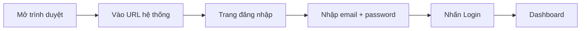
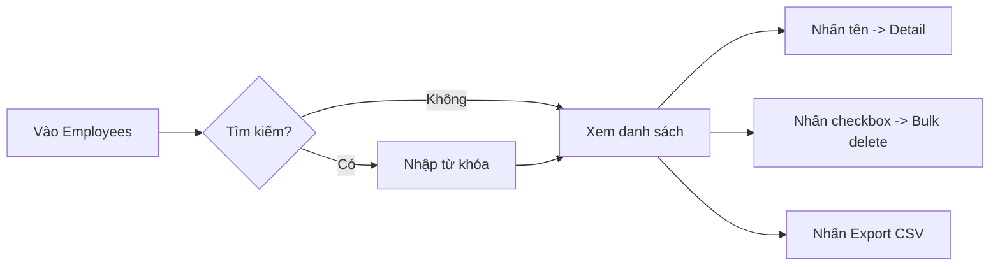
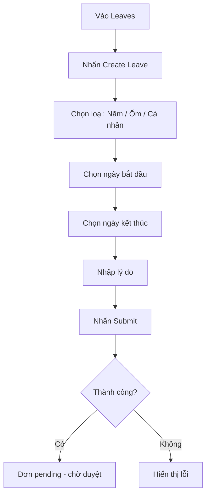
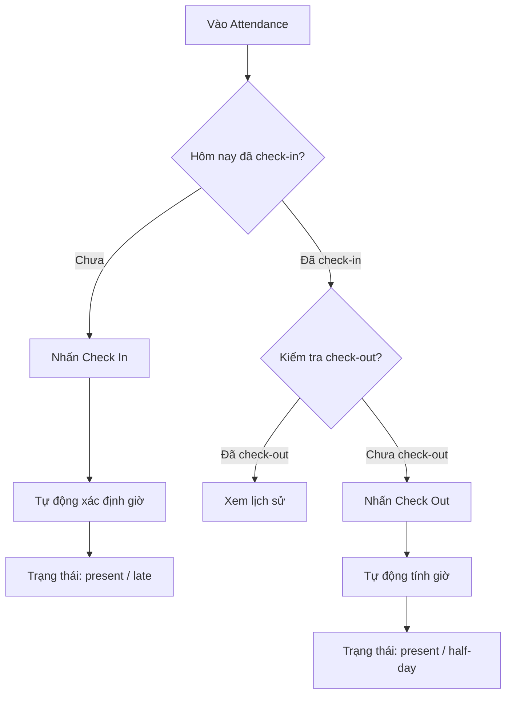
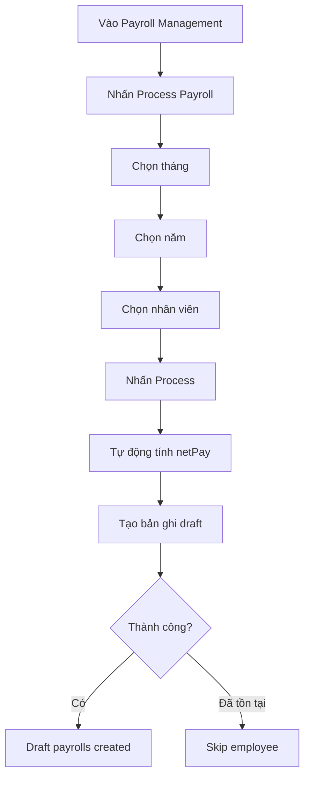

# Hướng dẫn sử dụng (User Manual)

## Hệ thống Quản lý Nhân sự (HR Management)

| Phiên bản | Ngày       | Người soạn | Mô tả                        |
|-----------|------------|------------|------------------------------|
| 1.0       | 17/06/2026 | HR Team    | Phiên bản đầu tiên           |
| 2.0       | 22/06/2026 | HR Team    | Cập nhật cấu trúc chuẩn       |
| 2.1       | 22/06/2026 | Dev Team   | Ghi chú trạng thái triển khai |

> **Tuân theo:** ISO/IEC 26514 (Systems and software engineering — Requirements for designers and developers of user documentation) và Microsoft User Assistance Model.
> **Trạng thái triển khai:** Các chức năng Auth, Employees, Departments, Leaves, Attendance, Payroll, Dashboard, Notifications, Profile đã có giao diện. Recruitment (Job Postings, Candidates), Performance Reviews chưa triển khai giao diện (đang kế hoạch). Socket.IO chưa triển khai.

---

## Mục lục

1. [Giới thiệu hệ thống](#1-giới-thiệu-hệ-thống)
2. [Bắt đầu](#2-bắt-đầu)
3. [Dashboard](#3-dashboard)
4. [Quản lý Nhân viên](#4-quản-lý-nhân-viên)
5. [Quản lý Phòng ban](#5-quản-lý-phòng-ban)
6. [Quản lý Nghỉ phép](#6-quản-lý-nghỉ-phép)
7. [Quản lý Chấm công](#7-quản-lý-chấm-công)
8. [Quản lý Bảng lương](#8-quản-lý-bảng-lương)
9. [Quản lý Tuyển dụng](#9-quản-lý-tuyển-dụng)
10. [Đánh giá Hiệu suất](#10-đánh-giá-hiệu-suất)
11. [Thông báo](#11-thông-báo)
12. [Cài đặt cá nhân](#12-cài-đặt-cá-nhân)
13. [Phím tắt](#13-phím-tắt)
14. [Khắc phục sự cố](#14-khắc-phục-sự-cố)

---

## 1. Giới thiệu hệ thống

### 1.1 Hệ thống này dùng để làm gì?

**HR Management** là hệ thống quản lý nhân sự toàn diện, giúp doanh nghiệp:

- Quản lý hồ sơ nhân viên tập trung
- Xử lý nghỉ phép nhanh chóng, minh bạch
- Chấm công online, tự động tính toán
- Tính lương hàng tháng tự động
- Đăng tin tuyển dụng và theo dõi ứng viên
- Đánh giá hiệu suất nhân viên

### 1.2 Ai sử dụng hệ thống?

| Vai trò   | Mô tả                                  | Có thể làm gì?                        |
|-----------|----------------------------------------|---------------------------------------|
| Admin     | Quản trị viên hệ thống                 | Mọi thứ! CRUD tất cả dữ liệu          |
| Manager   | Trưởng phòng / Quản lý đội nhóm        | Quản lý nhân viên trong phòng         |
| Employee  | Nhân viên                              | Quản lý thông tin cá nhân, nghỉ phép  |

### 1.3 Công nghệ

- **Truy cập**: Trình duyệt web (Chrome, Firefox, Edge, Safari)
- **URL**: `http://localhost:5173` (development)
- **Yêu cầu**: JavaScript được bật, kết nối internet

---

## 2. Bắt đầu

### 2.1 Đăng nhập



1. Mở trình duyệt web
2. Truy cập địa chỉ hệ thống (ví dụ: `http://localhost:5173`)
3. Nhập **Email** và **Mật khẩu**
4. Nhấn nút **Login**

> **Mẹo**: Bạn có thể nhấn nút demo accounts để tự động điền thông tin:
> - **Admin**: admin@hr.com / admin123
> - **Manager**: eng.manager@hr.com / manager123
> - **Employee**: emp01@hr.com / employee123

### 2.2 Giao diện chính

```
┌─────────────────────────────────────────────────────┐
│ [=] Sidebar (trái)        │ Nội dung chính          │
│                           │                         │
│  [Nguoi dung] John Doe   │  (Trang hiện tại)        │
│  [Online] Employee        │                         │
│  ───────────────────────  │                         │
│  [Bieu do] Dashboard      │                         │
│  [Nhom] Employees         │                         │
│  [Toa nha] Departments    │                         │
│  [Danh sach] Leaves       │                         │
│  [Dong ho] Attendance     │                         │
│  [Tien] Payroll           │                         │
│  ───────────────────────  │                         │
│  [Chuong] Notifications (3) │                       │
│  [Ca nhan] Profile        │                         │
│  [Cai dat] Settings       │                         │
│  [Thoat] Logout           │                         │
└─────────────────────────────────────────────────────┘
```

#### Các khu vực chính

| Khu vực         | Mô tả                                          |
|-----------------|------------------------------------------------|
| **Sidebar**     | Menu điều hướng, thay đổi theo vai trò         |
| **Nội dung**    | Hiển thị trang hiện tại                        |
| **Header**      | Breadcrumb, thông báo, thông tin người dùng    |

> **Lưu ý**: Sidebar có thể thu gọn bằng cách nhấn nút menu (goc trai tren cung)

### 2.3 Đăng xuất

1. Nhấn vào **Logout** ở cuối sidebar
2. Xác nhận đăng xuất
3. Bạn sẽ được chuyển về trang đăng nhập

---

## 3. Dashboard

### 3.1 Admin Dashboard

Khi đăng nhập với vai trò **Admin**, bạn sẽ thấy:

**Thẻ thống kê:**
- **Tổng nhân viên**: Số lượng nhân viên trong hệ thống
- **Đơn chờ duyệt**: Số đơn nghỉ phép đang chờ xử lý
- **Có mặt hôm nay**: Số nhân viên đã check-in
- **Tổng lương tháng**: Tổng lương của tháng hiện tại

**Biểu đồ:**
- **Nhân viên theo phòng ban**: Biểu đồ bar ngang

**Danh sách gần đây:**
- 5 đơn nghỉ phép gần nhất

### 3.2 Manager Dashboard

Khi đăng nhập với vai trò **Manager**, bạn sẽ thấy:

- **Tên phòng ban**: Phòng bạn quản lý
- **Số nhân viên**: Số lượng trong phòng
- **Đơn chờ duyệt**: Đơn chờ của phòng bạn
- **Có mặt hôm nay**: Nhân viên trong phòng đã check-in
- **Quỹ lương phòng**: Tổng lương phòng ban

### 3.3 Employee Dashboard

Khi đăng nhập với vai trò **Employee**, bạn sẽ thấy:

**Thẻ thống kê:**
- Đơn nghỉ phép: pending / approved / rejected
- Chấm công: present / late / absent / half-day

**Biểu đồ:**
- Phân bố nghỉ phép (pie chart)
- Chấm công theo ngày (bar chart)

**Sắp tới:**
- 3 đơn nghỉ phép approved sắp đến

---

## 4. Quản lý Nhân viên

### 4.1 Xem danh sách nhân viên

**Vai trò**: Admin, Manager

1. Vào sidebar, chọn **Employees**
2. Danh sách nhân viên hiển thị với các cột:
   - Tên (có thể nhấn để xem chi tiết)
   - Vị trí
   - Phòng ban
   - Lương
   - Thao tác

3. **Tìm kiếm**: Nhập tên hoặc vị trí vào ô search
4. **Lọc**: Chọn phòng ban từ dropdown
5. **Phân trang**: Chọn số item/trang (10, 20, 30, 50)



### 4.2 Thêm nhân viên mới

**Vai trò**: Admin

1. Trên trang Employees, nhấn **Add Employee**
2. Điền form:
   - **Bắt buộc**: First Name, Last Name, Position, Salary, Department, Hire Date, User ID
   - **Không bắt buộc**: Phone, Contract Type, Contract Expiry
3. Nhấn **Save**
4. Nhân viên mới xuất hiện trong danh sách

### 4.3 Xem chi tiết nhân viên

**Vai trò**: Admin, Manager, Employee

1. Nhấn vào tên nhân viên trong bảng
2. Trang chi tiết hiển thị:

| Phần        | Nội dung                                      |
|-------------|-----------------------------------------------|
| **Header**  | Avatar (chữ cái đầu), tên, vị trí             |
| **Personal**| Phòng ban, lương, ngày vào, số điện thoại     |
| **Contract**| Loại hợp đồng, ngày hết hạn, danh sách tài liệu |
| **History** | Timeline lịch sử thay đổi                     |

### 4.4 Upload tài liệu

**Vai trò**: Admin

1. Vào Employee Detail
2. Kéo xuống phần **Documents**
3. Nhấn **Upload Document**
4. Chọn file (yêu cầu: <= 5MB, JPEG/PNG/GIF/PDF/DOC/DOCX)
5. Nhấn Upload

### 4.5 Xuất CSV

**Vai trò**: Admin, Manager

1. Trên trang Employees
2. Nhấn nút **Export CSV**
3. File CSV tự động tải về

---

## 5. Quản lý Phòng ban

### 5.1 Danh sách phòng ban

**Vai trò**: Admin, Manager

1. Vào sidebar, chọn **Departments**
2. Bảng hiển thị: Tên phòng, Mô tả, Trưởng phòng, Thao tác
3. Tìm kiếm theo tên phòng

### 5.2 Thêm/Sửa/Xóa phòng ban

**Vai trò**: Admin

**Thêm:**
1. Nhấn **Add Department**
2. Nhập: Tên, Mô tả, Trưởng phòng
3. Nhấn Save

**Sửa:**
1. Nhấn nút Edit trên phòng ban
2. Cập nhật thông tin

**Xóa:**
1. Nhấn nút Delete
2. Xác nhận

### 5.3 Sơ đồ tổ chức

**Vai trò**: Admin, Manager

1. Vào sidebar, chọn **Org Chart**
2. Mỗi phòng ban là 1 card, hiển thị:
   - Tên phòng
   - Trưởng phòng
   - Danh sách nhân viên

---

## 6. Quản lý Nghỉ phép

### 6.1 Tạo đơn nghỉ phép (Employee)



1. Vào sidebar, chọn **Leaves**
2. Nhấn **Create Leave**
3. Chọn **Loại nghỉ**:
   - **Annual (Phép năm)**: Nghỉ phép hàng năm
   - **Sick (Ốm)**: Nghỉ ốm
   - **Personal (Cá nhân)**: Nghỉ việc riêng
4. Chọn **Ngày bắt đầu** và **Ngày kết thúc**
5. Nhập **Lý do** (nếu có)
6. Nhấn **Submit**

> **Lưu ý**:
> - Ngày kết thúc phải >= ngày bắt đầu
> - Một đơn tối đa 30 ngày
> - Không được trùng với đơn đã duyệt

### 6.2 Xem quỹ phép

1. Vào trang Leaves
2. Đầu trang hiển thị 3 thẻ quỹ phép:

| Loại    | Đã dùng / Tổng | Progress bar |
|---------|:--------------:|:------------:|
| Annual  | 2 / 12         | ██░░░░░░░░   |
| Sick    | 0 / 30         | ░░░░░░░░░░   |
| Personal| 1 / 3          | ███░░░░░░░   |

### 6.3 Duyệt/Từ chối đơn (Manager/Admin)

1. Vào sidebar, chọn **Leave Approvals**
2. Danh sách đơn đang chờ (pending)
3. **Để duyệt**: Nhấn nút Approve
   - Xác nhận -> Đơn được duyệt
   - Tự động trừ quỹ phép
   - Nhân viên nhận thông báo
4. **Để từ chối**: Nhấn nút Reject
   - Nhập lý do từ chối
   - Xác nhận
   - Nhân viên nhận thông báo

---

## 7. Quản lý Chấm công

### 7.1 Check-in / Check-out (Employee)



1. Vào sidebar, chọn **Attendance**
2. **Nếu chưa check-in**: Nhấn nút **Check In** (màu xanh)
   - Trước 9:00 AM -> Trạng thái: Present
   - Sau 9:00 AM -> Trạng thái: Late (canh bao)
3. **Nếu đã check-in và chưa check-out**: Nhấn nút **Check Out**
   - Làm >= 4h -> Giữ nguyên trạng thái
   - Làm < 4h -> Chuyển thành Half-day
4. Lịch sử chấm công hiển thị bên dưới

### 7.2 Báo cáo chấm công (Admin/Manager)

1. Vào sidebar, chọn **Attendance Report**
2. Thống kê: Present, Late, Absent, Half-day
3. Biểu đồ phân bố
4. Bảng chi tiết

---

## 8. Quản lý Bảng lương

### 8.1 Xem bảng lương

**Vai trò**: Employee, Manager, Admin

1. Vào sidebar, chọn **Payroll**
2. (Employee) Chỉ thấy lương của mình
3. (Manager) Thấy lương nhân viên trong phòng
4. (Admin) Thấy tất cả
5. Thông tin: Kỳ lương, Lương cơ bản, Thưởng, Khấu trừ, Thực nhận, Trạng thái

### 8.2 Xử lý lương (Admin)



1. Vào sidebar, chọn **Payroll Management**
2. Nhấn **Process Payroll**
3. Chọn: Tháng, Năm, Nhân viên
4. Nhấn **Process**
5. Hệ thống tự động tính:
   - `netPay = basicSalary + bonus - deductions`
   - Khấu trừ: BHXH (8%), BHTN (1%), BHTNLD (0.5%), Công đoàn (2.5%), Thuế TNCN lũy tiến
6. Bảng lương được tạo với trạng thái **Draft**

### 8.3 Đánh dấu đã trả (Admin)

1. Trên bản ghi draft, nhấn **Mark Paid**
2. Xác nhận
3. Trạng thái chuyển thành **Paid**

---

## 9. Quản lý Tuyển dụng

### 9.1 Tin tuyển dụng

**Vai trò**: Admin

1. Vào sidebar, chọn **Job Postings**
2. **Thêm tin**: Nhấn "Create Job Posting"
   - Nhập: Title, Department, Description, Requirements, Status, Openings
3. **Sửa**: Nhấn Edit
4. **Xóa**: Nhấn Delete (xác nhận)
5. **Lọc**: Theo status (Open/Closed/Draft)

### 9.2 Ứng viên

**Vai trò**: Admin, Manager

1. Vào sidebar, chọn **Candidates**
2. **Thêm ứng viên**: Nhấn "Add Candidate"
   - Nhập: First Name, Last Name, Email, Phone, Job Posting, Notes
3. **Cập nhật trạng thái**: Sửa ứng viên, chọn status mới
4. Quy trình tuyển dụng:

```
Applied -> Screening -> Interview -> Offered -> Hired
                                           -> Rejected
```

---

## 10. Đánh giá Hiệu suất

### 10.1 Xem đánh giá của tôi (Employee)

1. Vào sidebar, chọn **Performance Reviews**
2. Danh sách các đánh giá của bạn
3. Mỗi đánh giá: Period, Rating (thang 5), Comments, Goals, Status

### 10.2 Quản lý đánh giá (Admin/Manager)

1. Vào sidebar, chọn **Review Management**
2. Thống kê: Total reviews, Average rating, Submitted count
3. **Tạo đánh giá**: Nhấn "Create Review"
   - Chọn: Employee, Period (e.g. "2024-Q1"), Rating (1-5), Comments, Goals
4. **Sửa**: Nhấn Edit - cập nhật rating, comments, goals, status
5. **Status flow**: Draft -> Submitted -> Acknowledged

---

## 11. Thông báo

### 11.1 Xem thông báo

1. Nhấn vào **Notifications** ở sidebar
2. Danh sách 20 thông báo gần nhất
3. Thông báo chưa đọc có nền đậm hơn

### 11.2 Đánh dấu đã đọc

- **Đánh dấu 1 cái**: Nhấn vào thông báo
- **Đánh dấu tất cả**: Nhấn "Mark All Read"

### 11.3 Badge thông báo

- Số thông báo chưa đọc hiển thị bên cạnh bieu tuong chuong
- Cập nhật tự động, real-time

### 11.4 Các loại thông báo

| Loại              | Ví dụ                                            |
|-------------------|--------------------------------------------------|
| leave_request     | "Có đơn nghỉ phép mới từ Nguyễn Văn A"           |
| leave_approved    | "Đơn nghỉ phép của bạn đã được duyệt"             |
| leave_rejected    | "Đơn nghỉ phép của bạn đã bị từ chối (lý do:...)" |
| payroll_ready     | "Bảng lương tháng 6/2026 đã sẵn sàng"             |

---

## 12. Cài đặt cá nhân

### 12.1 Chỉnh sửa hồ sơ

1. Vào sidebar, chọn **Profile**
2. Nhấn **Edit Profile**
3. Thay đổi: Name, Email
4. Nhấn **Save**

### 12.2 Đổi mật khẩu

1. Vào Profile
2. Nhấn **Change Password**
3. Nhập: Mật khẩu hiện tại, Mật khẩu mới, Xác nhận
4. Yêu cầu: >= 8 ký tự, có chữ hoa + thường + số
5. Nhấn **Save**

### 12.3 Cài đặt giao diện

Vào sidebar, nhấn **Settings**:

| Tính năng      | Mô tả                              |
|----------------|------------------------------------|
| **Ngôn ngữ**   | English / Tiếng Việt               |
| **Theme**      | Light / Dark                       |

### 12.4 Dark Mode

Cách bật/tắt dark mode:
1. Settings -> Theme -> Dark
2. Hoặc dùng nút toggle trong sidebar

---

## 13. Phím tắt

### 13.1 Danh sách phím tắt

| Phím tắt    | Chức năng           |
|-------------|---------------------|
| `?`         | Mở hướng dẫn phím tắt |
| `G` + `D`   | Dashboard           |
| `G` + `E`   | Employees           |
| `G` + `O`   | Org Chart           |
| `G` + `L`   | Leaves              |
| `G` + `A`   | Attendance          |
| `G` + `P`   | Payroll             |
| `G` + `N`   | Notifications       |
| `Escape`    | Đóng dialog         |

> **Cách dùng**: Nhấn `G`, sau đó nhấn phím thứ hai trong vòng 1 giây.

### 13.2 Không hoạt động khi

- Đang focus vào ô input, textarea, select
- Đang mở dialog

---

## 14. Khắc phục sự cố

### 14.1 Không đăng nhập được

| Vấn đề              | Nguyên nhân           | Cách xử lý                           |
|---------------------|-----------------------|---------------------------------------|
| "Email không đúng"  | Sai email             | Kiểm tra lại email                   |
| "Mật khẩu không đúng" | Sai mật khẩu        | Thử lại hoặc liên hệ Admin           |
| "Tài khoản bị khóa" | Tài khoản bị vô hiệu  | Liên hệ Admin                         |
| "Không kết nối"     | Server không chạy     | Báo IT                                 |

### 14.2 Không check-in được

| Vấn đề                      | Cách xử lý                          |
|-----------------------------|--------------------------------------|
| "Đã check-in hôm nay rồi"   | Bạn đã check-in, không thể nữa      |
| Nút Check In không hiện     | Có thể bạn đã check-in rồi          |

### 14.3 Tạo đơn thất bại

| Lỗi                               | Cách xử lý                         |
|-----------------------------------|-------------------------------------|
| "Ngày kết thúc phải sau ngày bắt đầu" | Sửa lại ngày                   |
| "Đơn tối đa 30 ngày"              | Rút ngắn thời gian nghỉ            |
| "Trùng với đơn đã duyệt"          | Chọn ngày khác                     |

### 14.4 Lỗi hiệu năng

| Vấn đề                 | Cách xử lý                           |
|------------------------|---------------------------------------|
| Trang load chậm         | Kiểm tra kết nối mạng                |
| Dashboard không hiện   | Refresh trang (F5)                   |
| Thông báo không real-time | Kiểm tra kết nối socket (reconnect tự động) |

---

## Phụ lục: Liên hệ hỗ trợ

| Bộ phận   | Liên hệ           | Trách nhiệm                      |
|-----------|-------------------|----------------------------------|
| IT Support| Phòng IT          | Lỗi kỹ thuật, không vào được     |
| HR        | Phòng Nhân sự     | Sai thông tin, quên mật khẩu     |
| Quản lý   | Trưởng phòng       | Phê duyệt, thắc mắc quy trình    |
